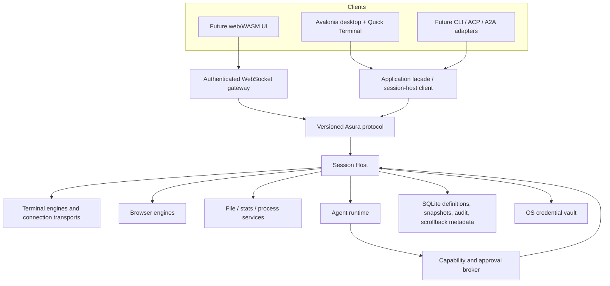

# Asura technical design and agentic development goal

**Status:** Proposed source of truth  
**Audience:** maintainers and implementation agents  
**Last updated:** 2026-08-01
**Applies to:** desktop v1 and the architectural path to server and headless modes

This document defines the intended product, target architecture, delivery milestones, and acceptance criteria. It is intentionally more complete than the mockups: a production application needs loading, empty, failure, permission, recovery, and accessibility states that are not drawn.

The terms **MUST**, **SHOULD**, and **MAY** express required behavior, recommended behavior, and optional behavior. When code, an old plan, and this document disagree, this document is authoritative unless an accepted architecture decision record (ADR) changes it.

## 1. Development goal

Build Asura as a cross-platform terminal workspace in which a user can:

1. define local and remote connections;
2. arrange terminal, browser, file, statistics, and process panels into reusable screens;
3. group active work into workspaces and restore it reliably;
4. operate the entire application from a configurable keyboard model;
5. use a built-in agent that can inspect and operate every authorized eligible
   panel in its current Workspace, including interactive terminal TUIs;
6. use a visual language that resembles the supplied design while adapting naturally to macOS, Windows 11, GNOME, and KDE;
7. later attach a web/WASM client or a headless ACP/A2A client without replacing the domain or runtime model.

The initial desktop product MUST be useful without the agent. Agent features enhance the same application commands and session APIs available to a human; they do not introduce a hidden second control plane.

### Product principles

- **Lifecycle follows the host mode.** In the desktop application, closing a panel, tab, or window closes its associated sessions using normal graceful-close and running-process confirmation behavior. In future server mode, closing or reloading a client page only detaches that client; server-owned sessions continue running until an explicit close, timeout, or retention policy applies.
- **One model, several front ends.** Desktop, Quick Terminal, future web/WASM, CLI, ACP, and A2A clients use the same application operations and runtime protocol.
- **Native where it matters.** Window materials, system appearance, key conventions, and accessibility adapt to the host OS. Asura retains a recognizable semantic design system while its embedded browser uses one pinned Chromium runtime across desktop platforms.
- **Automation is visible and governed.** Every agent action is scoped, cancellable, audited, and passed through the same capability broker.
- **Definitions are not runtime state.** A saved screen is a reusable definition; opening one creates runtime panel and session instances.
- **Capabilities are explicit.** Platform-specific features expose support flags and useful fallbacks instead of silently doing less.
- **Terminal correctness beats decoration.** IME, Unicode, mouse protocols, resize, clipboard safety, full-screen TUIs, and low-latency input come before command-block styling.

## 2. Product interpretation

The visual baseline is a compact desktop application with restrained translucency, rounded cards, JetBrains Mono for terminal and data surfaces, a workspace rail, tab strip, status bar, multi-panel canvas, command blocks, and a floating or docked agent surface.

Pixel identity is not a requirement. Implementations SHOULD preserve hierarchy, density, balance, clear focus, and subtle elevation while allowing platform profiles to alter metrics, materials, control shapes, typography, and window chrome. The application accent defaults to the host operating system's current accent. If the host does not expose one, Asura uses its bronze fallback accent.

## 3. Product language and domain model

The same terms MUST be used in UI, commands, persistence, logs, and code.

| Term | Meaning |
|---|---|
| **Connection** | A durable profile describing a local shell or an SSH, Docker, or WSL endpoint. It contains secret references, never secret values. |
| **Layout** | Reusable normalized panel geometry and constraints, independent of a monitor's pixel size. |
| **Screen** | A durable template combining a layout, panel types, connection bindings, startup commands, and optional agent-policy overrides. |
| **Workspace** | A durable ordered grouping of connection entries, saved-screen entries, and workspace-only tabs for a project or operational context. |
| **Tab** | An open runtime item within a workspace window. A tab may be created from a connection, a screen, or an ad hoc panel layout. |
| **Panel** | One rectangular region in an open tab. Panel types include Terminal, Browser, File Viewer, Statistics, and Process Monitor. |
| **Session** | A live runtime resource backing a panel, such as a PTY, browser context, file view, process sampler, or agent run. |
| **Attachment** | A client's visual/input binding to a session. Desktop user-close actions close the session; future server client disconnects detach without closing it. |
| **Command block** | Optional shell-aware metadata and output boundaries for one command. It is enrichment, not the terminal's source of truth. |
| **Agent run** | One governed execution with a target scope, provider/model, effective policy, event stream, and audit trail. |

### 3.1 Durable definitions

The domain layer SHOULD model at least:

- `ConnectionProfile` with kind, endpoint, authentication reference, environment, startup directory, keepalive, and host-key policy;
- `LayoutDefinition` with a versioned normalized grid/tree and minimum-size constraints;
- `ScreenDefinition` with metadata, layout, panel definitions, startup behavior, and policy override;
- `WorkspaceDefinition` with metadata and ordered entries;
- `ThemePreference`, `TerminalProfile`, `KeymapProfile`, `BrowserProfile`, `FileProviderProfile`, and `AgentConfiguration`;
- `SecretRef`, which is an opaque identifier understood only by the secret service.

Definitions use stable opaque IDs and schema versions. They contain no native handles, UI controls, provider clients, process objects, or resolved credentials.

### 3.2 Runtime model

The session host SHOULD expose projections for:

- `WorkspaceInstance`, `TabInstance`, and `PanelInstance`;
- `SessionDescriptor` with kind, lifecycle, capabilities, owner, and revision;
- `TerminalSessionState`, `BrowserSessionState`, and other type-specific state;
- `AgentRun` with target scope and linked actions;
- `InputLease` and attachment presence;
- health, reconnect, and recovery state.

Required invariants:

1. Visual indices are never identities; commands target IDs.
2. A panel references zero or one active session; a session can have zero or more read attachments and at most one active input lease.
3. A user closing a desktop panel/tab/window applies the desktop lifecycle policy: graceful close, confirmation when a live process or transfer requires it, then optional force termination.
4. A server-client disconnect or page reload applies the server lifecycle policy: detach while the server-owned session remains active according to retention policy.
5. Runtime mutations increment a revision and publish ordered events.
6. Agent tools cannot hold or reconstruct secret values.
7. A saved screen is immutable while an instance is running; editing it affects future opens unless the user explicitly reapplies it.

## 4. Target architecture



For desktop v1, the session host runs in the desktop process behind an in-memory transport and follows ordinary desktop close semantics. UI code MUST still depend on `ISessionHostClient`, not concrete engines. A later standalone host swaps the transport to a Unix-domain socket, named pipe, or authenticated WebSocket and supplies server detach/retention semantics without changing view models or domain operations.

### 4.1 Target project boundaries

| Project/boundary | Responsibility | Allowed dependencies |
|---|---|---|
| `Asura.Core` | Domain IDs, definitions, value objects, invariants, state machines | .NET BCL only |
| `Asura.Application` | Use cases, command/query handlers, authorization requests, ports | Core |
| `Asura.Protocol` | Versioned serializable DTOs, envelopes, event and stream contracts | Core primitives only |
| `Asura.SessionHost` | Runtime registry, lifecycle, attachments, input arbitration, projections | Application, Protocol, engine ports |
| `Asura.Terminal` | Terminal/PTY contracts, libghostty shim adapter, screen/input models | Core/Application contracts; native shim privately |
| `Asura.Browser` | CEF off-screen adapter, process runtime, and logical browser session | Application contracts; vendored Exclr8CEF privately |
| `Asura.Files` | Provider-neutral file locations, capabilities, transfers, previews, and protocol adapters | Core/Application contracts; protocol SDKs privately |
| `Asura.Agent` | Provider-neutral conversation loop, strict stream reduction, bounded context, and inert tool proposals | Core primitives only |
| `Asura.Agent.Providers` | Anthropic and OpenAI-compatible model discovery/streaming plus zero-tool chat composition | Agent, Application, Core; BCL HTTP/SSE privately |
| `Asura.Mcp` | Governed native MCP client, bounded stdio and Streamable HTTP transports, discovery, manifest freezing, and result projection | Application, Core; official MCP SDK privately |
| `Asura.Infrastructure` | SQLite, migrations, vaults, SSH/Docker/WSL, logging | Application ports and vendor libraries |
| `Asura.Platform.*` | macOS, Windows, and Linux appearance, window, hotkey, notification, and native-view bridges | Platform SDKs and Application ports |
| `Asura.App` | Avalonia composition, routes, view models, controls, accessibility | Application client contracts; never vendor engines directly |

Physical projects SHOULD be introduced when the boundary first carries real behavior. Do not create empty projects merely to match the table. Dependency tests MUST prevent UI/platform/vendor references from entering `Asura.Core`.

### 4.2 Application operations

All human and agent actions map to named application commands, for example:

- `connection.create`, `connection.test`, `connection.open`, `connection.disconnect`;
- `workspace.open`, `tab.create`, `tab.close`, `panel.split`, `panel.move`, `panel.resize`;
- `session.attach`, `session.detach`, `session.close`, `session.force_terminate`;
- `terminal.write`, `terminal.send_keys`, `terminal.send_chord`,
  `terminal.resize`, `terminal.read_screen`;
- `browser.read_state`, `browser.snapshot`, `browser.click`, `browser.fill`,
  `browser.check`, `browser.navigate`, `browser.back`, `browser.forward`,
  `browser.reload`, `browser.stop`;
- `agent.start`, `agent.steer`, `agent.approve`, `agent.cancel`;
- `settings.update`, `keymap.validate`, `screen.save`.

Commands return typed results and stable error codes. Views MUST NOT modify domain records directly.

### 4.3 Protocol

The protocol is transport-independent and revisioned. Its first implementation MAY use source-generated `System.Text.Json`; terminal screen diffs and screenshots MAY use negotiated binary frames later.

Every request contains `protocolVersion`, `requestId`, operation, actor, target IDs, expected revision where applicable, and a cancellation/deadline context. Every response contains the request ID, result or stable error, and resulting revision. Events contain session ID, monotonically increasing sequence, event kind, payload version, and timestamp.

The protocol MUST support:

- initial snapshots followed by ordered deltas;
- reconnect from a last acknowledged sequence;
- idempotency keys for retryable mutations;
- cancellation and deadlines;
- capability negotiation by client, host, engine, and session;
- bounded streams, backpressure, and explicit resynchronization;
- additive version evolution before breaking versions are introduced.

Do not expose Avalonia types, libghostty structs, browser-engine objects, or provider SDK payloads over the protocol.

## 5. Session host and panels

Statistics and Process Monitor sessions MUST collect POSIX targets through a
bounded structured-command transport rather than desktop process APIs. The
local adapter executes fixed `ps` probes without a shell; SSH, Docker, and WSL
adapters execute the same probes on their connection target. Parsing, sampling,
and panel presentation stay transport-independent. Browser is deliberately not
connection-switchable. The Terminal, Statistics, Process Monitor, and File
Viewer headers use the same connection selector and preserve the selected
connection through runtime recovery. Chart history is bounded presentation
state, is never persisted, and is not part of recovery.

`IConnectionRuntime` and `IConnectionCommandExecutor` form the reusable
connection-transport boundary. Terminal consumes prepared interactive launch
plans; Statistics and Process Monitor consume bounded command execution; file
providers may consume the same transport to prepare shared authentication and
trust before layering a protocol SDK such as SFTP. Panel modules MUST NOT
rebuild SSH, Docker, or WSL process arguments, resolve transport credentials,
or maintain a second host-trust decision.

The session host is the product's runtime center. It owns processes, connections, browser contexts, agent runs, scrollback metadata, recovery snapshots, and attachment leases.

Each panel service implements a common lifecycle shape rather than one oversized universal interface:

```csharp
public interface IPanelSession
{
    SessionId Id { get; }
    PanelKind Kind { get; }
    SessionCapabilities Capabilities { get; }
    ValueTask<SessionSnapshot> SnapshotAsync(CancellationToken cancellationToken);
    IAsyncEnumerable<SessionEvent> WatchAsync(long afterSequence, CancellationToken cancellationToken);
    ValueTask CloseAsync(CloseMode mode, CancellationToken cancellationToken);
}
```

Type-specific ports add meaningful operations such as terminal input or browser navigation. Avoid a generic `Execute(string, object)` escape hatch.

### 5.1 Attachment and input rules

- A view asks to attach by session ID and viewport metadata.
- The host returns an attachment ID, engine capability set, current snapshot, and event cursor.
- Read-only attachments MAY coexist.
- Interactive attachments and agents use an input arbiter. Human input normally preempts an agent lease; the policy is visible and configurable.
- Agent input MUST be shown with a running indicator and a one-action cancel control.
- In desktop mode, a user close command gracefully closes the associated session and asks for confirmation when work is active. Incidental control recreation is an implementation detail, not a user-visible persistence promise.
- In server mode, an attachment heartbeat expiring changes client presence only. Session retention and idle timeout are server policies.
- Application exit follows the selected host mode: desktop exit closes desktop-owned sessions; closing a server client detaches from server-owned sessions.

## 6. Terminal subsystem

### 6.1 Contracts

The terminal subsystem separates:

1. `ITerminalProcess`: PTY lifecycle, resize, ordered input, exit, environment,
   and connection identity;
2. `ITerminalState`: bounded terminal state operations such as viewport,
   selection, modes, title, working directory, and scrollback;
3. `ITerminalRenderState`: immutable renderer-facing viewport frames with
   revisions, row damage, live cursor state, complete cell styling, and Kitty
   graphics content/placements;
4. renderer attachment: the session-host lifetime and input-lease link used by
   the Avalonia presenter, not a native child-view ownership contract;
5. `ITerminalAutomation`: bounded screen snapshots, exact text/key input,
   waits, and durable shell-integration events.

An adapter MAY combine these internally, but the application observes the separated contract.

Renderer frames and automation snapshots are deliberately different. The
renderer needs exact physical cells, image placement, cursor styling, and
damage; agents need a bounded text/structured projection that cannot allocate
an unbounded image or viewport payload. Neither projection exposes a Ghostty or
PTY package type.

### 6.2 libghostty-vt strategy

Desktop terminal surfaces and their PTYs follow the lifetime of their owning panel session. Closing that panel/session uses the engine's graceful-close path and, when required, a standard running-process confirmation before force termination.

All supported desktop systems use one pipeline. Porta.Pty owns the local PTY
process and raw byte transport. libghostty-vt owns canonical terminal state,
VT parsing, terminal protocol replies, mode-aware key/mouse/paste encoding,
selection, and render damage. PTY output enters libghostty-vt as raw bytes;
managed UTF-16 decoding is not an intermediate terminal state. User input and
terminal-generated replies share one bounded ordered PTY writer.

An ordinary Avalonia control renders Application-owned frames and translates
keyboard, pointer, focus, clipboard, and IME interaction into typed
session-host operations on macOS, Windows, and Linux. The terminal path does
not host Ghostty's `NSView`, use Avalonia `NativeControlHost`, hand off an
IOSurface, or ask Ghostty to own a Metal/OpenGL surface. Avalonia therefore owns
terminal z-order, clipping, docking overlays, focus, and floating-window
composition.

`TerminalRenderFrame` contains a full current viewport and explicit
`None`/`Partial`/`Full` damage with ordered dirty rows. Cells retain
wide/spacer roles, selection, hyperlink and semantic metadata, all supported
styles, single/double/curly/dotted/dashed underlines, and a distinct underline
color. The live cursor retains terminal-controlled block/bar/underline/hollow
shape, visibility, blink, password state, wide-character-tail placement, and
explicit color instead of being reduced to the profile fallback.

Kitty graphics are generation-qualified and carry decoded image content,
source rectangles, viewport geometry, and z-order. The renderer caches content
by image generation, draws below background/below text/above text, and retires
stale images when the Ghostty storage generation advances. Unicode virtual
placements use Ghostty's own placement iterator and render-placement
calculation rather than a copied managed algorithm.

Asura pins Ghostty commit
`08f039fbb3dea9c6b1cdb5ff4550666598122346`. The native build applies the
small reviewed overlay under `native/ghostty-vt/patches` to a disposable
checkout. It adds a size-checked OSC 133 lifecycle callback, exposes canonical
virtual Kitty geometry and full-scrollback `ScreenSearch`, enables Ghostty's
existing Wuffs PNG decoder for libghostty-vt, and publishes an exact extension
ABI checked together with the complete managed import set. The C ABI and
safe-handle lifetime remain private to
`Asura.Terminal`. Updating the pin requires clean patch application,
upstream Zig/lib-vt tests, C header validation, managed interop tests, and
desktop conformance.

The same build stages Ghostty's reviewed Bash, Fish, and Zsh integration files
byte-for-byte. The launch adapter changes only the child-process launch plan;
the original launch remains the durable connection/recovery identity. OSC 133
prompt, input, executed, and finished events are retained as typed bounded
live-session automation events, including an optional exit code. Visible
command boundaries are resolved from Ghostty-tracked grid references so reflow
and scrollback do not turn screen-row inference into the semantic source of
truth.

The superseding decision, patch boundary, and rejected native-surface options
are recorded in [ADR 0040](adr/0040-cross-platform-libghostty-vt-terminal.md).

#### 6.2.1 Managed input and composition

Terminal input belongs to the same Avalonia control on every desktop. Avalonia
key, text, pointer, wheel, focus, clipboard, and text-input-method events are
translated into typed operations; libghostty-vt performs the terminal-mode
encoding. The presenter preserves the semantic distinction between physical
keys, text preedit, committed text, paste, and pointer events. It reports a
bounds-clamped IME caret, draws preedit state, and routes committed text through
the same input lease and human-preemption boundary as ordinary text.

Application shortcuts are resolved before terminal input. A physical human
event reacquires the exact interactive attachment lease and preempts queued
agent work according to host policy. Programmatic text, key, chord, paste, and
mouse operations remain typed and epoch/lease guarded; they do not synthesize
native platform events or bypass terminal mode encoding.

Host-specific differences remain at Avalonia's platform services and the
native library/PTY distribution boundary. They must not create a second terminal
state or a platform-only input path.

Future headless/server mode can reuse the libghostty-vt state and automation
ports without constructing an Avalonia renderer. Server ownership and retention
still require their own lifecycle ADR, but no desktop native-view extraction is
needed first.

### 6.3 Agent control of interactive TUIs

The agent cannot rely only on command blocks or shell command execution. Terminal automation MUST provide:

- a plain-text screen snapshot plus cursor and viewport metadata;
- optional structured rows/cells and incremental screen diffs;
- exact key events, chords, raw text, paste, mouse events where supported, and an explicit Enter action;
- `waitForText`, `waitForChange`, `waitForStable`, and timeout/cancellation;
- full-screen/alternate-screen detection;
- working-directory and shell prompt metadata when shell integration supplies it;
- input-lease status and human-interruption events.

This is sufficient to operate interactive OpenCode, Codex, Claude Code, editors, pagers, and other TUIs without pretending they are line-oriented commands. Test fixtures MUST cover alternate screen, resize, color, wide/combining characters, IME, mouse mode, bracketed paste, and an interactive confirmation prompt.

Generic TUI automation uses terminal facts rather than named-application
heuristics. After input, the agent can wait for a newer screen revision, wait
for visual quiescence, and read logical text with soft wraps removed. Visual
quiescence is not promoted to idle/prompt/approval state. Applications or
host-side adapters may additionally emit the bounded, expiring
`terminal.interactive-state.v1` OSC 777 observation protocol. These state
signals are untrusted and never authorize an action; applications without the
protocol remain fully operable through ordinary terminal primitives with their
interactive state reported as unknown. Local PTY launches advertise protocol
support through `ASURA_INTERACTIVE_STATE_PROTOCOL`; the variable is a
capability advertisement, not a semantic-state claim.

### 6.4 Command blocks are deferred enhancement

The design's command cards are desirable but not a desktop-v1 dependency. First collect semantic command boundaries using shell integration (for example prompt/command/output markers and working-directory updates) and retain a normal continuous terminal rendering mode.

A later block-mode spike SHOULD try a non-invasive overlay/index built from shell events and scrollback coordinates. Forking libghostty is a last resort, only after a written evaluation shows that a maintained adapter or overlay cannot meet selection, reflow, alternate-screen, and performance requirements. Full-screen TUIs automatically suspend or collapse block decoration. Agent correctness MUST never depend on block detection.

## 7. Connections

Connection support is a transport boundary, not a collection of special terminal views.

- **Local:** login shell, explicit executable, working directory, environment allowlist.
- **SSH:** system configuration/import, proxy/jump hosts, agent/key/password references, host-key verification, keepalive, reconnect, and remote shell integration where safe.
- **Docker:** engine/context, container selection, exec command, user, working directory, and lifecycle behavior.
- **WSL:** distribution, user, working directory, environment, and Windows path translation.

Opening a connection produces a typed result and progress events. Authentication, unknown host key, changed host key, missing runtime, permission denied, timeout, offline, and reconnecting are first-class states. Startup commands run only after the terminal is ready and are audited separately from connection establishment.

Transport capabilities remain separate application ports rather than one
oversized session interface. The current concrete capabilities are interactive
terminal launch, connection diagnostics, and bounded structured-command
execution. A module-specific protocol adapter may reuse those capabilities but
keeps its wire protocol and vendor types private. Adding a transport extends
the per-kind Infrastructure adapters once; panels do not branch on transport
kind.

Saved targets also expose `IPanelLaunchCapabilitySource`. Its typed
`PanelLaunchCapabilities` declares the default panel and every panel the target
can open; connection endpoints and file-provider configurations implement the
same contract. Launcher and workspace shortcut UI projects from this contract
instead of branching on SSH, S3, Docker, or another concrete transport.
Availability remains a runtime concern, so a target can retain its declared
capabilities while its current shortcut is disabled by platform or adapter
health.

Each terminal startup definition carries a closed delivery-failure policy.
`RetryWhileLive` is the backward-compatible default and retains one batch
context and idempotency key across the capped 1, 2, then 5 second retry
schedule. `StopAfterFirstDeliveryFailure` latches the first typed failure in
the opened panel instance, leaves the terminal available for inspection, and
withdraws the batch above the replaceable renderer so polling, renderer
recreation, reattachment, and reconnect cannot redispatch it. Neither policy
replays after confirmed delivery or recovery, including when the completion
audit outcome is uncertain. The policy concerns delivery or acknowledgement,
not the shell command's exit status. Only terminal panels may select a
non-default value; both saved-screen and workspace-only-tab editors expose the
same keyboard-reachable selector. The durable and runtime boundaries are
recorded in
[ADR 0032](adr/0032-startup-command-delivery-failure-policy.md).

## 8. File viewer and file providers

The File Viewer panel provides one consistent navigation and transfer experience over multiple filesystem and object-storage providers without pretending that every backend has POSIX semantics.

### 8.1 Provider contract

All locations use a structured `FileLocation` containing provider profile ID, authority/container, path or object key, and optional version. UI and agent code MUST NOT concatenate provider locations as local path strings.

`IFileProvider` exposes a capability descriptor and typed operations. Capabilities include list, stat, ranged read, streaming write, create directory/container, rename, copy, move, delete, search, watch, checksum, resumable transfer, versioning, symlinks, permissions/ACLs, atomic replace, server-side copy, pagination, and case sensitivity. Unsupported operations are disabled or return `UnsupportedCapability`; adapters do not emulate a destructive operation with weaker semantics without explicit confirmation.

Required providers are:

| Provider | Required considerations |
|---|---|
| POSIX filesystem | Roots, mount boundaries, symlinks, modes, ownership, hidden files, case sensitivity, and local/remote path identity. |
| Windows filesystem | Drive and UNC roots, long paths, reparse points, attributes, ACL-aware metadata, case behavior, and file-sharing conflicts. |
| S3 and S3-compatible storage | Bucket/region/profile, prefix-as-folder presentation, pagination, multipart transfer, object metadata, version IDs, and server-side copy where available. |
| SFTP | SSH host/profile reuse, host-key verification, POSIX-like metadata where the server exposes it, reconnect, and resumable transfer where safe. |
| FTP | FTP plus FTPS capability where supported, active/passive configuration, encoding, reconnect, and an explicit warning for plaintext FTP credentials/data. |
| SMB | Server/share identity, domain credentials, dialect/capability negotiation, ACL metadata, network discovery as an optional platform feature, and reconnect. |
| WebDAV | Base URL, authentication, collections, ETags/preconditions, locking where supported, redirects, TLS/certificate errors, and server-specific capability discovery. |

Protocol implementations SHOULD use maintained libraries or platform APIs behind adapters. Each provider ADR records library health, license, authentication support, cancellation/streaming behavior, platform coverage, and how its semantics map to the common capabilities. Do not implement S3, SFTP, FTP, SMB, or WebDAV wire protocols from scratch.

### 8.2 File Viewer behavior

The panel supports provider/profile selection, breadcrumb and editable location, tree/list views, sorting/filtering, hidden-item control, metadata, text/image/structured preview where safe, bounded binary/hex preview, open-with, upload/download, new folder, rename, copy/move, delete/trash when supported, and a cancellable transfer queue.

Large reads and transfers stream with progress and backpressure. Overwrite conflicts show source/destination metadata and offer skip, replace, keep both, or apply-to-all where semantically valid. Interrupted transfers expose retry/resume only when the provider guarantees a safe continuation. Destructive operations distinguish reversible trash/versioning from permanent deletion.

Provider authentication uses OS-vault `SecretRef` values. Certificate, host-key, credential, permission, offline, quota, throttling, stale-version/ETag, name collision, unsupported operation, and partial-transfer failures are first-class states.

The File Viewer connection selector lists every materialized file target in one
place: Local and custom filesystem roots, saved SSH connections projected as
transient SFTP profiles, and durable SFTP, FTP/FTPS, SMB, WebDAV, and S3
profiles. The SSH projections reuse the connection's endpoint, username,
authentication, host-key policy, and startup directory without becoming
separately durable definitions. The panel has no second provider picker; target
selection always replaces the hosted File Viewer session while preserving its
panel identity and layout.

Opening a saved screen never substitutes a different File Viewer provider or
falls back to its root. If the exact saved profile is not materialized yet, the
panel remains unbound and watches catalog refreshes without creating host
authority. Its first successful hosted operation binds the exact saved
structured location and profile; profile selection, location editing, and
navigation remain disabled during that bind. A failed first bind may retry only
the same location. Once bound, the session-owned provider generation and root
remain immutable for that panel.

Agent file tools use the same provider operations: `files.list`, `files.stat`,
`files.read`, `files.write`, `files.mkdir`, `files.copy`, `files.move`,
`files.delete`, and `files.search`. Policies target provider profiles and
structured location prefixes. A connection or workspace scope does not
implicitly grant access to every local drive, share, bucket, or remote root.

The first governed mutation slice is only `files.mkdir` and `files.delete`, as
defined by
[ADR 0030](adr/0030-governed-file-viewer-mkdir-and-delete.md). The model
supplies a typed non-root relative path; the host owns the exact
session/profile/authority/root/capability binding and derives every mutation
flag. Mkdir is `MustNotExist`. Delete is permanent, non-recursive,
`MustExist`, and removes whatever occupies the exact approved path at dispatch;
it does not claim identity with an earlier observation. Auto is escalated and
rejected defensively by SessionHost; only exact human approval or a confirmed
run-local YOLO permit can authorize either mutation. There is no trash, undo,
recursive delete, or action retry in this slice.

Ordinary provider `CreateDirectory`/`Delete` support does not advertise an
agent mutation. Production composition must add a separate host-trusted
governed capability, and the runtime, composer, and SessionHost all require
both flags. The current matrix enables mkdir only for the non-redirecting
WebDAV adapter and enables no governed delete provider. Local POSIX/Windows,
SFTP, FTP, and SMB keep their
ordinary human mutations but expose neither governed mutation because their
ancestor checks are not bound to later pathname use. WebDAV delete is also
ordinary-only: a file-to-collection replacement between kind inspection and
DELETE could turn the server operation into a recursive collection delete.
S3 delete remains ordinary-only because a key-only request creates a soft
delete marker rather than permanent deletion when bucket versioning is enabled
or suspended, and versioning state can change after any session-time check.

## 9. Built-in browser

Desktop browser panels use the pinned Chromium Embedded Framework runtime:

| Platform | Rendering/deployment |
|---|---|
| macOS | CPU OSR; bundled framework and five helper applications |
| Windows | CPU OSR; flat runtime (release blocked on the CEF 150 sandbox bootstrap) |
| Linux | CPU OSR; flat runtime plus qualified Chromium sandbox |

Profiles partition cookies, storage, cache, and navigation state. Durable named
profiles use an owner-private CEF working directory during the app run; after
CEF flushes at shutdown, the complete request-context tree is sealed into an
encrypted LiteDB blob and the plaintext tree is removed. Startup restores the
tree before the profile opens, including cookies, local storage, IndexedDB,
cache, service workers, and navigation/session files. `PrivateSession` creates
one no-cache-path partition per panel and destroys it at the final lease. The
built-in profile preserves the existing shared/per-workspace partition choice.
CEF's runtime-global `Local State` is encrypted alongside the context archives
so OS-crypt metadata survives; initialization waits for startup unlock and
recovery. Permission and media requests fail closed and publish a visible,
typed denial. Downloads require Chromium's explicit Save As flow, publish typed
start/progress/completion/cancellation events, and write only to the location
the user chooses outside the encrypted browser profile.
When application encryption is deliberately disabled, saved sessions are
deleted and durable selections run session-only instead of writing plaintext.

Each browser panel pins its exact profile definition and catalog revision for
its lifetime, including renderer replacement and popup ownership. Missing or
disabled profiles fail visibly without fallback. Clear-data operations bind an
exact profile id, partition, and revision, serialize requests, honor
cancellation, and name supported categories. CEF supports exact cookie and
HTTP-auth clearing, restoring inactive encrypted contexts when necessary;
whole-profile reset requires zero leases and deletes the encrypted archive.
Settings does not invent a target for private-session or per-workspace
partitions, and browser cleanup never deletes downloaded user files.

Optional Basic/Digest HTTP credentials bind an exact host, optional port and
realm, username, and vault `SecretRef`; the desktop adapter resolves them only
for the matching non-proxy CEF challenge. Portable bundles strip that binding
and import custom profiles disabled. Recovery retains the exact logical profile
identity and shows a repair state if it cannot be resolved. OAuth and other
security-sensitive flows use an explicit user-gesture “Open in system browser”
action, never redirect heuristics. [ADR 0051](adr/0051-logical-browser-profiles-with-ephemeral-cef-state.md)
records the encrypted profile boundary, recovery behavior, and privacy guarantees.

In desktop mode, a browser session and its CEF renderer follow the lifetime of
the owning panel, independently of whether that panel's Avalonia visual is
currently mounted. Inactive tabs keep a hidden CPU-OSR renderer available to
governed semantic and input operations; presenting the panel adopts the same
attachment. Closing the panel closes the browser. A renderer-process crash
replaces the frozen view and reports loss of volatile page state.

**Implemented CEF foundation (2026-08-08).** `Asura.Application` exposes
closed browser address, state, result, renderer, logical-session, and typed host
operation contracts. `Asura.Browser` privately wraps the source-pinned
Exclr8CEF CPU-OSR control; `Asura.App` and the session host contain no CEF
types. The desktop composition root owns the concrete adapter and the desktop
entry point owns CEF subprocess/init/pump/shutdown ordering. Browser panels are reachable from saved screens, the
launcher, the panel chooser, and command search; their chrome supports address,
back, forward, reload, stop, status, keyboard focus, and accessible names.
HTTP(S) and `about:blank` are the only accepted top-level addresses, new windows
fail closed, and developer tools are disabled. The session host validates exact
graph ownership and the interactive human attachment before binding a renderer,
dispatches the typed operations with normal revision/deadline/cancellation
guards, and closes browser sessions through the existing panel/tab/window
lifecycle. Runtime recovery retains the last logical URL, while detach/reattach
preserves monotonic document revisions and does not reload the same retained
renderer. The view is ordinary Avalonia content, so layout, clipping, and
overlays no longer depend on a native child surface. [ADR 0042](adr/0042-cef-off-screen-browser-runtime.md)
records the runtime, packaging, and release gates.

### 9.1 Engine-neutral automation

The engine-neutral contracts retain the useful interaction model of
`agent-browser`. The production CEF adapter advertises bounded state,
navigation, wait, semantic snapshot, exact-element click/fill/check, and
low-level mouse/key/scroll operations. Provider-authored script evaluation is
not part of the production profile.

**Implemented governed contracts (2026-07-24).** The native agent runtime has
ten closed typed browser operations: `browser.read_state`, `browser.snapshot`,
`browser.click`, `browser.fill`, `browser.check`, `browser.navigate`,
`browser.back`, `browser.forward`, `browser.reload`, and `browser.stop`.
`read_state` and `snapshot` are
observations under `BrowserData`; click, fill, and check are mutations under
`BrowserInteraction`; and the five navigation operations are mutations under
`BrowserNavigation`. Snapshot capture, click, fill, and check use fixed
application-private native-adapter scripts. No provider-authored script,
raw-JavaScript tool, selector, DOM or browser-engine object, CDP client, or
Node.js child process enters the public path.

One immutable profile is fixed for the factory, every session it creates, and
its renderer surface. Desktop creates the surface from the exact
session-factory profile. SessionHost snapshots that factory profile for
negotiation, rejects and disposes a created session whose capabilities differ
in either direction, and attachment rejects both missing and extra renderer
capabilities. The separately named `FullAutomationCandidate` adds only the
dormant evaluation capability; production keeps provider-authored evaluation
disabled.
[ADR 0026](adr/0026-native-browser-capability-conformance-gate.md) records the
gate.

An exact panel/session tool schema receives its browser identity from the
host-owned run target and does not accept `panel_id`. An internal `OpenTab` or
Workspace schema always requires one enumerated eligible `panel_id`, even when
only one browser currently qualifies. The runtime freshly resolves that selection, and
the trusted composer narrows it to one exact panel/session before the broker
issues an expiring one-use authorization. The session host captures and
revalidates the exact current interactive browser attachment owned by the
approving desktop client, consumes the authorization once, and completion-audits
the result without acquiring a terminal input lease. Ordinary browser chrome
operations remain human-only and cannot be invoked with an agent actor to
bypass this bridge.

Provider-visible state is bounded and labeled `untrusted_browser`: HTTP(S)
query and fragment are removed, title text is secret-redacted and byte-bounded,
and renderer error messages are reduced to stable codes. The host treats a
`HumanApproval` as the one-use allow decision for its exact typed action. All
five navigation tools are cataloged as mutations, so the
broker escalates `BrowserNavigation=Auto` to exact human approval rather than
allowing approval-free navigation. Click, fill, and check are separately cataloged
mutations, so the broker similarly escalates `BrowserInteraction=Auto`.
`read_state` and `snapshot` can normally arrive as `AutoPolicy`; the host
nevertheless evaluates that source for every operation as defense in depth.
At that host gate, authorized navigation is not restricted to the current
origin: it may leave `about:blank`, follow redirects, and activate links across
sites. Click, fill, and check accept `HumanApproval` or confirmed run-local
`YoloPolicy`; authorization-source failures use
`browser_action_not_authorized`. [ADR 0021](adr/0021-governed-browser-state-and-navigation.md)
records the boundary.

Governed navigate, back, forward, and reload additionally require
`browser.navigation_origin_guard`. The host freezes the approved destination
boundary as unrestricted, refuses to overlap an unresolved load, and holds the
one-action execution open through native completion. The renderer still
revalidates the exact starting address/document revision, serializes navigation,
and fences late or ambiguous terminal events, but it does not reject a start or
final address merely because its origin changed. Stop and authority
cancellation interrupt the pending load. Only final success records
`*_completed`; loading overlap uses retryable `navigation_in_progress`.
[ADR 0022](adr/0022-governed-browser-origin-containment.md) records the
superseded containment decision and the navigation-serialization invariants
that remain.

`browser.snapshot` binds the trusted committed logical address and document
revision, translates that binding to the exact last-projected renderer-local
document, and checks it before and after capture. Address/revision drift fails
closed. A renderer revision regression invalidates the projection and its
references rather than being normalized into current state. Chromium's native
accessibility tree is projected into a lean semantic tree: empty/generic wrapper
noise and duplicate actionable descendants are removed while document structure,
text, and interactive nodes remain. `interactive_only`, case-insensitive `filter`,
and `max_depth` are typed snapshot inputs. Filtering retains ancestors and runs
before the bounded 512-node projection, so early page chrome cannot consume the
budget before a requested late-page result. Frames, shadow roots, and
named-platform parity are not claimed.

The provider projection is labeled `untrusted_browser`, redacts secret-shaped
page text, removes HTTP(S) query and fragment data, truncates overlong addresses
with metadata, and exposes only allowlisted stable error codes. Its actual JSON
encoding after escaping is at most 64 KiB; there is no independent 48-node
provider cutoff, and projected nodes are reduced only when the complete envelope
would exceed the kernel byte limit. A truncated result reports available and
returned counts and can be narrowed with the same pre-cap query. Only one native
snapshot may be outstanding.
Cancellation fences late completion, deadlines quarantine an ambiguous adapter
for fail-closed replacement, and capture is unavailable during unresolved
navigation.

Random opaque element references are bound privately to the exact document,
native adapter, and a fixed-script handle. They expire after two minutes, the
next snapshot, navigation/document revision, adapter replacement, session
detach, or close. The page-realm registry maps the private handle to the exact
stored `HTMLElement` object and a validation closure; a `MutationObserver`
epoch invalidates the complete registry after any observed top-document
subtree, attribute, or text mutation. There is no locator replay or
`querySelector`. [ADR 0023](adr/0023-governed-native-document-snapshots.md)
records the snapshot boundary and its native-engine limits.

`browser.click` accepts only the exact opaque `reference` and
`document_revision` from one snapshot. The trusted composer binds both
arguments to the one-action approval. SessionHost accepts only
`HumanApproval`, requires the exact ready source document and interactive
attachment, freezes its current origin, and translates the logical document to
the exact renderer-local binding. Resolving a valid lease obtains the private
snapshot nonce, element token, mutation epoch, native adapter, and exact object;
an accepted attempt invalidates all public and native leases before activation.
The fixed script flushes pending mutation records, requires the epoch to match,
revalidates the stored object, and calls captured
`HTMLElement.prototype.click`.

Click additionally requires `browser.navigation_origin_guard`. The product
supplies an unrestricted boundary, so cross-site link activation is allowed;
navigation still waits for its terminal event and final-address projection.
Cancellation wins only before native dispatch is committed. Later cancellation
cannot overwrite a confirmed activation, and Asura never retries a click.
A malformed result, deadline, native exception, missing terminal event, or
other uncertain post-dispatch state returns non-retryable
`browser_interaction_outcome_unknown`. Native-surface ambiguity attempts
adapter quarantine and fresh `about:blank` replacement. Every unknown outcome
is committed as a non-retryable tool result, skips the stale remainder of its
batch, and returns control to the provider for fresh inspection. Unconfirmed
adapter recovery leaves that surface unavailable rather than enabling replay.
[ADR 0024](adr/0024-governed-browser-element-click.md) records the exact-object,
one-shot, commit, and quarantine boundary.

`browser.fill` accepts that same exact opaque `reference` and
`document_revision` plus well-formed text bounded to 2,048 UTF-8 bytes. Tabs,
newlines, and carriage returns are permitted; other control characters and
unpaired surrogates are rejected. Literal secret-shaped text is rejected
before approval. Approval renders the exact value in a reversible quoted and
escaped form, including empty, whitespace, and permitted controls; the material
digest binds the raw exact text, not its display encoding. The reference is
one-shot and fillable only when its exact
object is a `<textarea>` or an `<input>` whose type is `text`, `search`,
`email`, `url`, or `tel`; password, file, hidden, number/date-style inputs,
contenteditable elements, and every other element kind fail closed.

The session and adapter repeat the exact document check; the fixed script
repeats the registry-secret, nonce, token, and mutation-epoch checks, then
revalidates interactability and rejects disabled, hidden, inert, or read-only
controls. Before the setter it rejects deterministic HTML value normalization:
CR or LF in every input, CR in a textarea, leading/trailing ASCII whitespace in
URL and single-email inputs, and that whitespace around any comma-delimited
multiple-email token. This returns the stable pre-setter
`browser_fill_value_not_supported` error. It then uses the captured value
setter/getter, verifies the exact assigned value before and after dispatching
one bubbling, composed synthetic `input` event. Neither the
provider result nor audit records echo the text. Cancellation has authority
only before native dispatch commits; any uncertain post-commit result is
non-retryable
`browser_interaction_outcome_unknown`, quarantines the native adapter and
settles the failed tool result without redispatch, and requires a fresh
observation before another provider-chosen action.
[ADR 0025](adr/0025-governed-browser-element-fill.md) records this boundary.

`browser.check` accepts the same exact opaque `reference` and
`document_revision`, with no provider boolean: the operation means ensure
checkedness is true. It accepts only a native
`<input type="checkbox">` or `<input type="radio">`; custom ARIA controls and
every other element return `browser_element_not_checkable`. An accepted
attempt consumes the complete reference set. If the captured native checked
getter already returns true, it succeeds without activation or events.
Otherwise the fixed registry calls the captured
`HTMLElement.prototype.click` on that exact object and verifies checkedness
again. This uses native checkbox/radio activation, including radio-group peer
updates and browser-defined `input`/`change` events, without selectors,
property-setting authority, pointer coordinates, keystrokes, focus, or trusted
user activation.

Check repeats the same exact document, human-approval, origin-guard,
navigation-containment, deadline, one-shot, receipt, and quarantine boundaries
as click and fill. It never retries. Any uncertain post-activation outcome is
non-retryable `browser_interaction_outcome_unknown`, quarantines the native
adapter, settles the failed tool result, and returns control for fresh
inspection. A future uncheck
operation remains separate and will not uncheck a selected radio implicitly.
[ADR 0027](adr/0027-governed-browser-element-check.md) records this boundary.

When native checkedness is confirmed without an observed navigation start,
success waits through one queued UI-turn observation barrier while the frozen
origin guard remains installed. A deadline atomically wins over queued native
results and resolves outcome-unknown before UI quarantine marshalling; stalled
UI cleanup cannot leave the caller waiting or permit a later success.

Required common operations:

- open/navigate, back, forward, reload, stop, URL/title/status;
- accessibility/DOM-derived snapshot with short-lived opaque element references
  (initial bounded read plus exact-object click/fill/check consumption implemented
  behind the full-automation candidate profile);
- find by role, accessible name, label, text, test ID, or selector;
- click, bounded text-control fill, and native checkbox/radio check (candidate
  implementation), followed by double-click, hover, focus, type, select,
  uncheck, press, and scroll;
- wait for URL, element, text, load state, or timeout;
- isolated JavaScript evaluation where supported and permitted;
- screenshot and viewport metadata;
- profile/cookie/storage management through explicit capabilities;
- downloads, dialogs, permission prompts, certificate failures, and new-window requests as events.

`BrowserProductEvent` is the closed product event family for dialogs, file
pickers, permission denials, certificate rejection, downloads, find results,
and renderer-process recovery. CEF types remain private to `Asura.Browser`.
The panel presents these states separately and exposes find-in-page through the
engine-neutral `IBrowserFindController`. Renderer replacement starts a blank
renderer and reports the prior address only as an optional reload target; the
UI explicitly says unsaved form input and other volatile page state were lost.

Console, network inspection, screenshots, and additional interaction families
are optional future CEF capabilities. Unimplemented operations return
`UnsupportedCapability` or outcome-unknown rather than simulating success.

Every browser tool call passes through domain allow/deny policy, content-boundary labeling, and the capability broker. Browser page text is untrusted input and MUST never silently elevate tool permissions.

### 9.2 Off-screen composition

CEF paints into an Avalonia-owned visual. Browser panels therefore follow normal
Avalonia z-order, clipping, transforms, popovers, and modal overlays. The CPU OSR
path coalesces pending frames to bound memory and latency. Shared-texture OSR is
not enabled until every platform has a complete handle ABI, GPU-copy lifetime
proof, device-loss recovery, and acceptance evidence.

## 10. Built-in agent

### 10.1 Runtime approach

The `earendil-works/pi` project is a strong reference for session lifecycle, event streaming, model/provider abstraction, steering/follow-ups, compaction, custom tools, and embeddable agent sessions. It is not a permission system.

[ADR 0017](adr/0017-native-dotnet-agent-runtime.md) selects an in-process native
.NET loop for desktop v1. Asura owns provider streaming, target resolution,
policies, approvals, secrets, audit, and panel tools without packaging a
Node.js/Pi child process. The loop cannot execute tools directly, and the domain
does not depend on provider SDK payloads, TypeScript types, or Pi session files.

[ADR 0018](adr/0018-native-ai-provider-and-chat-boundary.md) adds a separate
native provider boundary for Anthropic and OpenAI-compatible model discovery
and streaming. Provider credentials are resolved per request from an exact
profile-scoped vault reference. Exact-origin, bounded HTTP/SSE parsing prevents
provider I/O from becoming an implicit application execution path. The
desktop now composes those adapters through `Asura.Agent.Runtime`; the
adapters still receive neither a session host nor an executor, and their tool
calls remain inert until the governed runtime creates a closed typed request
for the broker/session-host path.

**Implementation status (2026-08-17):** steering and follow-ups share one
bounded, ordered workspace-run queue. Enter queues an ordinary follow-up while
busy; Command/Super+Enter queues steering; a queued row can be promoted with
**Steer**, edited, deleted, or reordered. The primary action remains the send
arrow and Stop remains independent.

Steering is consumed only after the current provider response or complete
correlated tool batch has settled. It does not cancel the current generation,
skip remaining tool calls, or rewrite an earlier user message. The next
provider request receives steering as a distinct retained user turn. Ordinary
follow-ups run when the agent would otherwise stop. Queue input cannot answer a
dedicated question, decide a capability request, approve an action, change
policy, or create tool authority. These decisions are recorded in
[ADR 0046](adr/0046-ordered-step-boundary-agent-steering.md); the earlier
generation-replacement design in
[ADR 0037](adr/0037-bounded-native-provider-steering.md) is not routed by the
desktop presentation.

### 10.2 Target scopes

An `AgentTarget` is one of:

- panel;
- connection session;
- open screen/tab;
- workspace;
- explicit user-selected live-terminal set.

The desktop product surface exposes one `Workspace` scope. A run pins the
window/workspace identity, not one initial panel roster. Before each provider
continuation it re-inspects the authoritative workspace graph, accepts the
current ordered set of supported live Terminal, Browser, File Viewer,
Statistics, and Process Monitor panels, and rebuilds the runtime-contributed tool
manifest. Closed panels disappear and newly opened eligible panels become
available without retargeting the run. Every operation still narrows to one
host-enumerated current panel/session binding and revalidates that binding
immediately before execution. Exact panel, connection-session, and selected-set
targets remain internal/testable contracts and retain fixed-topology fail-closed
semantics; they are not separate workspace/tab/window concepts in the current
agent UI.

A valid live workspace contains at most 64 panels in total. The runtime graph,
context resolver, fixed graph pages, and provider `panel_id` enums share that
authoritative bound, so a workspace-scoped run observes every panel rather than
silently truncating the graph. Creating, restoring, or registering a 65th panel
fails atomically; increasing this product bound requires coordinated graph-page,
prompt, per-schema, and aggregate tool-schema budget changes.

The context resolver translates a target into currently authorized panels and resources. The agent sees stable IDs, human titles, connection boundaries, working directories, visibility, and capabilities. Widening scope always requires a visible user action or an approval governed by policy.

Saved-screen targeting is a two-phase presentation workflow, not a new
`AgentTarget` kind. Selecting a durable template records only its exact catalog
revision and grants no authority. The existing saved-screen activation path
must first resolve its layout, connections, panel capabilities, and policy
provenance into a live tab. That tab remains pending while the user reviews it;
a separate confirmation accepts its exact window/workspace/tab identity. Only
then may prompt dispatch use an ordinary `AgentTarget.OpenTab`. Revision drift
before activation, missing dependencies, a replaced live identity, or a
non-visible pending tab fails visibly without falling back to another scope.
Later definition edits cannot rewrite the accepted tab's captured policy or
provenance, and choosing another scope clears this authorization context.

An exact terminal-panel or connection-session tool schema omits `panel_id`.
Every broader Workspace schema and every internal `OpenTab` or
selected-terminal schema requires a host-enumerated eligible `panel_id`, even
when exactly one terminal can perform the operation. The parser does not infer
authority from current cardinality.

**Implementation status (2026-07-24):** The complete first governed
workspace-graph family is production-reachable. `workspace.inspect`,
`tab.list`, and `panel.list` project only the registered
graph objects already inside the immutable run target; they never discover
sibling workspaces, tabs, or panels. `panel.inspect` and `panel.focus` select
one exact current member. An exact panel or connection-session scope resolves
to one graph-backed panel and accepts no provider-selected identity. A broader
Workspace scope or internal `OpenTab`/selected-panel scope is narrowed for
panel actions by one required `panel_id` whose schema enum contains only
eligible members, even when exactly one member is eligible.

The runtime pins graph structure independently from operational session state
for exact scopes. For Workspace and internal `OpenTab` targets, membership,
order, and session bindings are live and replace the prior tool manifest after
each successful round; the target's window/tab/workspace identity remains fixed.
A connection-session scope must still own its exact current session, and
out-of-scope sibling changes neither invalidate nor leak into a clipped exact
scope.
Clipped provider results omit the workspace revision and graph sequence because
those global clocks would reveal unrelated sibling activity; a complete
workspace scope retains them.
Graphless Quick Terminal sessions advertise no graph tool. These decisions are
recorded in
[ADR 0029](adr/0029-scope-clipped-governed-workspace-graph-observations.md).

**Implementation status (2026-08-15):** A workspace-scoped run also exposes
`tab.create`, `tab.close`, `panel.add`, `panel.split`, and `panel.close` through
the `WorkspaceLayout` capability. The runtime derives all tab/panel enums from
the fresh complete graph and panel-kind enums from the trusted desktop port.
The composer binds the ordered topology; SessionHost consumes one exact permit,
then calls a narrow presentation-owned mutation port and verifies the resulting
host graph. Layout actions never retry graph conflicts. Unsaved database edits
block close, while failure after the UI commit boundary is outcome-unknown and
settles as a non-retryable failure before provider reconciliation. See
[ADR 0045](adr/0045-governed-workspace-layout-mutations.md).

### 10.3 Tool surface

The initial tool families are:

- `workspace.inspect`, `tab.list`, `panel.list`, `panel.inspect`, `panel.focus`,
  `tab.create`, `tab.close`, `panel.add`, `panel.split`, `panel.close`;
- `terminal.read_screen`, `terminal.read_screen_diff`, `terminal.find_on_screen`,
  `terminal.find_rendered_history`, `terminal.jump_to_rendered_history`,
  `terminal.read_scrollback`, `terminal.find`, `terminal.send_text`, `terminal.paste`, `terminal.submit_text`,
  `terminal.send_keys`, `terminal.send_chord`, `terminal.send_mouse`,
  `terminal.wait`, `terminal.interrupt`,
  `terminal.resize`;
- `browser.read_state`, `browser.snapshot`, `browser.click`, `browser.fill`,
  `browser.check`, `browser.navigate`, `browser.back`, `browser.forward`,
  `browser.reload`, and `browser.stop`, followed by the later browser automation operations in
  section 9;
- `files.list`, `files.stat`, bounded textual `files.read`, `files.mkdir`, and
  permanent non-recursive `files.delete`, followed by later provider-neutral
  file mutations from section 8;
- `processes.list` for one hosted local Process Monitor; governed local macOS
  Git operations and exact Docker lifecycle tools are exposed by typed
  application services, while process mutation remains absent;
- `statistics.read` for one hosted local Statistics panel, returning bounded
  numeric observations through the same observation policy and audit path;
- `agent.ask_user`, `agent.request_capability`, and `agent.report_progress`.

Tools return structured data, stable errors, truncation metadata, and links to full local artifacts when applicable. Screen reads and terminal output use explicit byte/token budgets. Tool execution is cancellable.

Rendered-screen search and screen diffs are viewport observations rather than
scrollback aliases. A screen diff is available only for the latest revision the
agent actually observed; renderer, context, and health reads do not replace that
baseline, while a later agent-visible screen/find/wait/diff result does. Stale
baselines return no fabricated rows. Special
key repetition is bounded and encoded into one PTY delivery. The optional
interactive input-region signal is an exact half-open zero-based
`row`/`start_column`/`end_column_exclusive` range. It is app-authored, expiring,
untrusted metadata; its absence remains unknown and never triggers heuristic
approval handling.

These dotted names are Asura domain, routing, and audit identities. They
never cross an AI-provider wire contract directly. The agent kernel preserves
already compatible names and derives a deterministic opaque provider alias for
every other name, constrained to 64 ASCII letters, digits, underscores, or
hyphens. Provider responses are accepted only against the exact frozen alias
map and translated back to the internal identity before a proposal can reach
the capability broker. A bounded session ledger keeps each alias bound to one
internal identity across continuation, cancellation, and compaction; later
rebinding fails before provider invocation. Tool-definition, schema,
returned-call, and generated-argument budgets are independent.

**Implementation status (2026-07-24):** All five first-family tools are
production-reachable through the same broker/SessionHost boundary.
`workspace.inspect` uses a closed empty schema and resolves the run's one
trusted workspace without accepting a workspace identifier.
A Workspace run has one authoritative context: the complete registered graph.
Panels without hosted sessions remain ordinary members of that context, so a
launcher-only workspace can answer, inspect its graph, and create a tab or
panel. Terminal/browser/file/database/Docker tools are derived from live
session attributes on panels in that same context. Selecting a launcher tab
never hides live sessions in sibling tabs.
`tab.list` and `panel.list` accept only an optional fixed offset from
`0/16/32/48`, return pages of 16 with offset/returned/next/complete receipts,
publish no totals, and cannot accept IDs, filters, sorts, or continuation
tokens. Their scope-clipped projection includes
registered Terminal, Browser, File Viewer, Statistics, and Process Monitor
panels, but no session, capability, connection, path, browser, process, or
content details. Titles are secret/unsafe-Unicode redacted, rune-safe truncated
to 128 UTF-8 bytes, and labeled
`content_origin=untrusted_workspace_graph_metadata`; actual JSON is capped at
64 KiB.

Exact panel/session `panel.inspect` and `panel.focus` schemas remain closed
empty objects; broader schemas require exactly one enumerated `panel_id` and
reject unknown fields. `panel.inspect` returns fresh host-owned identifiers,
revisions, lifecycle/focus state, and bounded, redacted labels marked
`content_origin=untrusted_panel_metadata`. `panel.focus` consumes one exact
authorization before the host can commit an expected-revision graph
activation. It returns only the committed graph identity, revision, sequence,
and whether focus changed; focusing an already focused panel is a
revision-stable no-op.

`agent.report_progress` is an intrinsic native-runtime presentation tool rather
than a capability-bearing application action. It is always advertised after a
valid run target is resolved, uses a closed schema containing one bounded
single-line message and an optional integer percentage, and replaces one
ephemeral `CurrentProgress` snapshot value. The runtime re-resolves the pinned
target before accepting an update, but it requests no broker permit, invokes no
capability-bearing SessionHost action, and creates no action-audit row. Its
existing read-only SessionHost context inspection is the mechanism that
revalidates the target. Invalid Unicode, control or formatting code points,
duplicate or unknown fields, values over 512 UTF-8 bytes, percentages outside
`0..100`, and secret-shaped text fail closed. The fixed provider receipt does
not echo model text. New prompts, completion, failure, cancellation, stop,
clear, and disposal clear the value; it is never copied into the
visible/durable chat transcript, SQLite, diagnostics, recovery, or logs. The
accessible live surface presents only the newest update. These
decisions are recorded in
[ADR 0033](adr/0033-intrinsic-agent-progress-reporting.md).

`agent.ask_user` is the second intrinsic native-runtime tool. Its closed schema
contains one required non-sensitive `question`; it has no model-controlled
target, options, timeout, default, identity, permission, or UI instructions.
Question text is strict-Unicode, printable, single-line, literal-secret-free,
and at most 1,024 UTF-8 bytes. A fresh opaque question ID binds one visible
two-minute pending card to either a strict, non-secret answer of at most 2,048
UTF-8 bytes or an explicit decline.

The runtime re-resolves the complete pinned target before showing the question
and after atomically claiming the response. Expiry, Stop, cancellation,
disposal, duplicate/stale IDs, or target drift clears or discards the response.
A submitted answer is labeled
`content_origin=user_supplied_agent_answer`; it is task-intent data, never
approval, capability authority, or permission to widen scope. The tool uses no
capability catalog entry, broker permit, SessionHost action, or action audit.
Only the existing native session's exact structured tool-result commit
continues the provider, and visible chat projects a question/answer pair only
after that matching success exists in the in-memory transcript. The accessible
`INPUT NEEDED` card has a dedicated answer field, Send and Skip actions, an
expiry, and an explicit no-credentials/no-approval warning without stealing
focus from a terminal. Question/answer content is excluded from SQLite,
recovery, diagnostics, action audit, and normal logs. These decisions are
recorded in
[ADR 0035](adr/0035-intrinsic-agent-user-clarification.md).

`agent.request_capability` is the bounded run-local policy-request intrinsic.
It remains outside `AgentToolCatalog` and is handled in-process by the native
.NET runtime. It is advertised only when the final ordinary production tool
set actually contains a cataloged tool whose trusted mapped capability is
`Off` in the current run policy. The runtime omits the intrinsic when there is
no such capability or while YOLO is active; enum membership, target support,
and a catalog entry which did not survive final tool composition are not
sufficient.

Its closed schema contains exactly one required `capability` string whose
dynamic enum consists of explicit stable lower-snake-case tokens for those
current candidates. There is no model-controlled reason, prose, target, tool,
permission, duration, persistence choice, ID, or UI text. One call can request
one capability, and at most one accepted request can reach a human capability
decision during one top-level Send turn.

A request uses its own opaque `AgentCapabilityRequestId`, two-minute UTC
expiry, `AwaitingCapabilityDecision` state, presentation contract, and
decision API. It never reuses `agent.ask_user` or an ordinary action approval.
The authenticated card contains only trusted target, capability, and affected
tool titles; it offers **Enable Ask for this run** and **Keep Off** and states
that no action is being approved. Before presentation and again before an
allowed decision is applied, the runtime re-resolves the complete pinned
target and final advertised ordinary tools, and verifies the exact run, ID,
expiry, policy generation, candidate capability, and absence of YOLO. The
decision is claimed atomically once; stale, duplicate, late, cancelled,
target-drifted, tool-drifted, or policy-drifted decisions fail closed.

Allow changes exactly one run-local permission from `Off` to `Ask`. It cannot
grant `Auto` or YOLO, alter provider/model or any other capability, widen the
target, approve an action, or persist a definition. The runtime keeps the
immutable trusted baseline policy distinct from the mutable run policy and
from the broker-enforced effective policy. A run starts with run policy equal
to baseline. An allowed request updates the run policy; a separately confirmed
YOLO window overlays that run policy, so YOLO disable or expiry returns to the
run policy without erasing a prior bounded `Ask` grant.

The request itself does not enter the broker's ordinary `RequestAsync` path,
receive a permit, invoke SessionHost, dispatch a target operation, or create an
action-audit chain. Allow uses the broker's authenticated run-policy update and
must durably commit its deterministic policy-transition audit before returning
success. An ambiguous or failed broker/audit transition revokes current
authority and leaves the run suspended/quarantined. Keep-Off and expiry change
no policy and create no action audit. The bounded success result contains only
the capability token,
`permission=ask`, `scope=run`, and
`action_approval_required=true`; it omits model prose, IDs, target data, and
trusted display text.

Every later terminal, file, browser, process, or other action still follows its
ordinary trusted catalog, broker, exact approval, one-action permit,
SessionHost revalidation, dispatch, and action-audit path. Stop, Clear,
disposal, and a new run discard the pending request and run-policy grants.
Nothing is added to durable screen/workspace policy or recovery. Headless,
ACP/A2A, and external decision routing remain future work and cannot infer a
grant from the absence of desktop UI. These decisions are recorded in
[ADR 0036](adr/0036-intrinsic-agent-capability-request.md).

`processes.list` is a governed application observation over an already-hosted
local Process Monitor panel. It maps to `ProcessControl`/`Observation`, whose
default policy remains `Off`, and uses the normal one-action broker,
SessionHost, and durable audit path when enabled. Exact panel schemas contain
only optional fixed sort and limit enums; Workspace and internal `OpenTab`
schemas also require one fresh host-enumerated Process Monitor `panel_id`, even
when only one is eligible. The model cannot choose a connection/session, command, PID/name
filter, arbitrary limit, offset, or continuation token. Limits are
`16`/`32`/`64` and sorts are CPU, memory, name, or PID, with CPU/32 as the
defaults.

SessionHost resolves and consumes authority under the graph gate, releases the
gate for exactly one typed local monitor capture linked to caller, permit, and
panel-close cancellation, then re-resolves and discards the sample on
ownership/session/revision/kind/capability drift. The hostile-result projection
is at most 64 rows and 64 KiB escaped JSON, labels itself
`content_origin=untrusted_local_process_metadata`, uses strict-Unicode
secret/path/control-redacted 128-byte process names, validates UTC/count/PID/
CPU/memory invariants, and omits command line, executable path, user,
environment, open files, cumulative CPU time, terminal content, and native
errors. Audit retains only the ordinary exact bindings, stable outcome,
duration, and returned count; it never retains process metadata or recaptures
during completion reconciliation. This tool always observes the machine
running Asura, not the remote machine behind a terminal. These decisions
are recorded in
[ADR 0034](adr/0034-governed-local-process-monitor-observation.md).

This surface deliberately covers the useful cmux-style behaviors—enumerating workspaces and panels, reading a terminal screen, sending exact input, taking captures, and controlling an embedded browser—without requiring cmux protocol compatibility or copying its implementation.

### 10.4 Policy and approvals

Permissions use four ordered modes:

| Mode | Behavior |
|---|---|
| `Off` | The capability is unavailable to the agent. |
| `Ask` | Each material action requires user approval before execution. |
| `Auto` | Routine actions execute automatically, while destructive or high-risk actions still require approval according to the capability's risk rules. |
| `YOLO` | Actions within the authorized target scope execute without per-action approval, including destructive actions. Hard scope boundaries, authentication, secret non-disclosure, cancellation, and audit still apply. |

Effective policy is resolved from:

`global -> workspace -> screen -> run override`

with the most specific explicit value winning for one accepted runtime instance.
When a tab is accepted from a saved screen or workspace, the desktop captures
the source definition IDs and revisions together with a normalized, complete
policy value. That immutable runtime provenance includes provider, model, and
every capability; later definition edits affect future opens, not the accepted
tab. The governed prompt carries this trusted captured policy into run
registration. Provider output and panel content cannot select or amend it.
Callers without an explicit runtime-provenance override preserve the governed
runtime's configured baseline; the prompt seam never substitutes the product
default over a separately configured global policy.

A target spanning several runtime tabs resolves each captured policy
independently, then takes the least-permissive value for every capability.
Provider or model disagreement makes the broad target invalid rather than
selecting one member. The current agent surface displays the effective
provider, model, and capability values used for the run.

At minimum, distinct capabilities exist for terminal input, destructive terminal actions, file read, file write, Git mutation, browser navigation, browser data, network fetch, Docker control, process control, MCP tools, and secret use. Approvals show actor, exact target, operation, material arguments, working directory/host, risk, duration, and whether approval is once/session/persistent.

Durable policies accept only `Off`, `Ask`, and `Auto`. `YOLO` is never stored
in a screen, workspace, or recovery snapshot and is never the default. It is a
separately selected, scoped live-run overlay. The composer exposes Full access
as an ordinary approval mode at all times; no secondary confirmation dialog or
visible timer is required. The selection remains until the user chooses Ask or
the run ends. Disabling it revokes the current policy generation. Audit records
distinguish `Auto` policy execution from `YOLO` execution.

Within one live run, the governed runtime preserves the immutable accepted
durable policy as its **baseline policy**, initializes a separate **run
policy** from it, and registers a broker-enforced **effective policy**. The
bounded `agent.request_capability` intrinsic may change one run-policy
permission only from `Off` to `Ask`. A confirmed Full access mode is an
effective overlay on the run policy, not a replacement for it; selecting Ask
restores the run policy. Stop, Clear, disposal, and a new run discard the
run policy and reconstruct future authority from a newly accepted baseline.

The built-in agent MUST:

- never receive provider or connection secret values in its prompt/tool result;
- use opaque secret handles resolved only at an execution boundary;
- record every requested, approved, denied, started, succeeded, failed, and cancelled action;
- expose stop/cancel even while a provider or tool is streaming;
- label terminal/browser/tool content as untrusted;
- avoid presenting a sample transcript as a live run.

### 10.5 MCP servers

MCP configuration includes add/edit/remove, a local stdio executable or remote
Streamable HTTP endpoint, environment/header secret references, working
directory, enabled tools, bounded diagnostics, and per-scope enablement.
Adding a server, changing its transport authority, credential bindings, or
expanding tools requires explicit confirmation. MCP tools are wrapped by the
same capability and audit path as built-in tools.

**Implementation status (2026-08-29):** governed stdio and Streamable HTTP MCP
transports are production-composed. Schema-two `McpServerProfile` definitions
use a closed transport discriminator: stdio contains one absolute executable,
ordered arguments, optional working directory, and environment-name-to-
`SecretRef` bindings; Streamable HTTP contains one bounded HTTP(S) endpoint,
an explicit acknowledgement for plaintext HTTP, and HTTP-header-name-to-
`SecretRef` bindings. Both carry exact enabled-tool names, enabled state, and
trust provenance.
Only the current schema-two MCP profile is accepted; non-current schemas are
rejected at the infrastructure boundary without migration. SQLite,
import/export, and dependency-aware secret handling preserve references rather
than values. Every imported MCP profile is normalized to disabled and untrusted before
publication. The Settings editor and trust-confirmation dialog author both
transport variants. Remote authoring requires HTTPS except for exact loopback
HTTP, persists the Core insecure-transport acknowledgement only for that
loopback exception, and exposes bounded header-name-to-`SecretRef` rows without
loading or displaying header values.

`Asura.Mcp` pins `ModelContextProtocol.Core` `1.3.0` and the stable
`2025-11-25` protocol. The official SDK owns initialization, JSON-RPC
correlation, lifecycle, pagination DTOs, and typed `tools/call` messages.
Asura supplies the SDK with a private bounded stdio `IClientTransport` because
the SDK's built-in stdio transport inherits the ambient environment and does
not provide the required pre-deserialization message/shape and retained-stderr
bounds. That transport launches directly without a shell, clears the
environment before adding only vault-resolved profile values, validates strict
newline-delimited UTF-8 JSON, drains stderr to count-only metadata, and performs
bounded child-process cleanup. A cumulative incoming control-message budget
applies to initialization and resets for every list page and tool call, so a
notification or server-request flood closes the transport instead of starving
the expected response. SDK types do not cross the project boundary.

For remote profiles, the official SDK `HttpClientTransport` runs in forced
Streamable HTTP mode; the separate SSE transport is unsupported. A private HTTP boundary
rejects redirects and cross-origin requests, disables cookies, ambient proxy
use, decompression, and automatic redirects, and bounds response headers,
session identifiers, and JSON/SSE body bytes. The SDK owns POST framing and
the `Accept`, `MCP-Session-Id`, and `MCP-Protocol-Version` protocol headers.
Only non-reserved configured headers are added, after resolving their exact
profile-scoped references with `SecretUseKind.McpServerHttpHeader`; header
values are bounded UTF-8 and cannot contain null or control characters.

`McpTools=Off` opens no MCP run and advertises no MCP aliases. Under `Ask` or
`Auto`, the runtime opens eligible enabled profiles, intersects bounded
discovery with each exact allowlist, and freezes the profile revision, server
identity, protocol, allowlisted tool display name or redacted placeholder,
private per-session HMAC tool identity, sanitized object schema, schema digest,
and a run-local opaque provider alias. The raw protocol tool name stays inside
the private session binding. Tool-list change
notifications make the catalog stale; they cannot expand an existing manifest.
Sanitized schemas share a 512-KiB aggregate run budget in addition to their
individual limits; excess discovery fails with a stable capacity result and
disposes every opened profile session before the manifest reaches the agent
kernel.
All aliases map back to the one trusted `mcp.call` catalog action, classified as
`McpTools` plus `Mutation`. Both `Ask` and `Auto` therefore require an exact
human approval. Confirmed run-local Full access uses the same frozen binding,
one-use authorization, host validation, and audit path without another prompt.

Before any catalog, vault, or transport access, the execution host also requires
a broker-issued launch lease for the exact registered agent/run and live
enabled policy generation. Immediately before one dispatch, it re-inspects
the run target, recomputes its binding, verifies the frozen manifest, current
profile revision, and credential-session validity, consumes the one-action
human authorization, and calls the exact privately bound tool once. It never
retries. Post-dispatch cancellation, transport loss, malformed or oversized
response, and other ambiguous failures become
`mcp_tool_outcome_unknown`; the runtime closes the uncertain MCP session,
commits the non-retryable result, skips the stale batch remainder, and returns
control for fresh inspection. Valid results are projected to at most
64 KiB, omit binary/resource content and operational identities, redact exact
and secret-shaped values, and carry `content_origin=untrusted_mcp`.
Replacing or deleting an MCP-scoped credential closes every run that resolved
it and waits for any in-flight Settings probe to dispose before returning, so
the next launch is the first one allowed to resolve the replacement.

The MCP diagnostics boundary also exposes an explicit one-shot **Test** operation.
It requires an authenticated human client and the exact current profile
revision, serializes one initialization-and-discovery probe under a maximum
30-second deadline, projects discovered and enabled counts while withholding
server-chosen tool identifiers, and explicitly disposes the transport session
before returning. The probe never calls a tool, creates broker or
agent-action authority. Trust and enablement are independent: a reviewed,
trusted profile can be tested while disabled, but only a trusted and enabled
profile can enter an agent run. Imported definitions remain untrusted until the
normal confirmation flow is completed.

Every Test and live profile launch publishes an immediate, closed lifecycle
state with an opaque per-session correlation identifier. Settings distinguishes
untrusted, disabled, testing, starting, healthy, degraded, failed,
cleanup-uncertain, and stopped states. The retained journal contains at most 32
app-authored events per profile for at most 24 hours. It persists only stable
codes, fixed bounded messages, timestamps, and count-only stderr shape metadata;
raw stderr, endpoints, arguments, environment names or values, and
server-selected text have no storage shape. Profile-revision and credential
changes invalidate the corresponding live/test session, and stale durable
summaries are ignored. An authenticated user can clear retained history, but
that operation does not clear or bypass the host-lifetime cleanup circuit.
Retry remains unavailable after uncertain cleanup and requires an application
restart.

The intentionally excluded protocol surfaces are legacy SSE fallback,
resources, prompts, sampling, elicitation, tasks, durable session resume,
per-scope server selection, persistent health polling, and retained viewing of
server-authored log text. HTTP/SSE diagnostic lifecycle expansion remains
deferred. The SDK may reconnect an interrupted SSE response up to two times
inside one live Streamable HTTP session, but Asura never retries a
dispatched tool call and does not persist a remote session for later resume.
MCP profile add/edit/disable/delete/import/reload rotates a host-owned catalog
generation, immediately marks affected runs closing, and disposes their
transport sessions without waiting for another tool call. Tool-list
notifications likewise cannot expand a frozen run and fail the next adjacent
check.
Each configured stdio process runs with the desktop user's OS authority and is not
a sandbox; environment isolation only prevents accidental ambient-variable
inheritance. Shutdown confirms the directly launched root process and requests
best-effort process-tree termination when needed, but portable .NET process
APIs cannot prove containment of a deliberately detached or reparented
descendant. Cleanup uncertainty trips a host-lifetime circuit breaker that
prevents additional MCP launches. These decisions and limits are recorded in
[ADR 0038](adr/0038-governed-native-dotnet-mcp-stdio.md).

## 11. Themes and host appearance

Theme implementation separates **semantic tokens** from a **platform visual profile**.

Semantic tokens cover surfaces, text, borders, selection, focus, accent, success/warning/error/info, terminal ANSI colors, workspace colors, spacing, radius, and elevation. Platform profiles map those tokens to typography, control metrics, chrome, materials, motion, menus, and focus treatment.

Accent resolution is:

1. an explicit user-selected custom accent, when configured;
2. otherwise the current host OS accent, updated live;
3. otherwise the Asura bronze fallback.

The Pencil compositions' orange accent is illustrative and does not override this rule.

### 11.1 Profiles

| Profile | Behavior |
|---|---|
| **Automatic (default)** | Detect host OS/desktop/version, follow supported appearance settings including accent, and choose the matching profile. Use Asura bronze only when the host provides no accent. |
| **macOS Classic** | Pre-Liquid Glass/AppKit-like chrome, restrained vibrancy, compact controls, current design's closest match. |
| **macOS Liquid Glass** | Use supported AppKit Liquid Glass materials for navigation/control layers; fall back to Classic on older macOS. |
| **Windows 11** | Fluent metrics and focus, system accent, Mica/Acrylic where available, high-contrast-safe fallbacks. |
| **GNOME** | Adwaita-like proportions and hierarchy, system scheme/accent/high contrast/font where available. |
| **KDE** | Breeze-like proportions and system palette/accent while preserving Asura information hierarchy. |
| **Asura / Custom** | Portable branded presets and explicit user token overrides. |

Automatic mode follows color scheme, accent, high contrast, reduced motion, reduced transparency/material availability, text scale, and appropriate platform hotkey conventions when the OS exposes them. Host accent following is enabled by default. On Linux, use Avalonia platform settings plus the XDG Settings portal and desktop identification; direct GNOME/KDE APIs are optional adapters, not core dependencies.

The terminal palette is independently configurable. Selecting a light application chrome does not silently rewrite a pinned terminal color scheme.

Liquid Glass is used selectively for navigation, chrome, transient controls, and sidebars—not as a readability-reducing effect behind every terminal cell. System reduce-transparency and reduce-motion choices win. Custom colors must be contrast-checked and expose a reset.

### 11.2 Appearance settings additions

The designed Appearance screen SHOULD add:

- System/Light/Dark behavior separate from platform profile;
- follow-system accent toggle, custom accent override, and a read-only indication when the bronze fallback is active because the host exposes no accent;
- high-contrast and reduced-motion status;
- a persisted application text-scale override that follows the host by default and reapplies live
  to every open window;
- terminal palette selection separate from app palette;
- unsupported-material explanation/fallback;
- live preview and reset per section;
- import/export for portable custom themes.

## 12. Keyboard input and command registry

Terminal input and application commands are separate configurable layers.

### 12.1 Command registry

Every application action has a stable command ID, title, category, contexts, default binding, availability predicate, and parameter schema. Menus, command palette, keybindings settings, agent actions, and accessibility automation invoke the same registry.

Contexts include Global, Window, Workspace, Tab, Panel, Terminal, Browser, TextEditing, QuickTerminal, and Modal. Resolution order is:

`modal -> active prefix sequence -> application context -> panel context -> terminal keymap -> hosted content`

Conflicts are detected before save. Users can search, record, unbind, reset, and export bindings. Config files preserve unknown future command IDs so downgrades do not destroy user data.

### 12.2 Terminal keymaps

Ship three terminal-editing presets:

- macOS Native;
- Windows Native;
- Linux Native.

The detected host preset is the default. Presets cover copy/paste, selection, word movement/deletion, line movement, find, font size, clear, and common shell-control expectations. Platform text-editing/hotkey information is consulted when available. Users may clone a preset and override any binding. Terminal bindings contain exactly one stroke so the shared libghostty-vt/Avalonia terminal path resolves selected shortcuts consistently on every desktop; multi-stroke sequences and their timing/failure policy belong to the Application layer.

### 12.3 Application keymap

The default application keymap is tmux-like with `Ctrl+B` as prefix. The initial mapping SHOULD include:

| Sequence | Asura command |
|---|---|
| `Ctrl+B`, `c` | New tab |
| `Ctrl+B`, `%` | Split left/right |
| `Ctrl+B`, `"` | Split top/bottom |
| `Ctrl+B`, arrow or `o` | Focus adjacent/next panel |
| `Ctrl+B`, `z` | Toggle panel zoom |
| `Ctrl+B`, `x` | Close panel with lifecycle confirmation |
| `Ctrl+B`, `,` | Rename tab |
| `Ctrl+B`, `&` | Close tab |
| `Ctrl+B`, `n` / `p` / `l` | Next / previous / last tab |
| `Ctrl+B`, `0`…`9` | Select tab by position |
| `Ctrl+B`, `[` | Enter terminal copy/scroll mode |
| `Ctrl+B`, `Ctrl+B` | Send literal prefix to the active terminal |

Terminology remains Asura's (`tab`, `panel`), even where tmux calls them windows and panes. Prefix timeout, repeatability, and whether a failed sequence is discarded or passed through are configurable; the safe default discards it and shows a brief key hint.

Global Quick Terminal registration is a separate OS service. Conflicts and missing accessibility/desktop permissions get a diagnostic state and guided recovery.

## 13. Persistence, recovery, and OS-backed secrets

Use SQLite with migrations and WAL for durable application data. Use normalized records or versioned JSON payloads according to query needs; repositories hide that choice from the domain.

Persist:

- connection, layout, screen, and workspace definitions;
- ordered tabs/panels and restorable session descriptors;
- settings, theme and keymap profiles;
- agent run metadata, approvals, and audit events;
- browser profile references and non-secret metadata;
- bounded terminal scrollback segments/indices where enabled;
- migration version and last clean shutdown marker.

Do not use full event sourcing for ordinary definitions. Append-only audit and runtime event logs are appropriate, while current snapshots remain the fast source for restore.

### 13.1 Secrets management

All persistent credentials and secret values MUST be stored through an `ISecretVault` adapter backed by the operating system's credential store:

| Platform | Required persistent store |
|---|---|
| macOS | Keychain Services |
| Windows | Windows Credential Manager or an OS-protected DPAPI-backed credential store |
| GNOME and compatible Linux desktops | Secret Service / system keyring |
| KDE | KWallet through a supported Secret Service bridge or dedicated adapter |

SQLite and portable settings store only opaque `SecretRef` values, labels, type, scope, and non-sensitive timestamps. They never store a secret value, reversible local encryption key, or plaintext credential. If no usable OS credential store is available, Asura fails closed for persistent storage and MAY offer an explicitly memory-only credential for the current process.

The Secrets settings screen supports create, relabel, replace/rotate, scope review, last-used metadata, dependency inspection, and delete confirmation. It never reveals values by default. Export, backup, diagnostics, logs, telemetry, agent prompts, tool results, and crash reports exclude secret values.

Connections, AI providers, MCP servers, browser profiles, and file providers resolve secret handles only inside their infrastructure adapter at execution time. Agent tools may select an authorized `SecretRef` but cannot read, echo, or reconstruct its value. Secret resolution and use are audited by reference and purpose, never by value.

### 13.2 Recovery

Startup detects unclean shutdown, validates migrations, and offers restore, safe mode, or discard-runtime-state without deleting definitions. Migrations are transactional, backed up before destructive schema changes, and tested from every supported persisted version.

## 14. UX information architecture and complete state inventory

### 14.1 Primary navigation

The desktop has five primary surfaces:

1. **Launcher:** connections, saved screens, history, recent sessions, search, and create/open actions.
2. **Workspace window:** native title/chrome, tabs, optional connection favorites, workspace rail, panel canvas, agent, and status bar.
3. **New panel/tab launcher:** searchable type, workspace, connection, screen, and command chooser.
4. **Quick Terminal:** global drop-down using the same session/application services.
5. **Settings:** Appearance, Workspaces, Connections, Files & Transfers, Terminal, Keybindings, AI Providers, Agent, MCP, Secrets, Browser, Quick Terminal, Data & Diagnostics, and About/Updates.

### 14.2 Screens represented by the design

| Surface | Required completion beyond the drawing |
|---|---|
| Connections & Screens | Loading, empty sections, search-no-results, unavailable provider/runtime, connection progress/error, context menus, keyboard navigation, destructive confirmation. |
| Terminal Workspace | Real tab/panel operations, active/inactive/focused states, reconnect, session ended, zoom, drag/drop, minimum-size behavior, close policy, agent dock/floating fallback. |
| New Tab/Window | Recent/favorites, result ranking, invalid command, create-in-new-window, disabled unavailable panel types, keyboard-only selection. |
| Split New Panel | Valid split targets, preview, minimum size rejection, cancel/restore focus, inherited connection/cwd. |
| Quick Terminal | First run, global-hotkey permission/conflict, multiple displays/spaces, opening/hidden animation, session restore, focus-loss rules, offline/error. |
| Saved Screen editor | New/edit/duplicate, dirty state, validation, missing connection, startup-command failure policy, agent override, preview, delete/undo. |
| Layout Designer | Keyboard editing, grid resize, min sizes, overlap rejection, panel order/accessibility, reset, cancel with unsaved changes. |
| Workspaces settings | Empty state, reorder, missing item, workspace-only tab, icon/color picker, delete/migrate open instances. |
| Appearance | System profiles, contrast-safe custom colors, live preview, terminal palette, import/export/reset, unsupported material. |
| AI Providers | Add/edit/test, OAuth/API-key flows, unavailable model, refresh, quota/rate-limit, display order, local provider discovery. |
| Agent | Effective scope and permission mode including persistent YOLO warning, live run, tool details, approval, denied, waiting, provider offline, retry, cancellation, compaction, history, audit link. |
| Quick Terminal settings | Hotkey recorder/conflict, monitor/space, size, animation/reduced motion, restore and focus behavior. |

### 14.3 Missing but required screens/flows

The implementation MUST formulate these consistently from the design system:

- connection create/edit/test wizard, SSH host-key review, authentication, reconnect, and connection diagnostics;
- screen library detail, duplicate/delete/export/import, and missing-dependency repair;
- full history search/detail/clear/export with privacy controls;
- Terminal settings: shell/profile, font/palette, scrollback, cursor, selection, clipboard, shell integration, bell, links, and compatibility;
- Keybindings settings with Terminal and Application tabs, presets, prefix editor, recorder, conflict resolution, import/export, and reset;
- browser panel chrome, profile picker, downloads, permissions, certificate/interstitial, crash/reload, find, and clear-data flows;
- File Viewer provider/profile manager, location browser, previews, transfer queue, conflicts, progress, retry, and loading/empty/error/permission/unsupported states for POSIX, Windows, S3, SFTP, FTP, SMB, and WebDAV;
- agent run history with retention/export, cross-run audit detail, policy
  comparison, and model/provider recovery;
- MCP server and Secrets management;
- onboarding for shell/runtime/provider prerequisites and optional import;
- data, cache, logs, diagnostics bundle, migration, update, licenses, and safe-mode settings;
- crash/session recovery and close-with-running-sessions dialogs;
- application command palette and keyboard prefix hint;
- reusable offline, loading, skeleton, empty, no-results, permission, unsupported, stale, conflict, and retry components.

### 14.4 State and accessibility rules

Every async surface specifies loading, empty, content, partial/stale, recoverable error, terminal error, and cancelled states. Optimistic mutations must show rollback on conflict. Destructive actions state their runtime effect.

All controls require accessible names, logical keyboard order, visible focus, scalable text, sufficient contrast, and screen-reader announcements for connection/session/agent state. Color is never the only status signal. Motion and translucency respect OS preferences. Core workflows are operable without pointer or drag-and-drop.

## 15. First desktop delivery train

“Desktop v1” means milestones M0–M4. Block terminal presentation, server/WASM, and headless ACP/A2A are explicitly later milestones, but M0–M4 must preserve their architectural path.

### M0 — Application and session boundaries

**Implementation status: complete (updated 2026-08-01).** The desktop composition root, typed application client, versioned protocol envelopes, in-process host, bounded event/revision model, attachments, input leases, engine-neutral terminal presenter, scope-aware close flow, dependency tests, and required ADRs are implemented. The cross-platform libghostty-vt/Avalonia terminal and hosted File Viewer panels run through this boundary; transfer ownership and panel/tab/window close route through the same session-host lifecycle. The host owns an immutable, ID-addressed workspace/tab/panel graph per desktop window. Opening registers before presentation, tab/panel activation and structural proposals use expected revisions, UI state commits only after a validated host receipt, replacement is atomic by window, and explicit unregister/window close/client disconnect remove stale targets. Terminal and hosted-file creation validate typed graph ownership and link the live session into its panel; registration reconciles creation races from hosted state and discards client-supplied links; reconnect, exact-identity close, closed-session rejection, and authoritative-null preservation prevent stale sessions from replacing or erasing the current target. Each actual link/unlink advances the ordered graph stream. The desktop follows that stream from its accepted cursor, resumes after resynchronization, and refreshes once before retrying a mutation on a genuinely newer revision. Quick Terminal uses an independent window ownership boundary, and no graph operation is agent-authorized before M3. The decision and concurrency limitation are recorded in [ADR 0016](adr/0016-host-owned-runtime-workspace-graph.md). Deterministic tests distinguish detach, graceful close, cancellation, confirmation/force termination, engine failure, server disconnect, revision conflict, idempotent replay, stream resynchronization, creation/registration/close races, reconnect overlap, and disposal during creation.

The application-facing terminal contract now preserves the four explicit
capability ports in section 6: process/lifecycle, canonical state,
renderer attachment, and automation. Session-host operations depend on the
narrow port they use, while `ITerminalPanelSession` remains only the
factory/source-compatibility aggregate. Immutable launch metadata carries
non-secret environment and connection identity through local, SSH, Docker,
WSL, workspace, and Quick Terminal creation. Built-in engines and test fakes
run the same conformance checks, including rejection of a generic execution
escape hatch.

Deliver:

- composition root and dependency injection;
- application command/query boundary and `ISessionHostClient`;
- runtime session IDs, host-mode lifecycle policy, attachment, event, capability, and input-lease contracts;
- protocol envelope and fake in-memory host;
- presentation controls that receive sessions through application ports rather than calling vendor engines directly;
- persistence, browser, agent, and platform-theme ADRs;
- dependency-architecture tests.

Exit criteria:

- Presentation and domain layers have no direct dependency on terminal, browser, storage-protocol, or provider SDK implementations.
- Desktop `ClosePanel`, `CloseTab`, and `CloseWindow` paths gracefully close their owned sessions and request confirmation for active work according to policy.
- The protocol can represent the future server distinction between client detach and explicit server-session close without changing domain IDs or application commands.
- Engine failure, graceful close, cancellation, and forced termination are distinct tested outcomes.

### M1 — Durable desktop shell

**Implementation status: in progress (2026-07-23).** The durable-shell product surface is implemented: versioned SQLite definitions, transactional graph validation, secret-free definition import/export, recovery, platform vault adapters, secret-safe audit, immutable durable models, and first-run definitions are composed into the desktop app. The Avalonia launcher, workspaces/tabs/panel canvas, settings, command palette, editable layout designer, workspace and saved-screen editors, application and terminal keybinding editor, app-reachable definition bundle workflow, platform-profile/live appearance, diagnostics export, recovery, local libghostty sessions, and live local Statistics and Process Monitor panels are reachable without sample state. Monitoring uses a package-free cross-platform engine behind typed session-host capabilities. It polls without overlap, preserves a last-good sample across recoverable failures, bounds process enumeration and returned rows, starts only after graph registration, and excludes command lines, users, environments, open files, and terminal content. Monitor recovery stores only panel kind, title, and layout metadata; it never stores samples, process names, or PIDs. Selected M1 surfaces have current same-viewport visual QA. The layout designer now matches the exported 1000 × 648 composition and supports pointer-captured paint and edge-resize gestures in addition to its complete keyboard surface. Paint commits one validated snapped rectangle; resize commits exact replacement bounds only when captured geometry is still current; Escape, capture loss, unrelated pointers, and stale keyboard edits cannot partially or accidentally commit a gesture. Native menus, exact-modifier gestures, overlays, and the command registry share one focus-restoring action path, including confirmation before leaving dirty/modal editors and explicit renderer focus restoration after a close is cancelled. Host accessibility preferences are event driven and update the running UI: Windows uses `UISettings`, macOS uses `NSWorkspace`, and Linux uses the XDG Settings portal with a GNOME text-scale fallback; Quick Terminal also disables motion and translucency when the host requests it. Every explicit application text size consumes a live semantic font resource derived from the effective text scale, a repository convention rejects literal visible-text sizes, icon-only buttons require explicit accessible names, in-window overlays must trap keyboard focus, text-bearing search/chooser controls can grow past their design minima, and native/managed terminal hosts expose named polite status. Appearance now persists an optional application-wide text-scale override, follows the host by default, applies the saved value live to every open window through the existing catalog/resource pipeline, preserves schema-one payload compatibility, and gives macOS a legitimate `200%`/`250%` production path for named-host high-text-scale observation. The command palette is also the unified launcher search: it projects distinct command invocations with their exact arguments, create-panel types, connections, saved screens, workspaces, and the complete retained-session set into typed targets; ranks exact, prefix, substring, and secondary-term matches deterministically; keeps stale or unavailable targets visible but non-actionable; disables unavailable native list containers and skips them during keyboard navigation; and reuses the authoritative command/open paths so activation revalidates current state and restores focus consistently. The Launcher History surface now supplies bounded full-history search, exact metadata detail, reviewable stale rows, current-definition/platform-aware reopen, explicit loading/retry/empty/error/busy states, and scalable controls. Its local revisioned retention preference is not exported with portable definitions; expected-revision updates prune atomically, lifecycle timestamps are captured before queued persistence, selective clear retains post-confirmation completions, and a separately confirmed reset can purge malformed hidden rows. Metadata-only export uses a deterministic versioned allowlist, preserves an existing destination on failure, rejects duplicate activation, supports cancellation, publishes atomically, and reports cleanup uncertainty. Released SQLite migration checksums are frozen as fixture receipts; every historical schema upgrades through the real definition catalog while preserving the interrupted-run recovery decision, and induced migration failures prove full transactional rollback plus same-instance retry. Destructive migrations write to a unique same-directory temporary database, validate integrity and foreign keys, publish atomically, remove or surface uncertain temporary cleanup, and have a backup that reopens through the prior production migration catalog. Startup now validates the previous lifecycle row, including its SQLite storage types, before any mutation; malformed state fails closed. Per-profile single-instance ownership and its current-user-only activation endpoint are established before dependency injection and SQLite, secondary launches wait for a ready post-initialization UI handler, and activation failures use a sanitized visible fallback. Shutdown stops new activation, quiesces presentation/history producers, cancels graph watches waiting on UI dispatch, stops the session host, seals and drains recovery, and only then marks the run clean; the first accepted history or recovery failure remains sticky across later successful writes. Automated coordinator coverage includes stale endpoints, handler failure, startup delay, shutdown races, and profile-path aliases. A dedicated bounded test host now launches two distinct OS processes against the production coordinator and verifies that the secondary receives success only after the activation callback writes the primary process ID; timeout cleanup terminates both owned processes, and RID-qualified builds receive the exact host path from MSBuild. This is real coordinator process-boundary evidence, not a packaged-desktop/UI-activation receipt, which remains outstanding release evidence. At this snapshot, the repository gate discovers 1,427 cases: 1,426 pass, and the native-vault case is reported as skipped unless explicitly enabled; this includes 85 Core, 90 Application, 380 App, 13 Monitoring, 68 SessionHost, 259 Infrastructure, 85 architecture-convention, and 134 accessibility-and-package-acceptance cases. The separate opt-in vault runner passed the exact advertised Keychain lifecycle on macOS 26.5.2 arm64, confirmed cleanup, and emitted a validated sanitized receipt. The schema-v1 accessibility runner now binds its fixed VoiceOver/Narrator/Orca matrix to an exact full-package manifest and screen-reader identity, rejects substituted host/display boundaries and special package entries, continuously retains stable descendant identities, fails closed on lifecycle/cleanup uncertainty, and validates its JSON, Markdown, and digest as one sanitized receipt. The native macOS terminal build/smoke passes, and the current repository Release build succeeds with zero warnings. A bounded schema-v3 macOS accessibility probe validates packaged identity before any AX call and refuses unrelated application trees; the current local receipt is honestly `BLOCKED / SCREEN_LOCKED`. M1 remains open: automated keyboard coverage and a ready runner are not substitutes for complete physical keyboard-only acceptance; named-host VoiceOver, Narrator, and Orca verification of focus order, high text scales, clipping, and live announcements is incomplete; live accessibility-preference behavior still needs named-host acceptance on Windows and Linux; and native Windows DPAPI and Linux Secret Service round-trips remain outstanding. Existing automation names, live regions, and unexecuted acceptance instructions are implementation evidence, not completed accessibility acceptance. The isolated opt-in procedures are recorded in [platform vault acceptance](platform-vault-acceptance.md) and [platform accessibility acceptance](platform-accessibility-acceptance.md).

**Terminal architecture update (2026-08-01):** The terminal-specific
references in the dated snapshot above to local full-libghostty sessions,
native/managed presenter variants, and native macOS smoke describe the retired
implementation. The current terminal is the single libghostty-vt/Porta.Pty/
Avalonia path in [ADR 0040](adr/0040-cross-platform-libghostty-vt-terminal.md).
The named-host accessibility gate remains open.

Open runtime tabs can now be reordered within their current window and
workspace by pointer drag or the Move tab left/right commands. Each real move
submits one exact expected-revision graph proposal and changes the visible
order only after an exact host receipt; stale, rejected, cancelled, invalid,
boundary, and no-op moves leave both order and revision unchanged. Reordering
preserves tab, panel, session, active-tab, and active-panel identities, and
queues recovery only after acceptance. Cross-workspace and cross-window
transfers use a separate two-graph host transaction: the request carries both
exact owner windows, both expected revisions, and both complete proposed
graphs, while the receipt advances both graphs under one host gate and lists
every changed live-session owner. Rejection or cancellation commits neither
graph. The desktop moves the existing tab or panel object only after validating
that receipt, reflows a moved panel through the destination layout's minimum
size rules, and queues recovery only for accepted topology. Open-workspace Move
commands have direct keyboard bindings and publish a polite live-region
announcement. The same typed host operation accepts distinct source and
destination windows when both are owned by the authenticated client.

The current repository gate discovers 3,469 cases: 3,468 pass and the one
native-vault case is intentionally skipped unless explicitly enabled. This
supersedes the earlier M1 verification count embedded in the status snapshot
above.

Saved-screen deletion now captures the exact revision-matched durable
definition, publishes a one-level accessible undo receipt only after
compare-and-swap deletion succeeds, and restores through create-only
persistence so an identity recreated in the meantime is never overwritten.
Failed or cancelled deletion preserves any earlier receipt; failed or
cancelled restoration retains the receipt for retry or dismissal; and neither
deletion nor undo mutates a running screen instance.

Saved-screen create, edit, and duplicate now author every supported panel kind
against an explicitly selected layout and render the same real topology preview
used by the launcher. Per-layout drafts preserve unsaved slot configuration
when the editor switches layouts. Terminal slots select a saved connection,
File Viewer slots select either a durable provider or the intrinsic non-durable
Home provider, and browser startup locations are parsed before save. The dialog
owns the asynchronous compare-and-swap operation: it disables editing while a
save is in flight, stays open with the draft intact on revision, dependency,
cancellation, or storage failure, and closes only after persistence is
confirmed. Missing dependencies remain explicit. The editor exposes an optional
per-screen Agent Policy override with an exact catalog-backed AI-provider
profile, an exact model identifier, and every current capability. Missing or
disabled saved profiles remain explicit and block save instead of becoming
free-form display text. Selecting a profile initializes the editable model from
that profile's captured default. Its durable selectors offer only `Off`, `Ask`,
and `Auto`. Terminal panel drafts also retain the exact closed startup-command
delivery-failure policy across save, duplicate, per-layout draft switching, and
workspace-only-tab editing; changing a panel to a non-terminal kind resets the
policy to the configured terminal default.

Saved connection and saved-screen activation now follows one state-aware path
across the overview cards, New Tab/New Session launcher, and unified search.
With no runtime workspace it opens a new session; with one present it submits
the fresh-tab topology under the shared expected-revision graph gate and
publishes it only after an exact host receipt. Concurrent saved-tab appends and
tab removal serialize from the latest accepted graph, while definition
disappearance, host rejection, or pre-acceptance cancellation leaves the
existing graph and active identities unchanged. If cancellation loses a
receipt after host acceptance, the client queries the authoritative graph and
commits only a newer topology that matches the submitted intent. Revision
conflict retries rebuild from the refreshed graph so newer host focus is not
overwritten. Initial graph registration uses the same authoritative
reconciliation after cancellation or transport ambiguity; final graph removal
commits only when the host receipt succeeds or an authoritative query confirms
the graph is absent. Registration and structural replacement receipts require
both the revision and ordered-event cursor to advance coherently. Activation
receipts additionally bind the exact requested tab/panel focus; an unchanged
cursor is accepted only when that focus was already current. Ambiguous
reconciliation queries use a bounded runtime-lifetime deadline independent of
caller cancellation, so a lost receipt cannot hold the mutation gate
indefinitely. Otherwise the original failure remains visible. Every
unowned provisional workspace, partially constructed tab, and panel is
disposed after rejection, cancellation, or transport failure. Provisional
hosted File Viewer and monitor work remains dormant
until graph acceptance, and rejected or cancelled proposals are disposed
without startup side effects. Repeated saved-screen activation creates
independent tab, panel, and session identities, preserves the saved layout, and
records recent sessions against the exact connection or screen definition.
That source identity is one atomic tab value persisted by recovery schema two.
Recovery schema three additionally stores the accepted tab/workspace policy and
its source definition revisions; it never re-reads a newer durable definition
to decide a restored run's authority. Schema-three policy payloads must contain
one complete, structurally valid, non-YOLO capability map. Schema-one and
schema-two payloads remain readable with the fail-closed default policy, while
older schema labels carrying newer provenance or policy fields are rejected
instead of being reinterpreted. Successful startup recovery registers before
panel startup, records the already prepared recent-session identities, and
resumes the graph watch from its accepted cursor. Saved-workspace and
recent-session activation remain deliberate workspace-replacement flows.
Saved-screen-template agent targeting and named-host accessibility or visual
acceptance are not claimed by this slice.

Runner 1.1/catalog 1.1 removes the obsolete forced macOS text-scale block:
its fixed instructions require the production Appearance setting at 200% or
250%, and its validator accepts either an operator-observed pass or an honest
block without upgrading either result. Named-host observation remains open.

Deliver:

- SQLite migrations/repositories and OS vault abstraction;
- launcher, routes, workspace/tabs/panel canvas, new-panel chooser, settings shell, command palette;
- Automatic plus platform theme profiles and live appearance updates;
- command registry, tmux-like application keymap, three terminal presets, conflict UI;
- layout engine and layout designer;
- workspaces and saved screens CRUD with validation;
- crash marker, restore flow, diagnostics/logging foundation.

Exit criteria:

- Definitions survive restart and can be exported/imported without secrets.
- Persistent credentials are stored only through the OS-backed vault; unavailable-vault tests fail closed or use an explicitly memory-only credential.
- All primary navigation and layout actions work by keyboard.
- System light/dark/accent changes update live where the OS supports them.
- An unclean-shutdown fixture opens recovery without corrupting saved definitions.

### M2 — Terminal, connection, and file product

**Implementation status: in progress (2026-08-01).** The M2 product surface includes local, SSH, Docker, and WSL planning/adapters; connection security and reconnect flows; Quick Terminal; saved-screen startup; recent-session metadata and reopening; required File Viewer providers, browsing, previews, operations, product states, and cancellable transfers; and the universal hosted file-session lifecycle. Terminal runtime selection is now unified: macOS, Windows, and Linux use Porta.Pty raw-byte transport, canonical libghostty-vt state/input encoding, and the ordinary Avalonia-managed presenter described in [ADR 0040](adr/0040-cross-platform-libghostty-vt-terminal.md). Renderer frames preserve row damage, live terminal-controlled cursor shape/color/blink state, underline styles and colors, and generation-qualified Kitty content and placement lifecycle. A narrow patch over the pinned Ghostty source supplies normalized OSC 133 lifecycle callbacks, canonical Unicode virtual-placement geometry, and Wuffs PNG decoding; Bash, Fish, and Zsh integration assets are staged from the same pin and applied only to the process launch snapshot. Deterministic tests exercise raw split UTF-8, a real PTY, render damage acknowledgement, cursor and styled-cell projection, semantic lifecycle events, input flush, and forced shutdown. This is implementation evidence, not platform release acceptance. Named-host packaged rendering, interactive TUIs, physical keyboard behavior, IME, glyph/cell fidelity, clipboard, mouse, resize, alternate screen, sleep/wake, PTY lifecycle, and VoiceOver/Narrator/Orca behavior remain open release gates on the supported OS/backend matrix.

Deliver:

- local, SSH, Docker, and WSL adapters where applicable;
- real multi-panel terminal sessions and explicit session lifecycle;
- connection editor/test/host-key/auth/reconnect flows;
- terminal settings, scrollback, clipboard safety, links, IME, shell integration metadata;
- saved-screen startup commands and missing-connection repair;
- Quick Terminal on supported desktops;
- Windows/Linux terminal rendering behind the same contract;
- File Viewer, provider profiles, previews, conflict handling, and cancellable transfer queue;
- POSIX, Windows, S3/S3-compatible, SFTP, FTP/FTPS-capable, SMB, and WebDAV provider adapters behind the common capability contract.

Exit criteria:

- Opening the same saved screen creates independent runtime instances.
- Closing a desktop panel/tab/window applies normal graceful-close and active-work confirmation behavior.
- Connection errors and host-key changes are never flattened into a generic failure.
- Interactive TUI, Unicode/IME, resize, mouse, clipboard, and alternate-screen tests pass on each supported OS/backend.
- Quick Terminal shares definitions/settings but follows its own focus and restore policy.
- A provider conformance suite verifies listing, bounded reads, writes, conflicts, cancellation, error mapping, and every declared optional capability for POSIX, Windows, S3, SFTP, FTP, SMB, and WebDAV test backends.

### M3 — Embedded browser and governed agent

**Implementation status: governed terminal, including bounded paste and closed
destructive character chords,
scope-clipped workspace-graph observations, governed bounded File Viewer
observations plus exact mkdir/permanent-delete contracts (with production
delete fail-closed pending an eligible provider), production browser
state/navigation contracts (now on CEF OSR), deferred
snapshot/click/fill/check implementation, visible Workspace targeting with
internal exact/`OpenTab`/selected contracts, bounded initial provider steering, governed native
stdio and Streamable HTTP MCP, and the embedded Chromium foundation are in
progress (2026-08-13).**
`Asura.Agent` now provides the native, in-process, provider-neutral kernel
selected by ADR 0017. It accepts a closed typed provider stream, reduces it
under event/text/tool/JSON limits, preserves provider stop reasons, commits only
complete stable user/assistant turns, pins system context during CAS-based
compaction, and publishes a bounded cursor/resynchronization event stream.
Cancellation generation-fences state before notifying a provider and returns
promptly even when that provider ignores its token; outstanding provider
operations remain bounded. Model tool calls are cloned, untrusted, data-only
proposals. Native structured tool-result continuation correlates one complete
result set to the proposal generation without giving the kernel an executor.
Pending proposals still block unrelated turns and cancellation rolls an
unexecuted pending turn back.

Tool-result settlement and provider continuation are separate kernel
transitions. Exact correlated results first enter an
`AwaitingProviderContinuation` transcript. That stable boundary can be
checkpointed and compacted before the next provider request, matching Pi's
prepare-next-turn lifecycle and preventing long multi-tool workflows from
running past the model context window. The public convenience API preserves
submit-and-continue behavior for callers that do not need maintenance between
rounds.

Long conversations now compact automatically using Pi's budget model: the
active provider/model publishes its context capacity, the kernel triggers above
`contextWindow - 16,384`, retains roughly 20,000 tokens of the newest whole
user turns, and asks a separately configured provider/model to roll older state
into the structured summary. The composer displays current usage against that
effective capacity. Global AI settings select the compaction model and a
title-generation model; workspace and saved-screen policy layers can override
both independently. Incomplete policies are rejected; the editor requires
explicit primary, compaction, and title routes and never synthesizes any of them.
The compacted provider projection is distinct from the append-only committed
workspace transcript: compaction never removes visible history or inserts its
internal summary into the chat, and schema-v3 idle checkpoints persist both.
Maintenance
providers receive no tools or execution authority, and a compaction/title
failure cannot erase a provider answer that already committed. Quick Terminal
uses the same saved global AI configuration but keeps its runtime and transcript
inside its own workspace identity.

The kernel also exposes an explicit idle-checkpoint boundary. It captures only
fully committed `Ready` state: run identity, schema/generation/revision
metadata, stable conversation (including assistant reasoning summaries and
token usage, bounded signature-validated user images, and safe exact-bound
provider replay artifacts needed by later tool continuations), and
deterministic provider-tool aliases. Signed/summarized Anthropic blocks,
opaque redacted blocks, and encrypted/finalized OpenAI Responses items may be
durable. When a provider-private replay state contains suppressed raw Anthropic
or OpenAI reasoning, checkpoint capture retains the visible assistant turn but
omits that entire replay state; hidden reasoning never becomes durable. Active streams,
pending approvals, compactions, tool manifests, provider clients, policy
authority, capability leases, and secrets are excluded. Credential-shaped
literal content fails closed. The application checkpoint-store port has a
dedicated SQLite adapter whose immediate transactions, per-run revision fence,
workspace-bound payload checksum, bounded reads, and frozen migration receipt
make one settled snapshot atomic and corruption-detecting. The desktop owns one
governed runtime per live workspace, including Quick Terminal; it saves every
settled turn, projects only that workspace's newest valid transcript when the
workspace chat is created, and
lazily continues it only after the current trusted workspace manifest and the
provider-private replay binding both match. It never resumes in-flight work or
durable authority, and Clear removes the stored checkpoint. See
[ADR 0043](adr/0043-idle-native-agent-checkpoints.md).

Human follow-ups and steering are retained in a bounded workspace-run queue.
Steering is scheduled ahead of ordinary follow-ups at the next settled model
or complete tool-batch boundary, without cancelling current work. The composer
remains available during provider, tool, approval, question, and capability
states, but queued text remains separate from those dedicated decisions. Queue
operations change no authority and use no broker, SessionHost action, or audit
path. See [ADR 0046](adr/0046-ordered-step-boundary-agent-steering.md).

The kernel references only `Asura.Core` and the BCL. Compiled-boundary
tests reject process, network, filesystem, native-loading, terminal,
session-host, secret-vault, JavaScript, and Node.js authority. A separate
`Asura.Agent.Providers` project implements bounded Anthropic Messages,
OpenAI Responses, OpenAI-compatible Chat Completions, and model-aware GitHub
Copilot routing. The provider catalog also describes Google and Bedrock, whose
native runtime paths remain visibly unavailable and fail closed. OpenAI browser
PKCE/device authorization and GitHub device authorization keep access and
refresh material in scoped vault sessions; profiles retain only opaque
references. OpenAI browser login binds the public Codex client to its registered
literal `http://localhost:1455/auth/callback` redirect. GitHub device login uses
GitHub's public first-party Copilot client by default and permits a deployment's
registered public client ID to override it through
`ASURA_GITHUB_OAUTH_CLIENT_ID`; neither client ID is secret. Durable
GitHub device tokens remain vault-only refresh material and are exchanged for
short-lived Copilot API tokens before provider requests. Durable AI-provider
settings support endpoint, model, display
order, enabled state, and exact profile-scoped OS-vault credential references.
Transport tests cover exact request origins and headers, strict JSON/SSE
parsing, response and event limits, cancellation, sanitized errors, inert tool
proposals, and native result messages. A governed run pins an immutable
provider-profile revision and one request-scoped adapter through all of its
tool rounds. Editing, disabling, or removing that profile fails the run closed
before retained transcript can be sent to changed provider configuration.
Provider-private reasoning continuity is replayed only when the profile,
provider identity, protocol, model, actual routed endpoint, and adapter/auth
route identity all still match; vault-backed routes also bind a one-way digest
of the opaque credential reference. Any detectable drift fails before HTTP.
Replacing material behind the same vault reference cannot be distinguished
until the vault contract exposes an immutable credential revision.
`AgentPolicy.Provider` is the exact `AiProviderProfileId` value, not a provider
brand or display name, and `AgentPolicy.Model` is passed unchanged to creation
of the pinned request adapter. An explicit saved policy must resolve to its
exact enabled profile. A run without a durable override inherits configured
permissions but stamps its policy identity from the human-selected profile and
that pinned revision's default model; the UI, broker registration, audit, and
provider request therefore describe the same endpoint.

The desktop-v1 [agent-to-tool threat model](security/agent-tool-threat-model.md)
and [ADR 0019](adr/0019-one-action-agent-capability-broker.md) now define and
implement the first governed control-plane boundary. The desktop visibly binds
each run to one exact window/workspace identity. `AgentTarget` also retains
full panel, connection-session, `OpenTab`, and bounded same-workspace
selected-terminal variants as internal/testable contracts; these are not
additional visible scope choices. Workspace and `OpenTab` refresh current
eligible topology between provider rounds while retaining their enclosing
identity. Exact and selected targets retain fixed membership. The session host
resolves every target against its authoritative graph and live-session registry
in stable order, fails stale or cross-owner identities closed, preserves exact
graphless and superseded session targets without substituting a replacement,
and returns bounded immutable descriptive metadata. Each action snapshot
exposes a canonical graph/session binding fingerprint for execution-time
comparison but explicitly conveys no reusable authority.

The four read-only workspace-graph observations selected by
[ADR 0029](adr/0029-scope-clipped-governed-workspace-graph-observations.md)
are now connected end to end. Their schemas accept no identity or discovery
query and only fixed page offsets where applicable. SessionHost clips every
projection to the original target and binds the current ordered relative
window/workspace/tab/panel/kind sequence around one authorization. Structural
drift during that action or exact-session supersession fails closed; Workspace
and `OpenTab` may establish a new current topology at the next round refresh.
An out-of-scope sibling change and presentation/lifecycle-only refresh do not
invalidate or widen the observation. Results include non-session Statistics
and Process Monitor panels but exclude operational/session metadata, use
bounded secret-redacted titles labeled
`untrusted_workspace_graph_metadata`, and are measured against a 64-KiB
serialized limit. Clipped results also omit the graph's global revision and
sequence clocks, while a complete workspace result retains them. Graphless
sessions receive no graph tool.

The application now has a closed trusted
terminal/browser/File Viewer/workspace/local-process tool catalog, separate terminal
read/input/destructive and browser data/navigation capabilities plus
read-only file/workspace-graph/local-process observations and closed
create-directory/delete file mutations,
`Off`/`Ask`/`Auto`/`YOLO` policy evaluation, one-action approvals
and expiring exact authorizations, replay and
target/argument/policy-generation checks, and a fail-closed SQLite audit trail
for requested, approved/denied, started, and action outcomes. Trusted typed
terminal, browser, file, workspace, panel, and process composers derive
canonical argument digests and exact approval material from their respective
request objects. The session host
re-resolves the live target under its graph gate, recomputes the binding,
consumes the authorization, and dispatches only through the captured typed
panel port. Run/policy, session-lifecycle, and relevant attachment or input-lease
cancellation are linked to the operation; human lease preemption interrupts
terminal agent input. Restart recovery closes orphaned `started` actions
deterministically. Raw material arguments and screen/tool content are not
persisted. End-to-end tests cover real broker authorizations through the host
bridges. If an operation finishes but its outcome audit cannot be confirmed,
the broker moves its immutable completion and exact audit event into a bounded
quarantine, suspends the run, and revokes current-generation permits. The host
retries only that same completion, never the side effect; an unresolved retry
returns the stable `agent_completion_audit_unavailable` failure. The governed
runtime then stops provider continuation and cancels the run instead of
presenting the unconfirmed result as authority for another action.

The desktop agent card now exposes a lazy, keyboard-accessible audit timeline
for the selected current or restored run in production builds. Its read model pages whole action chains and
run-policy transitions newest-first through a run-bound opaque cursor. It
accepts only strict requested/decision/started/terminal phase sequences and
projects closed presentation DTOs containing trusted tool, policy, outcome,
duration/count, timestamp, and target-digest evidence. Raw storage JSON,
arguments, content, labels, artifact references, and actor identifiers never
cross this read boundary. A malformed row fails the complete page closed, while
read cancellation or storage failure affects only the timeline and cannot
interrupt or grant authority to the live run. The conversation inventory keeps
corrupt and temporarily unavailable rows visible but non-openable. Its separate
schema-19 agent-history metadata stores only run, provider-profile, model, policy,
generation, timestamp, and closed audit fields; conversation checkpoints remain
the separately reviewed recovery boundary that may contain bounded transcript
state. A revision-fenced global retention preference prunes checkpoints,
metadata, and exact run audit rows transactionally while protecting the active
run. Retention changes have their own append-only revision log. Confirmed deletion
removes the same exact dataset and leaves a bounded tombstone. Export revalidates
every audit chain, fails the whole operation closed on malformed or unavailable
evidence, writes a deterministic versioned allowlist with no prompt or tool
content, and publishes through a same-directory atomic replacement. The policy
inspector compares the selected run's baseline, run, and last effective policy
without restoring historical Full access as live authority.

`Asura.Agent.Runtime` now connects those boundaries without adding provider
or terminal/browser/file-provider/process authority to the agent kernel. The
visible product scope is `Workspace`. Before every provider continuation the
runtime re-resolves its current supported live Terminal, Browser, File Viewer,
Statistics, and Process Monitor membership and rebuilds the runtime's
tool-family contribution manifest. Disappearance removes a panel family from
the eligible schemas, and a newly opened eligible panel makes that family
available, without changing the pinned window/workspace
identity. Descriptive panel and tab labels remain visibly untrusted. Internal
`OpenTab` retains its exact tab identity while following the same live-topology
rule; exact panel/session/selected-set contracts continue to pin their graph
bindings and fail closed on drift. None is a separate scope choice in the
current desktop surface.
The runtime labels panel context as untrusted and adds a bounded host-generated
manifest containing only available panel IDs, relevant descriptive metadata,
and supported operations. For a broad scope, schemas require an enumerated
`panel_id` where that tool family needs explicit selection; every proposal is
parsed against a fresh host resolution, must name one member with the
advertised capability, and is narrowed by its trusted composer to an exact
panel/session action and exact approval. Structured tool results carry that
trusted panel ID so provider continuation cannot confuse which panel produced
the result. The closed terminal tool set is read-screen, wait, send-text, paste,
send-key, send-chord, send-mouse, interrupt, and resize. Wait proposals select
exactly one bounded condition: exact text, a newer content revision, or a
stable-screen interval;
each maps to the existing closed session-host request rather than polling in
provider code. Send-mouse accepts one closed zero-based terminal-cell event
with bounded coordinates and unique modifiers. It is advertised only for an
active terminal that reports both `terminal.mouse` and
`terminal.agent_input_barrier`; read/wait results expose the current
`mouse_tracking_enabled` state so the provider can avoid inactive mouse modes.
The trusted composer binds the exact session, button, event kind, coordinates,
and modifiers into approval and authorization.
The host independently rechecks both capabilities, consumes the authorization,
acquires a one-action input lease, and dispatches through the captured typed
terminal port. Human input preempts the lease, and a successful mutation returns
only a receipt.

Send-chord is a distinct destructive input contract for one lowercase ASCII
letter plus exactly one Control or Alt modifier. Its schema contains no raw
byte, escape, text, key-code, modifier-array, Shift, Meta, or combined-modifier
input. The composer binds the exact session and canonical
`Ctrl+X`/`Alt+X` display into approval and digest. It is advertised only with
both `terminal.send_chord` and `terminal.agent_input_barrier`; `Auto` escalates,
and SessionHost accepts only exact human approval or a confirmed run-local
YOLO permit before one leased typed dispatch. The shared libghostty-vt engine
validates the chord and performs terminal-mode encoding without falling back to
raw bytes, text injection, native key synthesis, IME, or active keyboard-layout
translation. The encoded event uses the same bounded ordered PTY writer as all
other terminal input, and the successful write is the commit point. The
authorization contract is recorded in
[ADR 0031](adr/0031-governed-terminal-character-chords.md); its retired
platform-engine dispatch details are superseded by
[ADR 0040](adr/0040-cross-platform-libghostty-vt-terminal.md).

Paste is provider-supplied text, never an ambient clipboard read. It accepts
non-empty valid Unicode of at most 2,048 UTF-8 bytes and
permits only tab, carriage return, and line feed control characters. The
composer binds the raw text to the digest and renders every control and
formatting character reversibly for approval; likely literal secrets fail
before authorization. Paste is advertised only with both `terminal.paste` and
`terminal.agent_input_barrier`, is cataloged as a mutation, and requires exact
human approval or an already-confirmed run-local YOLO policy. The host rejects
`AutoPolicy`, rechecks both capabilities, acquires one one-action input lease,
and only then invokes the typed terminal paste port with unsafe multiline
content confirmed. The shared terminal engine carries that lease cancellation with
the queued mutation through the PTY write, which is its irreversible commit
point. A normal receipt still waits for flush, but post-commit cancellation or
flush failure preserves the committed receipt while failing the session, so an
already-written command cannot appear safely retryable; shutdown and writer
failure still settle every uncommitted acknowledgement. The host
returns only a receipt and never retries dispatch when completion audit is
uncertain. Resize accepts exact integer columns from 2 to 1,000 and rows
from 1 to 1,000, plus the same closed `panel_id` choice in a broad scope. The provider
cannot name an attachment or supply logical dimensions or render scale. Before
advertising or composing resize, the runtime resolves exactly one current
interactive attachment owned by the authenticated visible desktop client,
preserves that attachment's trusted logical dimensions and scale, and binds
the attachment plus every viewport field into the approval and authorization.
No attachment, the wrong client, ambiguity, replacement, or revocation fails
closed without inferring or substituting an attachment. The host rechecks the
exact session revision before the engine call and serializes every renderer,
human, and governed resize as one per-session engine-plus-metadata transaction.
After a successful engine return, attachment metadata is committed under the
captured attachment authority even if an unrelated session revision or late
caller cancellation occurred; a changed attachment authority still fails
closed. libghostty-vt state and Porta.Pty receive and verify the exact cell grid
instead of claiming success from a pixel-only resize. Resize is a mutation
under the terminal command policy and dispatches once through the typed
terminal-process port. Output is bounded, secret-shaped material is redacted,
and parallel calls fail closed. Provider/tool continuation has no round-count
or whole-turn deadline; it continues until the provider completes or the user
cancels it. Each governed operation retains its own execution deadline. Stop,
request cancellation, scope-membership or session replacement, provider-profile
changes, runtime disposal, and failure recovery revoke authority rather than
retrying an uncertain side effect.

The governed File Viewer observations are `files.list`, `files.stat`, and
`files.read`, recorded in
[ADR 0028](adr/0028-governed-file-viewer-observations.md). The first mutations
are `files.mkdir` and `files.delete`, recorded in
[ADR 0030](adr/0030-governed-file-viewer-mkdir-and-delete.md). Exact
panel/session schemas accept only typed `path_segments` relative to the
host-owned root; both mutations require a non-root path. Broad Workspace and
internal `OpenTab` schemas additionally require a `panel_id` from the freshly
generated eligible-panel enum. The provider cannot name a profile,
authority, absolute root, version, continuation token, page size, hidden-file
policy, read limit, mutation precondition, recursive flag, trash behavior,
retry policy, or provider option.

The production File Viewer factory captures immutable provider capabilities,
limits, and the exact initial root from a session-pinned provider-adapter
generation. Replacing a saved provider under the same logical ID retires the
old generation but cannot retarget an existing panel; a newly opened panel
receives the replacement. List/stat/preview, ordinary mutations, transfer
enqueue, and retry all use the pinned generation; an active transfer owns an
additional lease until it settles. Before SessionHost binds a recovered panel,
its picker waits for the exact saved profile through asynchronous catalog
materialization and refuses another profile, fallback root, or edited location.
The first host ensure uses the exact saved structured location; controls remain
disabled while it commits, and a failed first ensure retries only that
location. After binding, the picker freezes that panel's profile set, so later
catalog changes apply only to new panels. Concurrent binding/catalog drift
narrows the picker to the trusted initial profile rather than offering an
adapter the session may not own.
Governed tools are currently advertised only for a versionless hierarchical
root, while ordinary object/container File Viewer sessions remain
human-operable.

List is first-page-only, hides hidden entries, and reads at most the lower of
the provider limit and 100 entries. Read accepts only a strict-UTF-8 text or
structured-text preview at most the lower of the provider limit and 64 KiB.
SessionHost consumes one exact authorization and rechecks graph ownership,
session revision, immutable file metadata, session and provider capabilities,
and cancellation immediately before the captured typed port. It treats every
provider result as hostile: count/depth/root/exact-location/name/media-type and
byte limits are validated, accepted locations are reconstructed from trusted
request material, and versions, continuation state, and provider messages are
removed. Provider continuation receives only a bounded/redacted JSON
projection labeled `content_origin=untrusted_file`; raw file data and paths are
not persisted in audit.

For `files.mkdir`, the trusted host derives `CreateDirectory` with
`MustNotExist`. For `files.delete`, it derives permanent `Delete` with
`Recursive: false` and `MustExist`; this deletes whatever file or empty
directory occupies the exact approved path when dispatch starts, not an object
identity inferred from a prior stat. Both are trusted mutations: `Auto`
escalates before authorization, the host accepts only `HumanApproval` or an
explicit run-local `YoloPolicy`, and durable policy/recovery cannot carry
YOLO. SessionHost invokes the captured provider mutation once. A valid receipt
wins late cancellation or binding drift. After invocation begins, any provider
rejection with a definite typed no-commit result is returned as a failed tool
result so the model may recover. An ambiguous transport/cancellation failure,
exception, or invalid receipt is non-retryable
`file_mutation_outcome_unknown`, is audited `Failed`, and causes the runtime to
commit the failed result, skip the stale remainder of the batch, and return
control to the provider for a fresh observation. Only completion-audit
reconciliation may retry; the side effect never does.

Both mutations additionally require an operation-specific, host-trusted
governed provider capability. Those flags default off and are assigned only by
production adapter composition with transport and confinement evidence.
Current production advertises WebDAV mkdir only. No provider currently
advertises governed permanent delete; ordinary local/SFTP/FTP/SMB/WebDAV/S3
delete remains human-operable but is not agent authority.

Mutation successes expose fixed metadata-free receipts containing only
`ok` plus `created`, or `deleted` and `permanent`; broad scopes also carry the
trusted selected `panel_id`. S3 clients set both `MaxErrorRetry` and
`MaxStaleConnectionRetries` to zero so the SDK cannot silently replay a single
host dispatch. S3 object deletion uses one-key `DeleteObjectsAsync` POST with
the per-object `ETag` value `*` for `MustExist`, not a single-object DELETE that
the HTTP transport may replay after a response-less disconnect. A bounded
loopback verifies one fully received POST for both a valid 503 and a
zero-response-byte disconnect. This slice has no trash, undo, recursive/root
delete, versioned observed-object delete, or model-controlled retry.
WebDAV MKCOL and ordinary DELETE carry explicit zero-length content so the
HTTP transport cannot silently replay a contentless request after the same
response-less disconnect; bounded loopback coverage proves one fully received
request for each verb.
The hardened S3 request also remains ordinary-only: a key-only delete can
create a versioned-bucket delete marker and cannot truthfully return the
governed contract's fixed `permanent: true` receipt.

The first governed browser set is `read_state`, `snapshot`, `click`, `fill`,
`check`, `navigate`, `back`, `forward`, `reload`, and `stop`. An exact-panel/session
schema omits `panel_id`; a broad Workspace or internal `OpenTab` schema always
requires an eligible `panel_id`, even when only one browser currently qualifies.
`read_state` and `snapshot` use `BrowserData`; click, fill, and check use
`BrowserInteraction`; and the five navigation mutations use
`BrowserNavigation`. The host requires the exact current interactive browser
attachment owned by the approving client, consumes one authorization,
revalidates attachment/session authority, applies the action-authorization rule recorded in
[ADR 0021](adr/0021-governed-browser-state-and-navigation.md),
requires the serialized-navigation capability recorded in
[ADR 0022](adr/0022-governed-browser-origin-containment.md), and dispatches
through the typed browser port without a terminal input lease.
Human approval permits its exact typed action. Because all five navigation
tools are cataloged mutations, the broker escalates
`BrowserNavigation=Auto` to that exact human approval; only `read_state` and
`snapshot` normally arrive as `AutoPolicy`. Click, fill, and check are separate
mutations and `BrowserInteraction=Auto` is also escalated. The host still
evaluates the authorization source as defense in depth: it accepts observations
and authorized navigation without a site-origin allowlist, while click, fill,
check, and history movement require their expected authorization source.
Confirmed run-local Full access is accepted only after the same starting
document, reference, input-barrier, and session checks. Authorization-source
denials use `browser_action_not_authorized`. State results are bounded, strip HTTP(S)
query/fragment, redact and truncate page-controlled text, exclude renderer
messages, and carry
`content_origin=untrusted_browser`. Ordinary browser chrome remains an exact
interactive human-client path, not an agent bypass.

Snapshot capture binds the exact trusted logical address/document revision and
translates it to the exact renderer-local document before the fixed private
native-adapter script runs. The binding is checked again after capture;
renderer revision regression, document drift, or adapter replacement fails
closed and invalidates references. Native capture accepts at most 128
top-document nodes. Provider serialization measures the actual escaped JSON
envelope, reduces its projected nodes to remain at or below 64 KiB, redacts
secret-shaped page text, removes HTTP(S) query/fragment, truncates long
addresses with metadata, and exposes only allowlisted stable error codes.

Only one capture may be outstanding; cancellation fences late completion and a
deadline quarantines an ambiguous adapter for fail-closed replacement. Random
opaque references expire after two minutes, the next snapshot,
navigation/document revision, adapter replacement, detach, or close. The
page-realm, top-document implementation and named-platform evidence limits are
recorded in
[ADR 0023](adr/0023-governed-native-document-snapshots.md).

The closed click schema requires one reference and the exact provider-visible
document revision. Approval binds both. The public reference maps privately to
the exact native adapter, document, snapshot nonce, element token, and
`MutationObserver` epoch. The fixed page-realm registry retains the exact
`HTMLElement` object and a validation closure, not a selector or structural
locator. It flushes pending records and rejects any changed epoch before
revalidating document connection, identity fields, accessible role/name/state,
visibility, and enabled state. An accepted attempt clears the full public and
native reference set before invoking captured `HTMLElement.prototype.click`,
making leases one-shot.

Click starts only from the exact ready source document, under
`BrowserInteraction` and exact `HumanApproval`, and supplies an unrestricted
navigation boundary. Any resulting navigation must reach a matching terminal
event before success; changing site origin is allowed. Cancellation has
authority before the native call is committed. After
commit, late cancellation cannot replace a confirmed result, and no retry is
issued. A deadline, malformed result, native exception, missing terminal event,
or otherwise unknown post-dispatch outcome returns non-retryable
`browser_interaction_outcome_unknown`, settles the failed tool result, and
forces fresh inspection before another action. Native-surface ambiguity
attempts adapter quarantine/replacement;
unconfirmed dispatcher, receipt, or adapter recovery leaves the surface
unavailable. The synthetic page-realm activation, top-document scope, and
named-platform evidence limits are recorded in
[ADR 0024](adr/0024-governed-browser-element-click.md).

The closed fill schema adds bounded `text` to the same exact reference and
provider document revision. It accepts well-formed Unicode of at most 2,048
UTF-8 bytes, permits tab/newline/carriage return, rejects other controls and
literal secret-shaped text before approval, and binds the exact text into the
one-action material digest. Approval uses a reversible quoted/escaped display,
while the digest binds raw text. Only `<textarea>` and input
`text`/`search`/`email`/`url`/`tel` are fillable; password, file,
contenteditable, and all other controls fail closed. The fixed native-adapter
script consumes the exact object and full reference set, repeats the mutation
epoch and interactability checks, and rejects deterministic normalization
before calling the setter: all inputs reject CR/LF, textarea rejects CR, URL
and single-email inputs reject edge ASCII whitespace, and multiple-email
inputs reject it around any comma-delimited token. That known failure is
`browser_fill_value_not_supported`. The script calls the captured value setter/getter, verifies
the assigned value, and dispatches a bubbling, composed synthetic `input`
event. Results and audit expose only a receipt/stable code and never the text.
Post-setter ambiguity is never retried; it returns
`browser_interaction_outcome_unknown`, quarantines the adapter, settles the
failed result, and requires fresh inspection. Unexpected in-process host
exceptions from click or fill are normalized to the same outcome-unknown result;
observation and navigation host failures
retain `browser_host_failed`. The registry and captured methods do not prevent
a hostile page from poisoning `Map`/`Set`, `Function.prototype.call`, or other
realm-visible APIs before or after registry installation or snapshot capture.
Page-realm prototype integrity, synthetic-event
semantics, and navigation-event ordering still require named-platform evidence
as recorded in [ADR 0025](adr/0025-governed-browser-element-fill.md).

For each guarded mutation, SessionHost freezes both the approved origin and the
trusted committed browser address/document revision. The renderer rechecks that
starting-document binding on its UI thread immediately before native dispatch.
The session validates its logical monotonic revision and translates it to the
exact last-projected renderer-local revision, so renderer replacement neither
invalidates a current document nor hides unprojected drift. Drift returns
retryable `browser_state_changed`. Observed top-level redirect starts outside
the frozen origin, including unsupported schemes, are cancelled synchronously.
The native wrapper assigns one monotonic local generation to an active dispatch
and redirect chain, and the surface rejects stale generations. A rejected or
cancelled attempt retains a draining guard: new human and governed navigation
fails retryably with `navigation_in_progress`, delayed starts remain cancelled,
and terminal events cannot update state until the matching generation drains.
Asura then unsubscribes and quarantines the entire old native adapter,
installs a fresh `about:blank` adapter, advances document revision, and clears
native history before accepting another navigation. Later callbacks cannot
therefore be relabeled against a newer operation; sender identity is rechecked
even for callbacks captured before unsubscription, and failure to replace stays
fail-closed. Stop bypasses session serialization only for an active governed
navigation, cancels a linked session-owned authority before renderer dispatch
can race ahead, treats an already-idle native Stop as successful cancellation,
and retains the queue through the concurrent interruption; attach, detach,
close, and ordinary browser operations remain serialized.

Every authorized terminal or browser dispatch also owns a linked,
identity-tracked
one-action cancellation source beneath the whole-turn boundary. The visible
active-tool card can request cancellation once, immediately marks that exact
activity as cancelling, and remains distinct from the persistent run-wide
Stop control. Action-only cancellation is recorded by the host and returned to
the provider as a structured `caller_cancelled` tool result, so the same
governed run may continue or accept a later prompt. Whole-turn cancellation
still wins races, revokes broker authority, and ends the run.
The session host returns the same trusted cancellation cause that it records;
permit, session, attachment, or terminal input-lease revocation takes precedence
over a concurrent caller request.

The current host-resolved Workspace topology is visible to the user through an
expandable context inspector in the agent card. Each projection preserves host order and
shows exact window/workspace/tab/panel/session identities, lifecycle and health,
focus/visibility, terminal connection/current-directory metadata where
applicable, browser-safe metadata, the File Viewer provider/trusted relative
root where governed reads are eligible, and each panel's exact advertised
operations. The provider manifest keeps file tool paths relative as `.`;
the human inspector shows a bounded, printable `provider-relative /…` root and
uses an explicit details-withheld fallback when displaying the path would
exceed its bound or expose secret-shaped/unsafe text.
Descriptive labels use the same secret redaction and UTF-8 bounds as the
provider manifest and are explicitly marked untrusted. Inspector rows convey no
permit, attachment, or reusable execution authority. Workspace and internal
`OpenTab` rows are replaced after a round refresh; exact/selected rows remain
fixed and reject membership drift. Clearing the run removes the rows.

The desktop binds approval to one composition-owned human principal shared
with the main window. Its agent surface shows provider and target state,
streamed/provisional text, current capability limits, active tool work, a
persistent run-wide stop control, a one-action cancel control on the exact
active tool, and a one-action approval card with trusted
tool/risk/target/material-argument details and expiry. Approve and deny are
explicit; a failed or stopped run must be cleared before reuse. The scope
selector is locked once a run starts, while broad-scope approvals still display
the exact panel action target rather than only the enclosing tab or workspace.
After authorization, every panel-owned tool family projects the host-selected
`PanelInstanceId` with its live action. The desktop turns the first such action
in a provider turn into a panel-presence lease: tool completion does not drop
it while the provider reasons, a later action against another panel transfers
it, and ready/failed/cancelled turn completion releases it. Shared panel chrome
draws a five-second accent inner-glow pulse around that exact panel, the shared
tab strip marks its containing tab, and workspace rail/menu chrome marks its
workspace. Panel headers do not add an activity robot—the exact glow is the
panel-level signal, leaving feature-specific header glyphs unambiguous. The
shell toolbar's robot independently pulses from its base colour to the accent
while any open workspace owns a live agent turn, including provider-only phases
before the first panel action. Focus is never used as a proxy and background
work remains visible after switching workspaces. Workspace-graph and MCP work
without a concrete panel do not invent one.

The shared Avalonia renderer's physical text, key, mouse, focus, and paste input
reacquires the exact human attachment lease adjacent to dispatch and preempts
agent input on every desktop OS. Each accepted physical event advances the
human-input authority before delivery, and queued programmatic input, including
a character chord, rechecks its captured lease/authority immediately before the
bounded PTY write.
Governed tools that inject
terminal input require the explicit `terminal.agent_input_barrier` capability,
so only conforming terminal sessions receive those input mutations.
Resize uses its separate exact-attachment authority and serialized-resize
contract and does not imply keyboard or mouse authority. A deterministic end-to-end
harness drives a stateful alternate-screen menu through native provider
continuation, the real broker, the real in-process session host, exact
Down/Enter input, one-action approvals, screen reads, structured results, and
terminal audit. A companion case proves that human lease preemption cancels an
in-flight key without changing the TUI. Engine tests additionally prove
current/stale-authority chord behavior and that queued stale agent input is
cancelled after physical input.

Adversarial terminal prompt-injection fixtures now drive malicious screen
instructions through provider continuation. They prove that content keeps its
`untrusted_terminal` origin, secret-shaped lines are removed before provider
delivery, out-of-scope panel requests and secret-bearing input fail before
approval or host execution, and an otherwise valid injected mutation still
cannot authorize itself under `Ask`.

Trusted connection adapters now attach bounded, non-secret connection-boundary
and initial-directory metadata to terminal launch requests. SessionHost owns
that metadata, refreshes current working directory from canonical terminal
screen state, includes it in context fingerprints, and supplies it to approval
presentation. The live agent header, capability card, and approval card expose
the exact target, connection boundary, and current directory.

The run-scoped full-access lifecycle supports exact panels, `OpenTab`, selected
panels, and Workspace. It overlays every capability for that live run; tools
still exist only when the exact workspace context exposes their required
session capabilities. The override cannot be loaded as a durable runtime default.
Selecting Full access is itself the explicit human choice; it remains run-bound
until Ask is selected or the run ends, revokes on downgrade, and records
deterministic secret-free policy transitions.
Changing the mode during a provider turn advances the policy generation
immediately. A pending, still-undispatched approval is revoked and the exact
proposal is re-inspected once under the new generation; dispatched,
cancelled, or outcome-unknown actions are never replayed. Focused tests cover
confirmed bypass, live pending-approval replacement, target mismatch,
broad-scope binding, active-action revocation, next-action approval, ambiguous
audit commit, and audit-failure suspension.

Additional browser profiles and permission/download/error flows, reference-backed interactions
beyond click/fill/check, named-platform snapshot/redirect/click/fill/check, and browser
automation conformance and document automation remain incomplete. The
CEF browser foundation, governed state/navigation tools, closed
snapshot/click/fill/check contracts, and serialized navigation completion are
implemented. Snapshot/click/fill/check are not implemented by or
production-advertised on the CEF adapter, and the work
does not yet satisfy all browser or agent-control exit criteria below. The
governed stdio and Streamable HTTP MCP bridges, profile persistence, bounded
one-shot initialization/discovery diagnostics, and remote-profile Settings
authoring are implemented; persistent health polling, retained logs, durable
session resume, and per-scope server selection remain later work.

Deliver:

- embedded CEF runtime, profiles, browser chrome, permissions/download/error flows;
- initial governed browser state/snapshot/click/fill/check/navigation plus the remaining
  common browser automation subset and capability matrix;
- AI provider settings and secure credential references;
- ADR-approved native .NET agent runtime;
- one visible Workspace agent scope plus internal exact/`OpenTab`/selected
  target contracts;
- terminal TUI control tools, scope-clipped workspace-graph and bounded File
  Viewer observations, initial browser tools, mixed-panel context
  inspector, approvals, cancellation, and audit;
- MCP management behind the same broker.

Exit criteria:

- One conformance suite runs the pinned CEF runtime on macOS, Windows, and Linux
  and records optional capabilities.
- An agent can operate a test interactive TUI through screen reads and exact keys, with user interruption and cancellation.
- An agent can inspect and manipulate a test page using stable snapshot references.
- `Off`, `Ask`, `Auto`, and `YOLO` are enforced session-host-side, not merely reflected in disabled UI; YOLO confirmation, indicator, audit, and immediate disable behavior are tested.
- Application-managed and vault-resolved secret values never appear in prompts,
  tool output, SQLite, diagnostics bundles, or normal logs. Text a user
  deliberately enters into provider instructions remains intentional prompt
  content and is not treated as a vault-secret disclosure boundary.

### M4 — Desktop hardening and release readiness

**Implementation status: in progress (2026-07-23).** Safe mode, recovery,
diagnostics export, a versioned first-run onboarding flow, and the first local
data-control categories are implemented. The Data & Diagnostics surface exposes
bounded recent-session privacy controls, a metadata-only inventory for crash
snapshots from previous runs, and exact app-managed cache/inactive-log
inventories. Recovery lists at most the newest 100 runs through the recovery
timestamp index, bounds each run to 32 snapshots, never reads snapshot payloads
for display, discloses older retained runs, and restores keyboard focus after a
confirmed removal. Every recovery delete protects the active run in an immediate
transaction and requires SQLite's dirty lifecycle ID to match this process's
initialized run ID; missing, malformed, or different lifecycle state fails
closed. A completed delete is committed without later cancellation ambiguity,
and a failed refresh cannot leave deleted rows presented as current. Restore
loads are bounded to 16 MiB per run, while queued whole-state writes coalesce by
key and cap distinct pending keys without allowing a later success to mask an
earlier persistence failure.

Cache and inactive application logs use explicit platform locations separate
from the cleanup target for durable definitions. The production build
truthfully reports that it does not currently write a persistent active log.
Each filesystem operation is moved off the UI thread, visits at most 4,096
entries to depth 16 and 8 GiB, validates the complete plan before mutation,
protects the configured active log and SQLite data/backups, and preserves each
category root. Symlinks, reparse points, device nodes, FIFOs, other non-regular
entries, unsafe selected-root ancestors, and reverse aliases through protected
log/data boundaries fail closed before deletion. On the shipping macOS target,
the bounded path walk is planning only: the mutator records Darwin device/inode,
owner, type, and size identities; rejects protected-root identity aliases and
device changes (including nested mount crossings); opens the selected root and
every descendant with non-following directory descriptors; and resolves every
mutation relative to those held descriptors. Each entry is atomically detached
with `renameatx_np(RENAME_EXCL)` into a private mode-0700 staging directory under
the held root, its detached identity is verified, and only then is it removed
with `unlinkat`. This closes both directory/file replacement and the final
`fstat`/unlink name-swap window without allowing an alternate namespace to reach
the active log or durable root. Cancellation has authority only before the first
artifact detach; subsequent failures return file-count/byte-count-only partial
receipts, and recovery diagnostics contain neither paths nor content. The UI
clears stale rows before attempting a refresh. Clear confirmation covers all
eligible category files present when cleanup starts, and focus returns to
Refresh afterward. Windows SUBST/reparse and Linux mount-alias guarantees remain
deferred with those non-shipping ports; their existing path-based behavior is
not represented as the macOS guarantee.

Onboarding checks the configured local shell without launching it, reports the
actual OS-vault persistence capability, links to definition import and bounded
history-privacy controls, persists completion independently from portable
definitions, and backfills existing profiles without presenting seeded
definitions as proof of completion. The About surface reports
product/platform/runtime state and the manual GitHub Releases update channel.
It does not check for or install updates. Its component inventory is supplied
by the desktop composition boundary, so presentation remains independent of
the concrete terminal engine.
The governed agent surface reports its native in-process .NET boundary, the
visible workspace target, live mixed terminal/browser/File Viewer/Statistics/
Process Monitor membership, live capabilities, and effective policy. It
also offers reviewed saved-screen-template activation that binds only the
resulting exact live tab. It does not claim browser interactions beyond
exact-object click/fill/check, cross-platform browser
automation conformance, persistent MCP
health/session resume, or
unattended MCP decision routing.
The macOS package includes the exact osx-arm64 .NET runtime license/notices, the
pinned Ghostty root license, deterministic managed dependency evidence, the
published Asura assembly closure, and exactly one terminal native library:
`libghostty-vt.dylib`. It also carries a native-terminal component catalog,
build receipt, patch-set identity, and a manifest for the staged Bash, Fish,
and Zsh integration resources. Packaging verifies those files against the
pinned source/toolchain receipt and rejects either retired Asura AppKit
shim or full-libghostty renderer payload.

The isolated native build uses a disposable pinned Ghostty checkout, applies
the ordered patch overlay, and publishes only after the library, license,
receipt, component catalog, and shell-resource manifest agree. The application
packager rejects symbolic links, special files, physical path aliases,
oversized payloads, pre-existing destinations, first-party PDBs, and
first-party assemblies containing the physical build-host repository path. It
validates the complete package fingerprint and publishes with an OS-level
exclusive rename in the same process. Exact candidate hashes are evidence
artifacts, not evergreen architecture claims.

This is structural unsigned-package and provenance evidence, not an independent
legal opinion or a distributable release. The project owner accepted the exact
macOS libghostty-vt and staged shell-integration source/license closure in
`licenses/macos-release-legal.json`. Security/prompt-injection and soak suites,
agreed performance measurements, icons/installers, signing, notarization, and
named-host package launch, terminal rendering/IME, and accessibility evidence
remain open.

Deliver:

- onboarding, safe mode, update/about/licenses, diagnostics bundle, data controls;
- accessibility pass and keyboard-only conformance;
- security and prompt-injection tests;
- soak tests for reconnect, restore, many panels, large scrollback, provider failure, and sleep/wake;
- signed/notarized/packaged installers and platform dependency diagnostics;
- performance budgets measured on named reference systems.

Exit criteria:

- No placeholder data is presented as live state.
- Recovery, upgrade, and rollback tests pass from every supported stored schema.
- All capability decisions and agent actions have correlated audit records.
- Crash, leak, idle-CPU, typing-latency, startup, and reconnect targets are documented and pass agreed release thresholds.

## 16. Later milestones

### M5 — Command-block terminal R&D

Run a gated prototype for block layout, shell-event indexing, reflow, selection,
TUI transitions, and accessibility. Use the typed OSC 133 lifecycle and
viewport-resolved command boundaries from the libghostty-vt pipeline; visible
row decoration is not the semantic source of truth. If Ghostty lacks another
required event, extend the narrow pinned overlay only after updating ADR 0040
with upstream strategy, patch size, rebasing cost, security ownership, and CI
coverage. Reuse Ghostty's implementation behind the C ABI where possible
rather than copying terminal algorithms into C#. Do not put this work on the
critical path to agent automation.

### M6 — Server mode and web/WASM client

The server runs `SessionHost` independently of a browser page and serves a versioned static HTML/WASM client over HTTPS alongside its authenticated streaming gateway. Closing or reloading the page detaches the client; it does not terminate sessions. The browser receives a snapshot and resumes ordered streams by sequence.

The WASM application is a client shell, not a place to run the desktop CEF
runtime or server PTYs. Avalonia Browser/WASM MAY provide shared chrome and view
models; terminal display uses a web-capable renderer driven by server screen
diffs. Browser panels in server mode use a server/browser backend or an
explicitly client-local browser capability rather than pretending desktop CEF
exists in WASM.

Server mode additionally requires TLS, authentication, session revocation, CSRF/origin controls, tenant/user isolation, quotas, rate limits, encrypted secret storage, audit retention, resumable streams, backpressure, and deployment/upgrade operations. Multi-user collaboration is out of scope until explicitly designed.

### M7 — Headless CLI, ACP, and A2A

Build adapters over the same protocol and application operations:

- a `asura` CLI for listing targets, starting work, streaming status, approving, cancelling, and attaching;
- an ACP adapter that maps external agent requests to Asura targets and events;
- an A2A adapter with authentication, task lifecycle, artifacts, status, and cancellation.

Headless does not bypass policy because no approval window is present. Policies must declare how `Ask` behaves: connect to an approval client, fail closed, or wait until a bounded deadline. A headless invocation may use `YOLO` only through an explicit configuration or command-line choice tied to a bounded target scope; it is never inferred from the absence of an approval UI. Headless runs produce the same audit, artifacts, and recovery state as desktop runs.

## 17. Security and trust boundaries

Threat modeling is required before any M3 bridge from model output to
application tools and again before M6. The zero-tool provider/chat boundary may
be implemented and tested before that decision because it exposes no target,
terminal context, approval, or application-execution method.

Trust boundaries include:

- user input versus terminal/browser content;
- local application versus remote hosts and containers;
- agent model/provider versus local tools;
- built-in tools versus MCP servers;
- UI client versus session host;
- one server user/tenant versus another;
- stored definitions versus OS-protected secret material.

Baseline controls:

- deny-by-default capability checks at the execution boundary;
- exact target validation and no path/host widening by string concatenation;
- host-key verification and clear changed-key handling;
- bounded output, file, screenshot, and scrollback reads;
- safe clipboard/paste confirmation for multiline or control-containing input;
- content-origin labels and prompt-injection-resistant tool descriptions;
- per-action cancellation, timeout, and structured audit;
- redaction and diagnostics review before export;
- dependency pinning, license inventory, and native/library provenance;
- fail-closed behavior when policy, identity, secret resolution, or audit persistence is unavailable.

## 18. Quality strategy

### 18.1 Test layers

- **Domain unit tests:** invariants, policy resolution, layout validation, lifecycle, keymap conflicts, migrations.
- **Application tests:** command authorization, idempotency, conflict/revision handling, restore, failure mapping.
- **Protocol contract tests:** serialization versions, snapshots/deltas, reconnect, cancellation, backpressure.
- **Engine conformance suites:** every terminal, browser, connection, and vault adapter runs common tests plus capability-specific tests.
- **Native integration tests:** focus, z-order, IME, scaling, multiple monitors, sleep/wake, appearance changes, global hotkeys.
- **Agent safety tests:** approval bypass attempts, malicious terminal/page content, secret exfiltration, scope expansion, cancellation races.
- **End-to-end journeys:** launcher to saved screen, layout edit, crash restore, Quick Terminal, browser automation, interactive-TUI agent run.
- **Visual regression:** representative Light/Dark and platform profiles at supported scale factors; tolerances are structural, not pixel-perfect cross-platform equality.

Tests MUST use deterministic fakes for routine CI and scheduled real-engine jobs for platform correctness. Every production incident that changes an invariant gets a regression test.

### 18.2 Observability

Use structured events with correlation IDs for UI command, request, session, connection, attachment, agent run, and tool action. Logs contain no screen content or command output by default. Metrics SHOULD cover startup, attach, input-to-render latency, event backlog, reconnect, memory/scrollback, provider latency, tool duration, approval wait, and failures by stable code.

## 19. Agentic implementation protocol

An implementation agent working from this goal MUST:

1. select the earliest incomplete milestone and a bounded vertical slice;
2. inspect the relevant current code and design source before editing;
3. state which invariant and acceptance criterion the slice satisfies;
4. use existing libraries and platform APIs behind ports before inventing infrastructure;
5. preserve unrelated user changes and avoid broad rewrites unless the milestone requires them;
6. add or update tests with every behavior change;
7. run the smallest relevant checks, then the repository test/format/build gates in proportion to risk;
8. update this document or add an ADR when evidence changes an architectural decision;
9. never mark a milestone complete while an exit criterion is simulated by sample data;
10. leave the repository in a runnable state and report limitations with evidence.

A slice is done only when its behavior is reachable through the application boundary, errors are typed and visible, cancellation/lifecycle is defined, persistence implications are addressed, accessibility is considered, and automated verification exists.

## 20. ADR backlog and defaults

Create concise ADRs for these decisions before their corresponding implementation becomes difficult to reverse:

1. terminal engine/shim boundary and desktop close semantics;
2. Windows/Linux terminal renderer and PTY libraries;
3. in-process desktop versus standalone server session host and transport;
4. SQLite schema strategy and scrollback storage;
5. file-provider libraries, capability mapping, and transfer semantics;
6. embedded browser runtime and capability matrix;
7. native agent runtime, provider boundary, lifecycle, and capability-broker integration;
8. platform appearance adapters and native material use;
9. server terminal renderer and streaming representation;
10. ACP/A2A authentication and approval behavior;
11. whether command-block requirements justify a libghostty fork.

Defaults until an ADR changes them:

- Avalonia/.NET remain the desktop application stack.
- The session host starts in-process behind a protocol-shaped client.
- Desktop close actions close their owned sessions; only server-client disconnect/reload uses persistent detach semantics.
- SQLite stores definitions/snapshots/audit metadata; the OS vault stores secrets.
- The application follows the OS accent by default and uses Asura bronze only when no OS accent is available.
- Desktop browser panels use the source-pinned CEF off-screen runtime.
- File providers use maintained protocol libraries or platform APIs behind the common capability contract.
- Pi is a behavior reference only; the desktop agent runtime is native .NET.
- `YOLO` is supported but is never an inferred or default agent permission.
- tmux-like application bindings and the host-native terminal preset are defaults.
- Command blocks, server/WASM, and ACP/A2A are deferred, while their boundaries are preserved.
- cmux is a behavior/reference source only; do not copy GPL-covered implementation into a differently licensed Asura codebase without an explicit licensing decision.

## 21. Upstream references

These are reference points, not substitute specifications:

- [Avalonia platform settings](https://docs.avaloniaui.net/docs/services/platform-settings) and [theme variants](https://docs.avaloniaui.net/docs/styling/theme-variants)
- [Avalonia Windows platform integration and native-control constraints](https://docs.avaloniaui.net/docs/platform-specific-guides/windows)
- [Apple: adopting Liquid Glass](https://developer.apple.com/documentation/TechnologyOverviews/adopting-liquid-glass) and [`NSGlassEffectView`](https://developer.apple.com/documentation/appkit/nsglasseffectview)
- [XDG Settings portal](https://flatpak.github.io/xdg-desktop-portal/docs/doc-org.freedesktop.portal.Settings.html)
- [GNOME `AdwStyleManager`](https://gnome.pages.gitlab.gnome.org/libadwaita/doc/main/class.StyleManager.html)
- [KDE `KColorScheme`](https://api.kde.org/kcolorscheme.html)
- [Ghostty/libghostty](https://github.com/ghostty-org/ghostty)
- [Chromium Embedded Framework](https://github.com/chromiumembedded/cef)
- [CEF off-screen rendering](https://github.com/chromiumembedded/cef/blob/master/tests/cefclient/browser/osr_renderer.h)
- [`vercel-labs/agent-browser`](https://github.com/vercel-labs/agent-browser)
- [`earendil-works/pi`](https://github.com/earendil-works/pi) and its [SDK documentation](https://github.com/earendil-works/pi/blob/main/packages/coding-agent/docs/sdk.md)
- [`manaflow-ai/cmux`](https://github.com/manaflow-ai/cmux)
