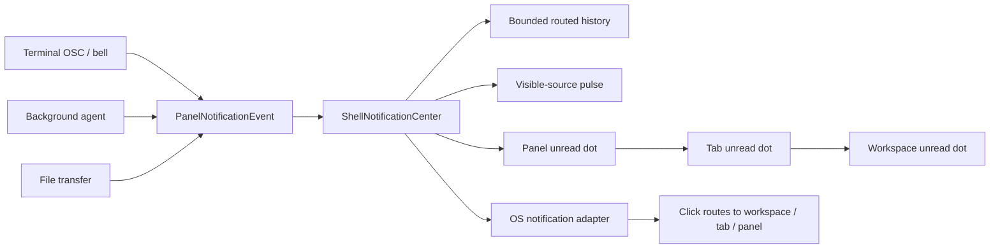

# Notification pipeline

## Target status

| Target | Status |
|---|---|
| Terminal notifications | Supported for applications that emit OSC 9 or OSC 777, plus bell after host activation. OSC 99 and a generic shell-facing `notify` command remain gaps. |
| Browser notifications | Blocked by the current Exclr8CEF Alloy+OSR runtime; see the browser gap below. |
| Background AI agent completion | Supported for the built-in workspace agent on success and failure; cancellation is intentionally quiet. |
| File-transfer completion | Supported once per completed or failed owner-scoped transfer. |
| Source → panel → tab → workspace indicators | Supported, with exact-source visibility suppression and dynamic topology reconciliation. |
| OS notification centers | Supported for live-process delivery and activation on Linux, macOS, and Windows, subject to host permission/identity requirements. |

## Behavior

Asura treats a notification as a routed, moment-in-time request for the
user's attention. The producer chooses its effects independently:

- `Visual` leaves an unread mark at the source panel and bubbles it through the
  containing tab and workspace.
- `System` asks the host adapter to publish into the operating-system
  notification center.

When the exact source panel is already visible in the focused window, the shell
records the notification as read, suppresses both sticky unread indicators and
native delivery, and briefly pulses that panel's outline as an in-app
acknowledgement. Merely showing the same workspace does not suppress or clear a
notification from another panel. Agent work belongs to the workspace's agent
surface, so opening the workspace does not clear it until that surface is shown.

Runtime IDs, rather than view references, are retained in the bounded history
and native payloads. Reconciliation after every accepted workspace graph change
attaches new sources, detaches removed or replaced sources, rebinds moved
panels, and preserves an unread mark across a same-ID replacement.

## cmux reference alignment

The local cmux reference reinforced four choices in this first slice: serialize
producer handoff, keep a bounded central history, route by stable workspace and
surface identities, and treat native delivery as a projection of the in-app
record rather than as the source of truth. Asura's center is deliberately
smaller, but it keeps those same boundaries so a later feed can be added without
moving unread ownership back into individual views.

cmux capabilities intentionally left for follow-up are called out below: OSC 99
and generic `notify` CLI ingress, jump-to-latest and feed controls,
application-icon counts, and withdrawing delivered OS notifications when a
record is read or cleared.

## Source support

| Source | Current behavior | Effects |
|---|---|---|
| Terminal | OSC 9 and OSC 777 desktop notifications are observed for every live panel, including background workspaces. The watch starts only after the session host accepts the terminal, and spawned shells receive managed `TERM`, `COLORTERM`, and `TERM_PROGRAM=ghostty` values so terminal-aware applications select a compatible notification protocol. Bell follows the terminal profile's Disabled, Visual, System, or SystemAndVisual setting. | Explicit notification: Visual + System. Bell: profile-controlled. |
| Built-in AI agent | A successful or failed run notifies when its agent surface is hidden or the window is unfocused. Cancellation does not notify. | Visual + System. |
| File transfer | The destination panel's owner-scoped queue emits one completion or failure notification per transfer. | Visual + System. |
| Browser | Not supported in the current embedded runtime. Alloy+OSR denies Web Notifications before the permission handler and does not initialize Chromium's platform notification service. CDP observation is profile-wide and cannot by itself attribute a service-worker event to one panel. | None. |

## Host support

| Host | Adapter | Activation |
|---|---|---|
| Linux | XDG Desktop Portal `org.freedesktop.portal.Notification` | Live action callbacks route by notification/workspace/tab/panel ID and preserve the portal activation token. |
| macOS | `UNUserNotificationCenter`; alert authorization is requested on first delivery. Requires an application bundle identity. | Live response callbacks route by notification/workspace/tab/panel ID. |
| Windows | Windows App SDK app notifications. | Live activation routes by notification/workspace/tab/panel ID. |
| Other/test hosts | No-op adapter; in-app unread indicators continue to work. | None. |

Native delivery is best-effort. A denied permission, unavailable portal, or
adapter error does not remove the in-app unread trail.

## Remaining gaps

1. Browser Web Notifications need an Exclr8CEF/Chromium vendor bridge for
   Alloy's `PlatformNotificationService`, origin-scoped permission UX, and
   click/action routing back to service workers. A `window.Notification`
   monkeypatch is not sufficient because it misses persistent service-worker
   notifications and their activation semantics.
2. Native activation is guaranteed only while Asura is running. Cold-start
   activation needs to enter the single-instance startup protocol with its
   notification route.
3. The Linux portal activation token is retained, but Avalonia 12 does not
   expose a public way to apply it when focusing an existing Wayland window.
   Internal routing succeeds; a compositor may still refuse to raise the app.
4. Native delivered notifications are not yet withdrawn when the same record is
   read inside Asura, and notification authorization/status is not exposed
   in Settings.
5. The bounded internal history has no notification-feed UI, jump-to-latest
   command, or explicit mark-read/mark-unread controls.
6. Terminal applications can use OSC 9/777 today, but there is no generic
   Asura `notify` CLI and no documented OSC 99 compatibility contract.
   Asura does not intercept application commands or inject provider hooks.
   An application that only prints a final response must emit a terminal
   notification protocol itself before Asura can report completion.
