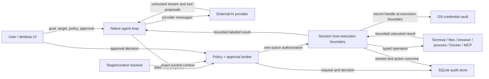

# Agent-to-tool threat model

- Status: Accepted for desktop-v1 implementation
- Date: 2026-07-25
- Scope: Asura desktop M3 agent target resolution, policy, approval,
  capability brokering, and audited tool execution
- Related decisions:
  [ADR 0017](../adr/0017-native-dotnet-agent-runtime.md),
  [ADR 0018](../adr/0018-native-ai-provider-and-chat-boundary.md),
  [ADR 0019](../adr/0019-one-action-agent-capability-broker.md),
  [ADR 0020](../adr/0020-native-webview-wrapper-and-first-browser-capability-slice.md),
  [ADR 0021](../adr/0021-governed-browser-state-and-navigation.md),
  [ADR 0022](../adr/0022-governed-browser-origin-containment.md),
  [ADR 0023](../adr/0023-governed-native-document-snapshots.md),
  [ADR 0024](../adr/0024-governed-browser-element-click.md),
  [ADR 0025](../adr/0025-governed-browser-element-fill.md),
  [ADR 0026](../adr/0026-native-browser-capability-conformance-gate.md),
  [ADR 0027](../adr/0027-governed-browser-element-check.md),
  [ADR 0028](../adr/0028-governed-file-viewer-observations.md),
  [ADR 0029](../adr/0029-scope-clipped-governed-workspace-graph-observations.md),
  [ADR 0030](../adr/0030-governed-file-viewer-mkdir-and-delete.md),
  [ADR 0031](../adr/0031-governed-terminal-character-chords.md),
  [ADR 0034](../adr/0034-governed-local-process-monitor-observation.md),
  [ADR 0035](../adr/0035-intrinsic-agent-user-clarification.md),
  [ADR 0036](../adr/0036-intrinsic-agent-capability-request.md),
  [ADR 0037](../adr/0037-bounded-native-provider-steering.md),
  [ADR 0038](../adr/0038-governed-native-dotnet-mcp-stdio.md), and
  [ADR 0047](../adr/0047-governed-local-git-tools.md)

## 1. Security objective

Asura lets a provider-backed, native .NET agent inspect and operate local
or remote terminal sessions and an initial ten-tool native-browser
state/snapshot/click/fill/check/navigation slice, perform bounded File Viewer
list/stat/text-preview observations plus the exact mkdir/permanent-delete
contracts, and perform scope-clipped workspace-graph observations plus exact
panel inspection and focus through governed application services. It can also
perform one bounded observation through an already-hosted local Process
Monitor panel. Production
currently enables governed WebDAV mkdir; governed permanent delete remains
fail-closed until a provider can prove its stronger semantics.
The runtime can also pause one provider tool continuation for a bounded local
user clarification. That response is intent data, not authorization.
It may separately ask the authenticated local user to change one currently
disabled, actually advertised production-tool capability to run-local `Ask`.
That policy decision approves no action; every later operation still requires
its normal exact authorization.
The authenticated local user may also steer one actively streaming initial
provider generation. Steering replaces uncommitted task intent only; it cannot
answer a question, decide a capability request, approve an action, change
policy, retarget the run, or rewrite a committed turn.
The MCP boundary may launch an explicitly configured local stdio server or
connect to an explicitly configured Streamable HTTP endpoint, freeze its
enabled tool manifest, and dispatch one governed tool call. It does not install
an agent or MCP runtime on a remote terminal target.
Model output, terminal output, browser content, file content, and MCP results
are untrusted data. None of them grant authority.

The security objective is:

> A tool action executes only when an authenticated live run, an exact current
> target, an explicit capability policy, the operation's risk, and any required
> user approval all authorize that one action. The session host revalidates the
> authorization at execution time and records the outcome without disclosing
> secrets.

## 2. Confirmed desktop-v1 assumptions

- Asura is a single-user desktop application. It does not expose inbound
  agent IPC, a local HTTP control endpoint, ACP, A2A, or a headless control
  endpoint in desktop v1.
- Same-account processes are not implicitly trusted. In-process composition
  reduces lifecycle complexity but is not an authorization boundary.
- Provider traffic is outbound HTTPS to an exact configured origin. Explicit
  unauthenticated HTTP is allowed only for an exact loopback endpoint.
- Provider adapters do not receive application tool executors, terminal
  sessions, file providers, browser objects, process launchers, or the OS vault.
- `Auto` may authorize routine read/wait actions. Mutations require `Ask`
  unless a more specific policy explicitly permits them. Destructive and
  high-risk actions still require approval in `Auto`. All five browser
  navigation tools are trusted mutations, so the current broker escalates
  `BrowserNavigation=Auto` to exact `HumanApproval`. `browser.click`,
  `browser.fill`, and `browser.check` are mutations under the separate `BrowserInteraction`
  capability and receive the same broker escalation. Only browser state and
  document snapshot reads normally receive `AutoPolicy`. Independently, the
  session-host browser gate accepts `HumanApproval` or an explicitly confirmed
  run-local `YoloPolicy` for click/fill/check and defensively accepts an
  `AutoPolicy` source only for closed observed operations and explicit
  navigation. It does not impose a site-origin allowlist. The three read-only File Viewer observations use the
  separate `ReadFiles` capability and normally receive `AutoPolicy`.
  `files.mkdir` is a mutation and `files.delete` is destructive; both escalate
  `Auto`, and the host accepts only exact `HumanApproval` or an explicitly
  confirmed run-local `YoloPolicy`. The four read-only workspace-graph
  observations use `Search`; they still require one-action authorization and
  audit because topology and titles disclose information.
- Every MCP tool is the trusted generic `mcp.call` mutation under `McpTools`.
  `Off` opens no MCP transport. `Ask` and `Auto` both require an exact
  `HumanApproval`; an explicitly confirmed run-local `YoloPolicy` can execute
  the same frozen one-action call without a second approval.
  Discovery metadata and annotations cannot supply capability or risk. A
  broker-issued launch lease for the exact registered actor, run, and live
  policy generation is required before catalog, vault, or transport access.
- `terminal.send_chord` is destructive terminal input, not text. It accepts
  one lowercase ASCII letter and exactly one Control or Alt modifier. `Auto`
  escalates, and SessionHost accepts only exact `HumanApproval` or an
  explicitly confirmed run-local `YoloPolicy`.
- `YOLO` is explicit, confirmed, target-scoped, run-bounded, immediately
  revocable, and audited. It is never inferred from a missing UI. Full access
  overlays every capability in the live run, including workspace layout,
  terminal, browser, file, database, Docker, and MCP tools that the exact
  workspace context actually exposes. Workspace, internal `OpenTab`,
  selected-panel, and exact-panel targets remain bound by the broker to that
  immutable run target. Typed request unions, current session/revision checks,
  input barriers, secret boundaries, cancellation, and one-action audit remain
  mandatory. Model data and durable policy cannot create the overlay.
- Durable screen and workspace policies accept only `Off`, `Ask`, and `Auto`.
  Selecting a saved screen for agent use grants no authority. The desktop must
  first instantiate its exact current revision, present the resulting live tab
  for review, and receive a separate confirmation binding the live window,
  workspace, and tab IDs. Missing dependencies or revision drift fail before
  authorization, and changing the ordinary scope clears this authorization
  context rather than widening it.
  When runtime graph acceptance succeeds, the desktop captures a normalized,
  complete policy plus its source definition IDs and revisions. Later
  definition edits cannot retarget the accepted tab. Recovery schema three
  preserves that exact provenance and rejects missing, malformed, incomplete,
  forged override markers, or YOLO-bearing policy data. Schema one and two
  restore a source-free, explicitly marked fail-closed default instead of
  consulting current definitions; the marker survives schema-three
  reserialization and clears only when current definition provenance is
  accepted.
- Governed prompts carry that trusted runtime policy into broker registration;
  `AgentPolicy.Provider` is the exact AI-provider profile ID and
  `AgentPolicy.Model` is the exact model supplied to the pinned provider
  adapter. A caller with no explicit override preserves configured permissions
  while binding provider/model identity to the selected profile and its
  captured default model. A saved override whose exact enabled profile is
  unavailable fails before broker registration or provider invocation.
  Provider output, model text, and panel content cannot provide policy. A target
  spanning multiple runtime policies takes the least-permissive value for each
  capability. Provider/model disagreement or an empty/invalid member set fails
  closed.
- Exact terminal-panel schemas omit `panel_id`. Every broader Workspace schema
  and every internal `OpenTab` or selected-terminal schema requires one current
  eligible `panel_id`, even when only one terminal can perform the requested
  operation; the parser never infers that identity from cardinality.
- `processes.list` is an observation under the independent `ProcessControl`
  capability, whose product default is `Off`. When explicitly enabled it still
  receives one-action authorization and audit. It can target only a current
  active local Process Monitor session; it cannot run a command, select a
  terminal connection, or observe the remote machine behind that terminal.
  Exact schemas omit `panel_id`; Workspace and internal `OpenTab` schemas
  require one current host-enumerated Process Monitor `panel_id`, even when
  only one is eligible.
  Sort and limit are restricted to a closed enum and `16`/`32`/`64`.
- `agent.ask_user` is an intrinsic runtime continuation, not a cataloged
  application action. Its closed schema carries only one bounded,
  strict-Unicode, literal-secret-free question. A random run-local ID, exact
  UTC expiry, one-way response claim, and post-response pinned-target check
  bind one submitted/declined answer to one pending question. The answer is
  explicitly non-authoritative: it cannot approve an action, change policy,
  add a capability, choose a target, or bypass the broker. Questions and
  answers create no action-audit or SessionHost operation.
- `agent.request_capability` is a separate intrinsic policy request, not a
  cataloged application action or ordinary approval. It is dynamically
  advertised only for capabilities mapped by the trusted catalog from
  ordinary production tools which are actually in the final current tool set
  and `Off` in the run policy. Its closed schema selects one stable capability
  token and carries no prose, target, permission, duration, persistence, or UI
  instruction. A separate authenticated, expiring card may change exactly one
  run-local permission from `Off` to `Ask`; it never grants `Auto` or YOLO and
  approves no action. Allow commits the broker's deterministic policy-update
  audit before success. Denial and expiry make no policy change and create no
  action audit.
- `agent.steer` is a human-only application operation, not a provider tool,
  broker action, clarification response, capability decision, or action
  approval. It is available once only while the initial provider generation is
  streaming after exact target resolution. The request binds the current run
  ID, exact projected initial kernel generation, and one bounded user update;
  a delayed request from an earlier turn cannot steer a later turn in the same
  run. Before the kernel accepts it, the runtime
  re-inspects the pinned target identity and, for Workspace or internal
  `OpenTab`, the current live topology. It revalidates the run/session/
  cancellation owner, immutable provider revision/current status, and
  baseline/run/effective policy generation. Acceptance preserves the exact
  provider/tool manifest for that steerable generation and creates one revised
  uncommitted user message.
  It changes no authority and creates no action or policy audit.
- The current desktop exposes ordinary live-scope choices for the active panel,
  current tab, Workspace, and selected terminals. It also exposes the separate
  two-phase saved-screen workflow described above; the template itself is never
  an `AgentTarget`. The run
  pins the selected exact enclosing identity and refreshes its current ordered
  eligible Terminal, Browser, File Viewer, Statistics, and Process Monitor
  topology before the initial provider call and between tool-result rounds.
  Tool schemas and the context inspector are rebuilt from that trusted refresh;
  new eligible panels may appear and closed panels may disappear without
  retargeting the run. Provider output cannot choose a window, workspace, or
  unadvertised panel.
  Exact panel/session, `OpenTab`, and selected-terminal targets remain
  internal/testable contracts. Exact and selected targets pin complete
  membership and fail closed on drift; `OpenTab` pins its enclosing identity
  and refreshes eligible topology like Workspace. Every broad action still
  requires a current host-enumerated `panel_id`, is narrowed to one exact
  panel/session, and is freshly revalidated adjacent to one-action permit
  consumption and dispatch.
- All five first-family workspace-graph actions are production-reachable.
  `workspace.inspect` accepts only `{}` and resolves the one workspace fixed
  by the trusted run context; `tab.list` and
  `panel.list` accept only an optional fixed page offset and no identity,
  discovery query, filter, sort, total, or page size. They project registered
  graph objects already inside the original target, including non-session
  Statistics and Process Monitor panels, and expose no sibling totals.
  Graphless sessions advertise none of the four observation tools. Exact
  panel/session `panel.inspect` and `panel.focus` schemas accept only an empty
  object. Every broader panel-action schema requires exactly one `panel_id`
  enumerated from current active graph-backed members, even when only one
  member is eligible; unknown or out-of-scope fields fail closed.
- Workspace layout mutations exist only for the one complete Workspace target.
  Their schemas enumerate current graph-owned IDs and trusted supported panel
  kinds. The action digest binds ordered topology, one `WorkspaceLayout` permit
  authorizes one mutation, and the UI bridge never retries drift. Unsaved
  database edits reject close. After the UI commit boundary, an absent or
  unverifiable fresh graph becomes the non-retryable tool failure
  `workspace_layout_outcome_unknown`. The locally observable graph remains
  available for reconciliation; a newer graph is accepted only when it retains
  the exact applied target.
- Normal browser chrome operations require the exact interactive `Human`
  actor/client. An `Agent` actor cannot use that API; the governed browser
  bridge requires broker authority and the exact interactive attachment owned
  by the approving client.
- Browser control uses the existing CEF panel and its sandboxed Chromium
  subprocesses. No Node.js controller, remote-debugging port, ambient JavaScript
  bridge, or separately agent-owned browser is launched.
- Governed File Viewer control uses the existing hosted `IFilePanelSession`.
  The model supplies only bounded structured path segments relative to a
  session-owned root. Governed mkdir and delete additionally require a
  non-root path. The model cannot supply a provider ID, authority, root,
  absolute path, version, page controls, continuation token, read limit,
  mutation precondition, recursive flag, trash/undo behavior, or retry policy.
  The host derives mkdir `MustNotExist` and permanent delete
  `Recursive: false`/`MustExist`.
  Ordinary mutation support is not agent authority. The runtime, composer, and
  host also require a production-assigned governed capability. Current
  production enables WebDAV mkdir only and no governed delete. Local, SFTP,
  FTP, and SMB pathname mutation remains human-only because prior
  ancestor checks are not race-bound to the later operation. WebDAV delete is
  human-only because a file can become a collection between kind inspection
  and DELETE, whose collection semantics would violate non-recursive approval.
  S3 key-only delete is human-only because bucket versioning can change
  concurrently and turn the claimed permanent delete into a retained-version
  soft delete marker.
  A saved File Viewer waits unbound for its exact profile, permits no
  substitution or location editing, and first binds the exact saved structured
  location; a failed first ensure retries only that location.
  Only versionless hierarchical sessions advertise this first slice; ordinary
  object/container File Viewer sessions remain available to a human.
- Document snapshots, click, fill, and check use fixed application-private
  native-adapter scripts, not provider-supplied JavaScript or selectors.
  Capture and the exact element registry are bounded page-realm mechanisms for
  the top document, not a cross-platform native accessibility tree or isolated
  browser world. Fill is limited to `<textarea>` and input
  `text`/`search`/`email`/`url`/`tel`; password, file, and contenteditable are
  excluded. Check accepts only native checkbox/radio inputs and never exposes
  uncheck or general property-setting authority.
- Production advertises state read, guarded navigation, and stop, but not
  snapshot, click, fill, or check. The shipped CEF adapter cannot bind policy
  to the connected peer, so every governed CEF mutation/automation request and
  detached rendered web-read/search request fails before native dispatch.
  Human navigation and bounded observation of already-loaded content remain
  separate. The omitted interaction operations also require an explicitly
  injected full-automation candidate profile until named-platform evidence
  closes the page-realm boundary. Factory, session, and renderer share one
  fixed profile, and renderer attachment rejects capability drift.
- Remote machines run no Asura agent. They receive ordinary terminal input
  through an already established connection and return terminal output.
- Future headless, ACP, A2A, remote browser control, and multi-user hosting must
  add authenticated caller identity and transport decisions without weakening
  this broker.

## 3. Assets

| Asset | Security property |
|---|---|
| Local and remote terminal control | Input is limited to the authorized live session and capability. |
| Local and provider-backed files | Reads and mutations stay within an explicit provider/profile and structured location prefix. |
| Connection and provider credentials | Application-managed and vault-resolved values remain in the OS vault and never enter prompts, transcripts, tool results, logs, or approvals. User-authored provider instructions are intentional prompt content and do not weaken this credential boundary. |
| Runtime workspace graph | A run cannot cross its immutable panel/session/`OpenTab`/Workspace/selection identity. Refreshing eligible topology inside the same Workspace or `OpenTab` is not target widening. |
| Browser profiles, authenticated pages, and snapshot references | Navigation, page data, one-shot exact-object handles, cookies, storage, downloads, and permissions remain separately governed. |
| Local process metadata | Observation is limited to one authorized hosted local Process Monitor, excludes command lines/paths/users/environment, and never implies remote-host process authority. |
| MCP server profiles, child processes, remote endpoints, transport secrets, and frozen tool manifests | Only trusted, enabled, revisioned stdio/Streamable-HTTP definitions, broker-authorized opens, and exact allowlisted run-frozen aliases can reach the generic governed call boundary. Imported profiles are forced disabled and untrusted; reviewed trusted profiles may be tested while disabled without becoming agent-selectable. Credential rotation closes every referencing session before returning. |
| Process mutation, Git, Docker, and network authority | Each family has an independent capability and risk rule. |
| Approval decisions | Decisions are tied to an actor, run, proposal, exact material arguments, target revision, scope, and expiry. |
| Audit history | Requested, decided, started, and agent-action outcomes are durable, correlated, ordered, and secret-free. |
| Application availability | Provider streams, output, waits, and tool work are bounded and cancellable. |

## 4. Trust boundaries and data flow

The important boundary is between a model proposal and a session-host
operation. A proposal is inert data. Only the broker can issue a one-action
authorization, and only the session host can consume it.

## 5. Entry points and attacker capabilities

### Entry points

- provider messages, streamed fragments, tool names, arguments, and usage data;
- terminal screen content, shell-integration metadata, escape-derived titles,
  and output from compromised remote hosts;
- browser DOM/accessibility text, URLs, downloads, dialogs, and page scripts;
- file names, metadata, previews, repository content, and structured documents;
- MCP server configuration, tool descriptions, arguments, and results;
- user-entered provider, connection, browser, file-provider, and policy
  configuration;
- durable definitions and runtime-recovery data loaded from SQLite;
- native terminal, embedded-browser, connection-library, and OS-vault adapter
  failures.

### Credible attackers

- a malicious or compromised AI provider;
- prompt injection embedded in terminal, browser, file, repository, or MCP
  content;
- a compromised remote SSH host or container;
- a malicious MCP server or file provider;
- a local same-user process attempting to reuse durable state or credentials;
- an operator who enables a broad policy without understanding its effect;
- accidental races caused by tab/panel/session closure, reconnect, retargeting,
  cancellation, or approval expiry.

Desktop v1 does not attempt to survive a fully compromised operating-system
account or kernel. It still minimizes credential exposure and ambient authority
so a content-level compromise does not automatically become tool authority.

## 6. Threats and required controls

| ID | Threat / abuse path | Impact | Required control |
|---|---|---|---|
| T1 | Provider emits a plausible tool call and bypasses application authorization. | Critical | Provider adapters expose proposals only. They have no executor or session-host dependency. Broker authorization is mandatory. |
| T2 | Terminal/page/file/process/panel-label/MCP content instructs the model to expand scope or reveal secrets. | Critical | All external content is labeled untrusted. File results carry `content_origin=untrusted_file`; MCP results carry `content_origin=untrusted_mcp`; local process results carry `content_origin=untrusted_local_process_metadata`; panel inspection carries `content_origin=untrusted_panel_metadata`; workspace-graph observations carry `content_origin=untrusted_workspace_graph_metadata`. Provider names/content, MCP server/tool metadata, graph and panel titles, connection boundaries, working directories, and process display names are bounded and redacted before continuation. MCP annotation fields are removed from provider schemas and cannot supply trusted approval text. Graph/process labels with literal-secret shapes or unsafe Unicode are replaced and accepted labels are rune-safe truncated to 128 UTF-8 bytes. Content cannot modify target, policy, approvals, or tool schemas. Secrets use opaque handles only. |
| T3 | A target silently widens to another workspace/tab/connection, or a stale provider-selected panel is substituted after topology refresh. | High | The visible run pins one immutable window/workspace identity; provider data cannot name or change it. Workspace and internal `OpenTab` targets refresh current eligible topology only inside that enclosing identity at provider-round boundaries. Every resulting broad schema enumerates current eligible panel IDs, and each proposal is freshly parsed, narrowed, approved, and executed against one exact current panel/session binding. A panel that disappears or changes after proposal preparation fails closed rather than being substituted. Internal exact and selected-terminal targets retain their complete fixed membership and reject drift. No refresh crosses the pinned workspace/tab identity, and no action falls back to another member. |
| T4 | A target or interactive terminal/browser attachment, File Viewer session, or Process Monitor session changes after approval but before execution. | Critical | Broad tool schemas expose only capability-supporting current panel IDs and require `panel_id` for browser, File Viewer, Process Monitor, and governed panel actions even when only one member is eligible. Exact panel/session schemas omit `panel_id` and accept only their closed action-specific fields; exact `panel.inspect` and `panel.focus` accept only `{}`. The runtime parses the selected ID against a fresh live resolution, and the trusted composer narrows it to one exact panel/session. Graph observations separately bind the current ordered scope-relative `window/workspace/tab/panel/kind` sequence for that action. SessionHost reconstructs that clipped sequence under its graph gate around one-action consumption; add/remove/reorder/kind drift during the action or exact-session supersession fails before projection, while a completed Workspace/`OpenTab` change may become the next round's freshly resolved baseline. For `panel.focus`, SessionHost holds the graph gate across exact resolution, permit consumption, fresh binding comparison, adjacent cancellation check, and expected-revision graph activation. No focus occurs before the one-action permit; revision/session drift fails before commit; late cancellation cannot erase a committed receipt; already-focused activation preserves graph revision and sequence. Governed browser dispatch requires exactly one current interactive attachment owned by the authenticated approving desktop client. Terminal resize similarly requires one owned attachment, preserves its trusted logical dimensions/render scale, and binds its opaque identity plus every viewport field. File approvals and authorizations bind the exact session revision, provider profile, authority, immutable trusted root, relative segments, and host-owned operation bounds. Process observation binds exact local panel/session revision, capabilities, sort, and limit, then post-validates the binding before publishing the one captured sample. File-mutation requests additionally bind the trusted operation while SessionHost derives `MustNotExist` for mkdir or permanent `Recursive: false`/`MustExist` for delete; the model cannot supply those fields. Approval and authorization bind target IDs, session and attachment IDs where applicable, graph/session revision, operation, material-argument digest, run, actor, and expiry. Host revalidates ownership, scope, exact session revision, provider/session capability, lease or attachment authority before starting. SessionHost projects the browser's trusted canonical origin plus document revision into immutable session metadata and the context fingerprint. Click, fill, and check require the requested revision to match that projection; their approval and digest bind its canonical origin, and execution reconstructs the material from a fresh context so origin or revision drift fails before authorization consumption. A guarded browser mutation additionally binds the committed address/document revision used by domain policy and rechecks it on the renderer UI thread; later drift fails retryably with `browser_state_changed` before native dispatch. Snapshot capture binds the same exact logical address/revision, translates it to the exact last-projected renderer-local document, and rechecks both before publishing; renderer revision regression invalidates the projection and references and fails closed. Click and check approvals bind the complete opaque reference and provider document revision; fill binds both plus the exact bounded text. The host binds the current address, and the session translates the exact logical source document to its renderer-local projection and verifies the returned receipt. Browser and file agent actions cannot use their normal human paths. Renderer, human, and governed terminal resizes share a per-session engine-plus-metadata transaction; after a successful engine/browser/file-mutation return, unrelated revisions and late caller cancellation do not reverse a reported effect, while changed authority before dispatch still fails closed. Missing, ambiguous, replaced, or revoked attachments/sessions are never inferred or substituted. |
| T5 | A mutation is mislabeled as a read and runs under `Auto`. | Critical | Closed tool catalog assigns capability and risk in trusted code. Model/provider supplied risk labels are ignored. The four workspace-graph reads and `panel.inspect` are `Search` observations; `processes.list` is a separate `ProcessControl` observation whose default remains `Off`; `panel.focus` is a `RunCommands` routine action and therefore follows the run's command permission rather than inheriting inspection authority. `browser.click`, `browser.fill`, and `browser.check` are mutations under distinct `BrowserInteraction`, the broker escalates `Auto`, and the host accepts exact `HumanApproval` or confirmed run-local `YoloPolicy`. `files.list`, `files.stat`, and `files.read` are closed observations. `files.mkdir` is a create-directory mutation and `files.delete` is destructive; both escalate `Auto`, and the host independently accepts only exact `HumanApproval` or a confirmed run-local `YoloPolicy`. Every MCP alias maps to the trusted generic `mcp.call` mutation regardless of server annotations; `Auto` escalates to human approval, while confirmed run-local Full access uses `YoloPolicy`. No rename, write, upload, transfer, trash, recursive-delete, or root-delete request exists in the agent file union. Unknown tools fail closed. |
| T6 | An approval or element reference is replayed, reused for changed arguments, or consumed by another run/document. | Critical | Approval produces a random opaque, one-action authorization with exact bindings, short expiry, atomic single consumption, and durable correlation. Snapshot references are separately random, exact-document/adapter-bound, two-minute leases; an accepted click, fill, or check invalidates the complete snapshot reference set before native mutation, and next snapshot/navigation/revision/replacement/detach/close also revokes them. |
| T7 | `Off`, a denial, cancellation, or YOLO revocation races with tool start. | High | The broker owns effective policy and run state. Policy/run revocation cancels the old authority generation before waiting for broker audit I/O; pending, stale, or cancelled generations fail closed at consumption. A revocation racing a durable `started` event records `started -> cancelled` and never returns a usable permit. Cancellation reaches provider and tool work. Browser-interaction and governed-file-mutation cancellation is authoritative only before the native/provider mutation invocation commits; afterward a valid result or non-retryable outcome-unknown wins, so cancellation cannot falsely authorize a duplicate retry. |
| T8 | Agent terminal input conflicts with a human or continues invisibly. | High | Input arbiter grants an agent lease. The host links execution to the lease-authority token, and human lease preemption cancels blocked or in-flight agent input. Tools that inject terminal input require the explicit `terminal.agent_input_barrier` capability. Governed mouse input is a closed, bounded terminal-cell event whose button, kind, coordinates, modifiers, and exact session are bound to approval; the host independently rechecks both `terminal.mouse` and the barrier immediately before typed dispatch. Governed paste is available only with both `terminal.paste` and the barrier, never reads the ambient clipboard, and receives one one-action lease immediately before typed dispatch. `terminal.submit_text` additionally requires Enter support and combines paste encoding plus protocol-correct Enter into one queued PTY write, preventing human or agent input from interleaving between text and submission. Repeated special-key input is capped at 64 and encoded into one queued PTY write under the same lease, so clearing a bounded draft does not create an interleaving window. Rendered-screen search and revision-bound diffs are observation-only, byte/row bounded, and labeled untrusted; a stale diff baseline returns unavailable rather than reconstructed content. Generic interactive state and its optional input range are app-authored, expiring, untrusted observations, are clipped to the actual viewport, and never grant authority or claim approval semantics. The portable engine retains cancellation authority through the PTY write, skips cancelled queued work, normally waits for flush, and treats successful `WriteAsync` as the irreversible commit point: later cancellation or flush failure preserves the committed receipt while failing the session, rather than inviting a duplicate retry. Failure or shutdown drains every uncommitted acknowledgement. The managed path reacquires the exact human attachment lease adjacent to dispatch; the macOS native path synchronously gates every keyboard, modifier, IME, paste, and mouse event and advances an epoch that queued programmatic sends recheck on the AppKit main thread. Native smoke proves both current-epoch guarded paste and stale-epoch rejection after physical input. A renderer without that complete invariant receives no agent input tool. Terminal resize uses separate exact-attachment authority and serialization and grants no keyboard or mouse authority. Governed browser actions use their own exact browser attachment authority and never acquire or imply a terminal input lease. The UI shows the active operation and keeps stop/cancel available during waits and streaming. |
| T9 | Approval UI hides dangerous material arguments or host context. | High | Prompt shows actor, operation, exact target, applicable terminal host/working directory or complete bounded browser navigation URL, and—for click/fill/check—the trusted canonical current origin, exact opaque reference, and document revision. It uses a reversible quoted/escaped rendering of exact bounded fill or paste text, including whitespace and permitted controls. File presentation shows the exact provider profile/authority, trusted root and relative path, plus first-page/hidden policy, preview bound, mkdir `MustNotExist`, move's exact destination and `MustNotExist`, or permanent recursive/non-recursive delete `MustExist` semantics. Delete explicitly means whatever occupies that exact path at dispatch; it does not claim observed-object identity. The digest independently binds the raw exact material, including the interaction origin. Paste and file mutations can be confirmed only by exact human approval or an already-confirmed run-local YOLO policy; `AutoPolicy` fails again at the host. Prompts also show bounded redacted arguments, risk, duration, and once/session/persistent effect. Destructive actions are not summarized as routine. Page-authored role/name remains desirable context but never authority. |
| T10 | Secret values leak through prompts, command lines, environment, HTTP headers, results, audit, diagnostics, or errors. | Critical | Vault resolution happens only inside the execution adapter with exact scope/purpose. Audit stores reference/purpose only. Redaction and architecture tests reject secret-bearing shapes. Portable imports force AI-provider profiles disabled and replace every API-key or OAuth `SecretRef` before persistence, so a retargeted endpoint cannot inherit a stored profile-scoped credential. MCP profiles persist only environment/header names plus scoped `SecretRef` values. The direct child starts with environment inheritance cleared; remote HTTP receives only explicit non-reserved vault-backed headers. Transport secret values are bounded UTF-8, the host drops request/launch dictionaries after connection, keeps only clearable exact-secret redaction buffers for the run, and exposes count-only stderr metadata. MCP projections redact exact and likely literal secrets and omit process/endpoint/environment/header/profile/error identities. Panel inspection marks descriptive metadata untrusted, redacts secret-shaped title/connection/path fields, and never returns session status detail; focus returns only host IDs and commit receipt fields. Governed paste rejects likely literal-secret material before approval, never reads the OS clipboard, and exposes only a completion receipt rather than echoing text to the provider or audit. Browser state/snapshot output removes HTTP(S) query and fragment data, redacts secret-shaped page text, and maps failures through a closed stable-code allowlist instead of exposing renderer messages or arbitrary native/provider codes. Fill rejects literal secret-shaped text before approval; its provider result and durable audit never echo the text. Governed file paths reject literal-secret-shaped arguments, textual previews are strict UTF-8 and secret-shaped data is withheld or redacted, and closed file failure codes expose no provider message. File-mutation success returns only fixed `created`, `moved`/`destination_created`, or `deleted`/`permanent` booleans, plus the already trusted `panel_id` in broad scope. File content, names, versions, continuation tokens, raw paths, provider receipts, provider error messages, and raw MCP results are not persisted in audit. |
| T11 | Tool output exhausts memory, blocks indefinitely, or floods provider context. | High | Requests, snapshots, output bytes/tokens, event counts, waits, artifacts, and durations have explicit limits, truncation metadata, cancellation, and backpressure. MCP stdio adds pre-deserialization wire-message/JSON depth/node/duplicate-property bounds and bounded stderr draining; Streamable HTTP adds response-header, session-ID, and aggregate JSON/SSE response-byte bounds. Both enforce bounded tool pages/count/schema/argument/result/content items, one serialized call per run, and a final 64-KiB provider envelope. Each untrusted panel-inspection display field is limited to 128 UTF-8 bytes after redaction; focus emits a fixed receipt. Governed paste accepts exactly one non-empty Unicode value bounded to 2,048 UTF-8 bytes and permits only tab and line-break controls. Governed file paths are at most 64 segments/4 KiB, list is first-page-only at most 100 entries with hidden items disabled, and read is a strict-UTF-8 text/structured preview at most 64 KiB; serialization measures the escaped result envelope and reduces it to the kernel result limit. Remote protocols without server-side paging reject a directory snapshot after a fixed entry/name-byte ceiling and check cancellation while capturing it, before sorting and projecting a page. Native document capture accepts at most 128 nodes, permits only one outstanding capture per surface, and uses a bounded deadline; cancellation fences late completion and a timed-out ambiguous adapter is quarantined for fail-closed replacement. Provider snapshot serialization measures the actual escaped JSON envelope and reduces its projection until it is at most 64 KiB. Click/fill/check exclude concurrent capture/navigation/interaction, share a bounded native deadline, and accept only closed one-field native results of at most 1 KiB; fill input is limited to 2,048 UTF-8 bytes and malformed output becomes outcome-unknown. |
| T12 | Audit omits a denied, failed, cancelled, or partially started action. | High | The broker durably records requested/decision/started states before granting authority. If an action-outcome append cannot be confirmed, it retains the exact immutable completion and deterministic audit event in bounded quarantine, suspends the run, and cancels current-generation authority. The host retries only that same completion and never redispatches the panel, terminal, browser, or file operation; changed retries fail closed. If the retry remains unresolved, provider continuation stops and the run is cancelled with a stable recovery error. SQLite enforces deterministic idempotent phase transitions, durable action claims prevent restart replay, and startup recovery reconciles orphaned `started` actions to secret-free `failed` with `application_restart_outcome_unknown`. Stable correlation IDs join run, proposal, authorization, and execution. |
| T13 | MCP adds a hidden local/remote execution path, inherits desktop credentials, redirects secrets, keeps a rotated credential, changes its catalog after discovery, or repeats an ambiguous side effect. | Critical | Schema-two durable profiles contain a closed `stdio` or `streamable-http` transport plus exact enabled tool names and no literal secret. Stdio carries one executable, ordered arguments, optional working directory, and environment-name-to-`SecretRef` bindings; HTTP carries one bounded absolute HTTP(S) endpoint, explicit plaintext acknowledgement, and non-reserved header-name-to-`SecretRef` bindings. Non-current schemas are rejected without conversion. Imported profiles are forced disabled. `McpTools=Off` opens no transport. The only exported `Asura.Mcp` production type is the governed session host; low-level clients, transport secrets, SDK DTO projection, and options are internal. Before catalog, vault, or transport access, that host requires a broker-issued lease for the exact registered actor/run and live enabled policy generation. The private stdio boundary uses no shell, clears ambient environment, bounds strict newline JSON, secret values/environment block, stderr, and root-process cleanup. The HTTP boundary forces Streamable HTTP, rejects redirects and cross-origin requests, disables ambient cookies/proxy/decompression, reserves protocol/framing headers, and bounds response headers, session IDs, and JSON/SSE body bytes. The SDK supplies initialization, POST message framing, JSON/SSE parsing, and session/protocol headers; the separate SSE transport is unsupported. Discovery intersects bounded pages with the exact allowlist and freezes profile revision, transport kind/target, negotiated protocol/server identity, secret-redacted display name, private per-session HMAC tool identity, sanitized object schema/digest, and provider-compatible run-local alias. Notifications only stale that manifest. Replacing or deleting an MCP-scoped credential synchronizes with any in-flight diagnostic probe and removes, cancels, and disposes every run that resolved it before returning. Every alias maps to trusted `mcp.call`; `Ask` and `Auto` require exact human approval; confirmed run-local Full access uses the same frozen one-action path without another prompt. The host re-inspects target/profile/manifest, consumes one authorization, and dispatches once. It never retries a tool call. Every post-dispatch cancellation, HTTP disconnect, transport failure, process exit, malformed/oversized result, or other invalid response is non-retryable `mcp_tool_outcome_unknown`; the uncertain MCP session closes, the result is committed, the stale batch remainder is skipped, and the provider can recover only from fresh observations. Valid text/structured results are bounded, redacted, and labeled `untrusted_mcp`; binary/resource content, stderr, raw exceptions, server-chosen diagnostic identifiers, and operational identities are omitted. Portable process APIs cannot prove containment of detached descendants; a configured executable is trusted code running with desktop-user authority, not a sandbox. A remote server has the authority of the deliberately delegated header credentials and can exfiltrate them. |
| T14 | Browser navigation or an element reference retargets after document/DOM change. | High | `BrowserData`, `BrowserInteraction`, and `BrowserNavigation` are separate capabilities. The broker escalates navigation mutations plus click/fill/check to exact `HumanApproval`; the host rechecks the authorization source, and click/fill/check accept `HumanApproval` or confirmed run-local `YoloPolicy`. Asura intentionally does not impose a same-origin browsing allowlist: authorized navigation, redirects, history movement, and activated links may cross sites. Guarded navigation and interaction still require `browser.navigation_origin_guard`, a ready/non-overlapping session, the exact logical starting address/revision translated to the renderer-local document, and an unrestricted navigation boundary. Interaction navigation waits for its terminal event; a nominal check success with no observed start waits through one queued UI-turn observation barrier. Snapshot uses only a fixed private script, accepts at most 128 top-document nodes, and returns random opaque leases bound to the exact document, adapter, snapshot nonce, element token, and mutation epoch. The fixed page-realm registry stores the exact `HTMLElement` object plus a validation closure, not a selector or sibling-index locator. Its `MutationObserver` watches top-document subtree/attribute/text changes; snapshot begin/finish and interaction dispatch flush pending records, and any epoch change clears the registry as stale. Click revalidates the exact object before synthetic activation. Fill restricts the exact object to supported text controls, rejects hidden/inert/disabled/read-only controls and deterministic normalization, and verifies the exact value before and after the synthetic `input` event. Check accepts only a native checkbox/radio and verifies checkedness after native activation. An accepted interaction clears all public/native leases before mutation. References also expire after two minutes, next snapshot, navigation/revision, adapter replacement, detach, or close. |
| T15 | A local process invokes future headless/ACP control without identity. | Critical | No desktop-v1 inbound endpoint. Future transports require authenticated caller identity, replay protection, approval routing, rate limits, and a separate ADR. |
| T16 | Audit records or durable approvals are edited to manufacture authority. | High | Audit is evidence, not an authorization source. Live broker state and one-action tokens are authoritative; persistent policy changes require authenticated UI confirmation and generation changes. |
| T17 | A committed browser click, fill, or check has an unknown outcome and the model retries an irreversible page action. | Critical | Cancellation is accepted only before native dispatch commits. After commit, malformed/oversized native output, timeout, exception, navigation ambiguity, receipt mismatch, or an unexpected in-process host exception becomes non-retryable `browser_interaction_outcome_unknown`; it is never normalized to cancellation and the interaction is never redispatched. A checkbox/radio that is definitely still unchecked returns the distinct retryable `browser_check_state_not_applied`. Observation/navigation host exceptions retain `browser_host_failed`. Check dispatch blocks page navigation for the operation, and ambiguous verification invalidates semantic references while preserving the current renderer and document rather than resetting it to `about:blank`. The runtime commits truly unknown results, skips every later proposal from the now-stale batch as `tool_batch_reconciliation_required`, and returns control to the provider for a fresh observation rather than destroying the conversation. |
| T18 | A hostile page poisons page-realm built-ins before or after snapshot capture and defeats exact-object or type checks. | Critical | Fixed scripts, closed parsers, and captured methods remain defense in depth but are not treated as an isolated world: `Map`/`Set`, `Function.prototype.call`, prototypes, and other realm-visible APIs may change before or after registry installation. Production therefore omits snapshot, click, fill, and check. The explicit full-automation candidate is limited to tests/conformance until a named adapter supplies hostile-page evidence. Factory, session, and surface share one immutable profile, renderer attachment requires exact capability equality, the host rejects a created session whose capabilities differ from the factory snapshot, and Desktop constructs its renderer from that same profile. |
| T19 | A file profile changes behind a live panel, a deferred saved panel binds a distractor root, or a malicious provider returns paths/tokens/content outside the requested scope. | Critical | The production File Viewer leases one complete provider-adapter generation for the session lifetime; list/stat/preview, ordinary and governed mutations, transfer enqueue, and retry use that generation, while active transfers retain an additional lease. Same-ID catalog replacement retires but cannot retarget that panel, and a new panel receives the new generation. A saved panel waits without host authority for its exact profile, refuses substitution, root fallback, or location editing, and binds its exact saved structured location on the first ensure; controls remain disabled during that commit and retry preserves the same location. The connection selector follows catalog materialization until a target is chosen; switching replaces the hosted panel session instead of retargeting its bound provider generation. Immutable metadata binds the exact initial root, capabilities, and limits into context and action fingerprints. SessionHost reconstructs requests from that metadata, then rejects excessive/hidden/malformed list entries, non-child or out-of-root paths, mismatched stat/preview locations, oversized/non-text/invalid-UTF-8 previews, and identity drift. Governed mkdir/delete/move additionally require non-root paths; move binds and resolves both source and destination inside the same immutable trusted root. The host derives mutation preconditions and validates exact in-root receipts, including mkdir final name and directory kind and move's exact destination. The panel boundary validates read-receipt source, offset, byte count, and bounded destination length before publishing a preview. Accepted locations are rebuilt from trusted request material; versions and continuation tokens are stripped, errors use a closed stable-code map, and runtime projection is bounded/redacted and labeled untrusted. |
| T20 | A provider, definition edit, recovery payload, or heterogeneous broad scope silently replaces the policy governing a live run. | Critical | A saved-screen template grants no agent authority: the desktop instantiates one exact current revision, requires review and separate confirmation of its exact live window/workspace/tab identity, and represents authority only as the resulting `OpenTab` target. Missing dependencies, pre-instantiation revision drift, stale live IDs, and unconfirmed pending instances fail closed; an ordinary scope change clears the saved-screen authorization context. Later definition edits cannot retarget an accepted live instance. Runtime graph acceptance captures immutable source IDs/revisions, an explicit-override marker, and a normalized durable policy before publication. The trusted desktop, not the provider request, supplies that policy to governed-run registration, and the run pins it until Clear. Provider is the exact profile ID and model is passed unchanged to the pinned adapter; an unavailable or mismatched explicit profile fails before broker/provider work. A no-override run binds configured permissions to the selected profile and captured default model, so presentation, broker, audit, and transport share one endpoint identity. Recovery schema three validates the complete capability set, provider/model, durable modes, override/fallback markers, and provenance before restoring; older schemas use a marked source-free default and reject newer fields under an older label. Broad scopes aggregate every explicitly governed member capability by least privilege, reject mixed explicit/inherited membership, and reject empty scopes or provider/model disagreement. Durable definitions and recovery never carry YOLO; only the separately confirmed live-run overlay can add it. |
| T21 | A graph observation leaks sibling topology, treats global ordinals as authority, or returns unbounded hostile titles. | High | Every graph projection is clipped to the immutable target identity before tool composition. Schemas accept no IDs or discovery query; fixed pages publish no totals. Each action's structural digest uses only its current ordered relative in-scope identity/kind sequence, so out-of-scope sibling insertion or reorder neither leaks through results nor creates a distinguishable failure. Drift during that action fails closed; Workspace and internal `OpenTab` may accept a completed in-scope topology change only through the next trusted round refresh, while exact/selected targets reject membership drift. Clipped results omit the global workspace revision and graph sequence clocks; only a complete Workspace target receives them. Graphless sessions advertise no graph tools. Results omit session and operational metadata, replace secret-shaped or unsafe-Unicode titles, truncate accepted titles to 128 UTF-8 bytes, carry an explicit untrusted origin, and enforce both application and serialized 64-KiB limits. |
| T22 | A file mutation happens, its response is lost or invalid, and the provider/model retries an irreversible effect. | Critical | SessionHost performs an adjacent final authority/cancellation check and invokes the captured mkdir/move/delete provider operation exactly once. A definite typed no-commit provider rejection is mapped to a closed failed tool result and returned to the model without redispatch. Once invocation begins, an ambiguous transport/cancellation failure, exception, or invalid/mismatched receipt becomes non-retryable `file_mutation_outcome_unknown`, is audited `Failed` rather than `Cancelled`, and is never redispatched. A valid exact receipt wins late cancellation, revocation, or drift. The runtime commits the ambiguous result, skips every later proposal in that stale batch, and requires fresh state inspection before a new provider-chosen action. Only the exact completion-audit event may use bounded reconciliation. S3/S3-compatible construction sets both `MaxErrorRetry` and `MaxStaleConnectionRetries` to zero and encodes the one-object mutation as one-key `DeleteObjectsAsync` POST with per-object `ETag` value `*` for `MustExist`, avoiding the response-less transparent replay observed with single-object DELETE. A bounded loopback proves one fully received POST for both a valid 503 and a zero-response-byte disconnect. WebDAV MKCOL and ordinary DELETE use explicit zero-length content; a second bounded loopback proves one fully received request after a zero-response-byte disconnect rather than the transport's otherwise observed replay. |
| T23 | An ordinary file provider capability is mistaken for race-free agent authority, truthful permanent deletion, rename authority, or recursive semantics. | Critical | Governed tools require separate production-assigned capabilities in addition to ordinary `CreateDirectory`/`Rename`/`Delete`, and the runtime, composer, and SessionHost each fail closed without them. Production grants local providers governed mkdir/move/delete and WebDAV only governed mkdir; remote rename/delete paths remain human-only where the adapter cannot prove the required mutation boundary. Local/SFTP/FTP/SMB ancestor checks are not bound to later pathname use. WebDAV kind inspection cannot prevent a file-to-collection replacement before recursive collection DELETE. S3 key-only delete can create a soft-delete marker and retain prior data if bucket versioning is enabled or suspended, and versioning can race a prior status check. Registration defaults to no governed capability; adapter-family, exact/broad schema, composer, and host-drift tests enforce the matrix without removing ordinary UI operations. |
| T24 | A character chord is smuggled as text/raw bytes, mislabeled as routine, or races physical terminal input. | Critical | `terminal.send_chord` accepts only one lowercase ASCII letter and exactly one Control or Alt modifier; bytes, escapes, text, key codes, modifier arrays, Shift, Meta, and combined modifiers are absent and rejected. The trusted catalog marks it `DestructiveTerminalActions`/`Destructive`; `Auto` escalates and SessionHost independently accepts only exact human approval or confirmed run-local YOLO. The composer binds the canonical chord and exact session. The host requires `terminal.send_chord` plus `terminal.agent_input_barrier`, consumes one permit, acquires one one-action lease, rechecks authority, and dispatches the typed port once. Portable input commits at the successful PTY write. The native shim exposes only an additive epoch-guarded ABI that validates the chord and rechecks physical-input epoch synchronously on the AppKit thread; stale authority sends nothing, and a committed receipt is never retried. |
| T25 | A local process observation is retargeted to a remote terminal, leaks secret-rich metadata, races panel closure, or floods provider/audit context. | High | `processes.list` exists only for an active graph-backed local Process Monitor session and uses `ProcessControl`/`Observation`; it never shells out or accepts a connection, command, session, or continuation token. It accepts only a bounded sort, limit, offset, optional exact PID, and optional bounded name filter. The exact composer binds panel/session/revision/capabilities and all filter/page material. SessionHost resolves and consumes one permit under the graph gate, invokes the captured typed monitor once outside the gate with caller/permit/session-close cancellation, then re-resolves and discards the sample on target drift. Hostile snapshots must satisfy UTC, count, PID uniqueness, finite CPU, memory, and row-limit invariants. Names use strict Unicode, secret/path/control redaction, and a 128-byte rune-safe bound. Provider JSON is measured at 64 KiB and omits command line, executable path, user, environment, open files, cumulative CPU time, and native errors. Audit stores only the stable result, duration, and returned count—not names, PIDs, measurements, source counts, or JSON—and completion reconciliation never recaptures. |
| T26 | A model uses a clarification to phish a secret, impersonate approval, bind a stale answer, flood the UI, or smuggle authority into a later action. | High | `agent.ask_user` is an intrinsic with a closed one-question schema and no capability, risk, broker, SessionHost, or action-audit path. Question and answer text use strict Unicode, single-line byte limits, and literal-secret rejection. The UI labels model text as untrusted and says that responses are neither approval nor a credential channel. A fresh opaque ID plus `now >= expiry` under the runtime gate atomically claims one response; stale, duplicate, late, cancelled, disposed, or stopped responses fail. The pinned target identity and applicable current topology are revalidated before presentation and after capture; exact/selected membership drift or enclosing-identity loss returns a fixed non-echoing failure. Only a matching successful structured result committed by `NativeAgentSession` can enter provider continuation or visible question/answer history. Questions are sequential, cannot overlap, expire independently, and remain subject to explicit decline or Stop; no call-count or whole-turn limit truncates legitimate workflows. Every later action still requires its own trusted catalog classification and broker authorization. |
| T27 | A model uses a capability request to self-escalate, grant multiple or unavailable tools, reuse an action approval, race target/policy drift, or retain authority across runs. | Critical | `agent.request_capability` is a native intrinsic outside `AgentToolCatalog`. Its dynamic closed one-token schema is derived only from the final actually advertised ordinary production tools and their trusted catalog mappings whose run-policy permission is currently `Off`; it is absent under YOLO. At most one accepted request reaches a human decision per top-level send. A separate random ID, `AwaitingCapabilityDecision` state, two-minute expiry, authenticated trusted-content card, and one-way claim cannot be substituted for a question or action approval. Pre- and post-decision checks bind the exact run, pinned target identity, applicable current topology and advertised tools, candidate, and policy generation. The broker persists a secret-free Requested event before presentation and exactly one closed terminal decision. Allow performs only run-local `Off`-to-`Ask`; the policy transition carries the same request ID and is durable before success. Audit ambiguity suspends or revokes run authority. The intrinsic returns no model prose, target, IDs, actor, or display text, never calls ordinary broker `RequestAsync`, receives no permit, and never invokes SessionHost. Denial/expiry create no action audit or policy transition, but close the separate capability-request audit chain. Stop, Clear, disposal, or a new run closes/discards the request and grant. Every subsequent action still requires its own trusted classification and exact authorization. |

## 7. Authorization invariants

The following invariants are mandatory:

1. A model proposal never directly calls an application operation.
2. Provider code cannot reference session-host, terminal, file, browser,
   process, Docker, MCP, native-loader, or general filesystem execution types.
3. The effective target is resolved from the current host graph. Missing,
   stale, mismatched, or out-of-scope IDs fail closed. Workspace and internal
   `OpenTab` runs retain exact enclosing identity while refreshing their current
   eligible mixed Terminal/Browser/File Viewer/Statistics/Process Monitor
   topology between provider rounds. Internal exact and selected-terminal runs
   retain complete fixed membership and never drop or replace an unavailable
   member. Every broad proposal is narrowed through a current enumerated
   `panel_id`; workspace-graph observations bind the ordered relative
   in-scope `window/workspace/tab/panel/kind` sequence for that one action,
   never global sibling ordinals.
4. Capability and risk come from a closed trusted catalog, not model arguments.
5. Effective policy resolution for one accepted runtime instance is
   `global -> workspace -> screen -> run override`; the most specific explicit
   value wins and its source revisions are captured immutably. A broad scope
   uses the least-permissive value for each capability and requires one exact
   provider-profile-ID/model pair. Explicit and inherited endpoint selection
   cannot be mixed in one broad run. With no durable override, configured
   permissions bind to the human-selected profile and its captured default
   model. The trusted desktop supplies the result; provider and content input
   cannot.
6. `Ask` requires an exact approval. `Auto` never bypasses trusted destructive
   or high-risk rules. `YOLO` never bypasses target, authentication, typed host
   guards, secret, cancellation, or audit controls. Governed mutations accept
   only `HumanApproval` or a confirmed run-local `YoloPolicy`, never
   `AutoPolicy`.
7. Every authorization is one-action, exact-argument, expiring,
   policy-generation-bound, and atomically consumed.
8. The session host revalidates authorization immediately before execution.
   For a workspace-graph observation it reconstructs the scope-clipped
   per-action structural binding around one-action consumption and rejects
   drift during that action or exact-session supersession before projection.
   A later Workspace/`OpenTab` round may establish a new current topology; an
   exact or selected target may not.
   For `panel.focus`, one-action permit consumption and fresh graph/session
   revision comparison precede the single expected-revision graph commit;
   focusing the current panel is a receipt-producing revision-stable no-op.
   For `processes.list`, the host consumes one permit before one typed local
   capture, links panel-close cancellation, and discards the sample if the
   panel/session binding drifts before post-capture validation.
   For a file mutation, the host derives the exact precondition and
   non-recursive behavior, performs the final checks adjacent to dispatch, and
   invokes the captured provider mutation once.
9. Every request has a durable decision trail. A started action must have
   exactly one action audit outcome before its run can regain authority or its
   result can continue to the provider; an unresolved completion remains
   quarantined and fails closed.
10. A cancellation, policy revocation, target closure, session replacement, or
    human input preemption prevents the next action and interrupts supported
    in-flight work. After a file-mutation provider invocation begins, only a
    valid trusted receipt or non-retryable `file_mutation_outcome_unknown` may
    complete it; a late cancellation cannot turn an ambiguous side effect into
    a retryable cancellation.
11. A local answer to `agent.ask_user` is never authorization. Its random ID,
    visible expiry, one-way response claim, and post-capture pinned-target
    validation bind it to one exact pending proposal. It can enter provider
    continuation only through the native session's structured tool-result
    commit; it cannot be consumed by the capability broker or SessionHost.
12. A decision for `agent.request_capability` can change only one current
    run-policy permission from `Off` to `Ask` after exact target,
    advertised-tool, policy-generation, run, ID, and expiry validation. It
    approves no action, yields no permit, and cannot change the immutable
    baseline, grant `Auto`/YOLO, persist policy, or survive the run. The
    broker-enforced effective policy changes only after its deterministic
    run-policy transition is durably audited.
13. `agent.steer` can replace only the current uncommitted initial user
    generation, once. Its exact run-plus-generation binding rejects delayed
    commands from another turn. Commit, steering, Stop, and caller cancellation
    linearize under the native session gate. Acceptance reserves bounded
    replacement-provider capacity before cancelling the old generation,
    preserves the provider and exact tool manifest, and generation-fences all
    late old deltas and proposals. Steering text cannot be consumed by the
    clarification, capability, approval, broker, or SessionHost paths.
14. An MCP server is opened only for a run whose effective `McpTools` policy is
    enabled, from one enabled revisioned stdio or Streamable HTTP
    profile. Its
    provider aliases come only from the frozen allowlisted manifest. Every call
    uses the generic trusted mutation, consumes exact `HumanApproval` or
    confirmed run-local `YoloPolicy`, and is dispatched once. `Off`, missing
    full-access confirmation, manifest/profile drift, and pre-dispatch
    cancellation fail before the call; post-dispatch ambiguity is never retried,
    closes the uncertain MCP session, and settles back to the provider as a
    non-retryable result.

## 8. Approval persistence

- **Once** authorizes one exact proposal and is consumed atomically.
- **Session** stores a bounded rule for one authenticated agent run and exact
  target scope. It expires when the run ends, the target changes, the policy
  generation changes, or the configured deadline passes.
- **Persistent** changes trusted policy configuration. It is not represented by
  replaying an old approval token and requires a dedicated confirmation that
  shows the resulting scope.

Desktop v1 may initially expose only `Once`; unsupported durations fail closed.
No approval duration is silently upgraded.

## 9. Audit model

For each proposal, durable audit uses one correlation chain:

1. `requested` — actor, run, proposal, target, capability, trusted risk, and
   redacted material-argument digest;
2. `approved` or `denied` — policy mode, policy generation, approval source and
   duration, or stable denial reason;
3. `started` — authorization ID, exact session/resource revision, and start
   time;
4. one of `succeeded`, `failed`, or `cancelled` — stable result code, bounded
   counts/duration, and artifact references where applicable.

Startup recovery maps an incomplete `started` action to secret-free `failed`
with `application_restart_outcome_unknown`. The process boundary cannot prove
whether an external side effect committed, and recovery never redispatches or
creates authority.

Screen content, command output, browser content, file content, MCP content,
process
names/PIDs/measurements/source counts, prompts, agent questions/answers,
secret values, and raw model arguments are excluded by default. Audit details use a closed set of
value-only shapes with explicit storage mappings.

Run-policy changes use a separate deterministic correlation chain. Each event
records the run, policy generation, exact target-identity digest, transition
(`YOLO` enabled, disabled, expired, or another update), and the bounded expiry
for legacy timed grants when applicable. The broker keeps the run suspended until this event is
durable; an ambiguous retry succeeds only when the existing deterministic
event matches exactly.

Capability requests use a separate broker-owned chain keyed by their opaque
request ID. A secret-free `Requested` event precedes presentation and exactly
one terminal decision records allowed, denied, expired, cancelled,
target/capability/policy drift, or audit failure. The details contain only run,
capability, policy generation, target digest, and the closed decision; model
prose, labels, raw targets, and secrets are excluded. An allowed decision also
carries the same request ID in the exact run-local `Off`-to-`Ask` policy
transition and withholds provider success until both records are durable.
Denial and expiry do not manufacture a policy transition or action audit.

`agent.steer` creates neither chain. Its human update is ordinary provider
input retained only in the bounded live conversation; the secret-free
`TurnSteered` event carries no text. Steering, rejection, and expiry are not
action or policy audit events.

An action-outcome write that may have failed after the operation is never a
reason to repeat terminal input, a browser side effect, or a file mutation.
The broker preserves the exact completion and audit event, revokes the run's current authority
generation, and accepts only an identical retry or an exact durable-event
reconciliation. Provider continuation is withheld until reconciliation
succeeds; an unresolved bounded retry terminates the live run with
`agent_completion_audit_unavailable`.

The desktop audit timeline is a read-only evidence surface, never an
authorization source. It can query only the current run ID owned by the
governed runtime; callers cannot type or select another run ID. Continuation
cursors are opaque, bounded, and digest-bound to that exact run.
The SQLite projection retrieves whole action chains, validates identity and
target binding across every phase, and accepts only the closed ordered
`requested -> approved/denied -> started -> succeeded/failed/cancelled`
transitions. Any selected corrupt or inconsistent entry rejects the entire
page. The application receives only closed, secret-free DTOs: no raw JSON,
arguments, content, paths, labels, artifact references, or actor identifiers.
Storage errors and cancellation become bounded presentation states and do not
change, stop, resume, or authorize the live run.

## 10. Verification requirements

Every enabled provider/tool bridge must have automated coverage for:

- unknown tools, capability mismatches, `Off`, `Ask`, `Auto`, and `YOLO`;
- dynamic capability-request omission and exact candidate enumeration from the
  final ordinary production tools; closed stable-token parsing; one request
  decision per top-level send; separate authenticated ID/state/card; expiry,
  cancellation, one-way claim, target/tool/policy-generation drift; exact
  run-local `Off`-to-`Ask`; no permit, SessionHost, or action audit for the
  request/deny/expiry; durable policy-transition audit before success; ordinary
  approval for the first subsequent action; YOLO overlay restoration; and
  Stop/Clear/disposal/new-run grant removal;
- initial-generation-only steering availability after target resolution;
  exact run/target/provider/policy/lifecycle revalidation; closed one-update
  request bounds; commit/steer, Stop/steer, caller-cancel/steer, duplicate, and
  stale-generation races; provider-slot reservation with non-cooperative old
  streams; same-instance two-stream conformance for every production provider
  adapter; exact provider/tool-manifest preservation; one revised user turn;
  queued old-generation provisional filtering; no steering during tool
  continuation, clarification, capability decision, approval, or tool
  execution; no broker, permit, SessionHost, authority, or audit effect; and
  draft restoration after rejected or cancelled presentation attempts;
- destructive-action escalation under `Auto`;
- governed chord closed exact/broad schemas, lowercase-letter and singular
  Control/Alt validation, readable canonical approval and digest differences,
  capability/barrier gating, one-action lease, human preemption, portable byte
  mappings and commit boundary, native current/stale-epoch behavior,
  layout-independent semantic ASCII encoding in legacy and Kitty modes, and
  rejection of raw-byte/text/escape fallbacks;
- exact target resolution for every target type and stale-ID/no-widening cases;
- saved-screen template non-authority, exact-revision instantiation, pending-live
  review, exact-live authorization, definition-edit stability, scope-change
  authorization clearing, and stale-target no-substitution cases;
- workspace-graph clipping, fixed paging without totals, graphless omission,
  non-session panels, exact-session supersession, per-action structural-drift
  rejection, accepted Workspace/`OpenTab` topology refresh between rounds,
  fixed exact/selected membership, out-of-scope sibling stability without
  global graph clocks, lifecycle-only refresh, hostile titles, and actual
  serialized output bounds;
- governed mkdir/delete closed schemas, typed non-root paths, exact
  session/profile/authority/root binding, capability drift, derived
  `MustNotExist` and permanent `Recursive: false`/`MustExist`, Auto rejection,
  human/run-local-YOLO authorization, fixed metadata-free receipts, and absence
  of recursive/trash/undo/retry inputs; provider-family tests must also prove
  that ordinary mutation flags remain human-operable but do not advertise an
  agent tool without the separate production-assigned governed flag;
- approval tampering, replay, expiry, changed arguments, wrong actor/run/target,
  double consumption, policy-generation change, and execution-time revision
  change;
- cancellation before decision, during approval, immediately before start, and
  during an operation;
- human input preemption and lease loss;
- malicious terminal/browser/file/MCP prompt-injection fixtures;
- secret-shaped values in proposals, approvals, results, audit, diagnostics,
  and provider messages;
- MCP Settings tests requiring an authenticated human actor and exact profile
  revision; one serialized probe capped at 30 seconds; initialization and
  bounded discovery without `tools/call`; count-only projection with
  server-chosen identifiers withheld; explicit directly launched process
  disposal; and no broker permit, agent-action authority, retained stderr/log
  content, reconnect, or server-authored persistent health state; the Settings
  diagnostic journal retains only bounded app-authored lifecycle events and
  count-only stderr shape metadata;
- requested/approved/denied/started/succeeded/failed/cancelled audit
  completeness, including ambiguous completion persistence, exact immutable
  retry/reconciliation, run quarantine, peer-permit revocation, and no provider
  continuation or side-effect redispatch while unresolved;
- bounded output, timeout, provider disconnect, session close/reconnect, and
  audit-store failure.

Architecture tests must continue proving that provider adapters and the native
agent loop cannot acquire ambient execution authority.

The terminal half of the malicious-content requirement is covered by
`GovernedAgentRuntimePromptInjectionTests`: injected screen instructions are
carried as explicitly untrusted tool data, secret-shaped lines are redacted,
scope widening, paste self-authorization fields, and secret-bearing mutation
arguments fail before approval or execution; a valid injected paste remains
subject to one exact action decision and its successful result contains only a
receipt. Browser state and document-snapshot provider projections
are covered by `GovernedAgentRuntimeBrowserTests`: they retain
`untrusted_browser`, remove HTTP(S) query/fragment data, redact and bound
page-controlled text, report address truncation, enforce the actual serialized
64-KiB limit, and exclude renderer messages through the stable-code allowlist.
Native snapshot coverage exercises exact document binding, logical/local
revision translation, the 128-node capture boundary, cancellation/deadline,
one-outstanding capture, quarantine, reference invalidation, and revision
regression. Click/fill/check coverage binds exact reference/revision arguments,
plus the exact bounded fill text, to human approval or confirmed run-local Full
access; rejects Auto at the host;
consumes the exact stored object through its mutation epoch; makes leases
one-shot; contains synchronous top-level navigation; preserves post-commit
results over cancellation; and reconciles non-retryable outcome-unknown results
before any later batch proposal. Fill coverage also rejects secret-shaped text
before approval, presents empty/whitespace/control values reversibly while
binding raw text, rejects deterministic control normalization with
`browser_fill_value_not_supported`, excludes password/file/contenteditable and
unsupported input types, and proves that provider results and audit never echo
the text. Check coverage restricts activation to native checkbox/radio inputs,
proves event-free already-checked success, and verifies checkedness after
captured native activation. Production-composition coverage proves that the
shared baseline advertises guarded navigation while omitting interaction
tools, that the shipped CEF renderer rejects every governed network-capable
dispatch without peer binding, that mismatched renderer capabilities cannot
attach, and that created-session capability drift is rejected before
registration. Named-platform
page-realm/synthetic-click/fill/check and navigation-event-order
conformance, plus malicious-content fixtures for reference consumers beyond
click/fill/check, remain required. File malicious-content fixtures likewise
remain required before additional corresponding bridges are enabled. MCP
boundary coverage exercises annotation removal, preserved argument-property
names, exact-secret result redaction, ambient-environment isolation, frozen
aliases, human approval under both `Ask` and `Auto`, `Off`, and post-dispatch
outcome-unknown settlement/session closure. Settings-test coverage proves that only an
authenticated human can start the exact-revision probe, that initialization
and discovery return counts while withholding server-chosen tool identifiers
and never calling a tool, and that the bounded probe session is explicitly
disposed before success. A full hostile MCP result carried through a
second provider continuation remains an M3 adversarial-fixture gap.

Workspace-graph coverage exercises all three observation schemas and five target
kinds; fixed offsets and pages; no totals or operational metadata; non-session
panels; secret-shaped, unsafe-Unicode, and rune-safe-truncated titles; the exact
64-KiB JSON boundary; `Search=Off`; one-action completion audit; graphless
omission; presentation and `Active -> Starting/Closing` refresh; exact-session
supersession; rejection of add/remove/reorder/kind drift during one action;
accepted Workspace/`OpenTab` topology replacement between rounds; fixed
exact/selected membership; and out-of-scope sibling reordering without
invalidation or disclosure.

Governed-file-mutation coverage must prove exactly one provider invocation;
definite pre-dispatch cancellation/drift without invocation; a valid receipt
winning late cancellation or drift; definite typed provider rejection being
returned as a bounded failed tool result; and ambiguous transport/cancellation
failure, exception, or each invalid receipt shape becoming non-retryable
`file_mutation_outcome_unknown` with a `Failed` audit. Runtime coverage must
prove ordinary failure continuation, stale-batch reconciliation for ambiguous
outcomes, and no side-effect redispatch. S3/S3-compatible
coverage must assert both SDK replay
knobs are zero and use a bounded transport fixture to observe exactly one
fully received one-key `DeleteObjectsAsync` POST for both a valid 503 response
and a literal zero-response-byte disconnect.
WebDAV coverage must observe one fully received explicit-zero-content MKCOL
and DELETE after the same literal disconnect. Only MKCOL is currently
governed; the DELETE case protects the ordinary UI path.

## 11. Residual risk

- A user-approved shell command can intentionally perform anything available to
  that shell account or remote account. Exact presentation and scope reduce
  surprise; they do not sandbox the shell.
- `YOLO` deliberately accepts all enabled agent-action risk within its
  confirmed target until Ask is selected or the run ends. It remains directly
  selectable and easy to revoke from the composer.
  Proposal targets must remain members of the selected run boundary, and the
  broker revalidates the run target and policy generation. For Workspace and
  `OpenTab`, membership can evolve only within that confirmed workspace/tab as
  the live topology changes.
- The retained governed-navigation state machine constrains observed top-level
  redirects and late events in peer-capable conformance fakes. The shipped CEF
  adapter is not peer-capable, so all model-governed network-capable CEF paths
  fail before native dispatch; they cannot create redirects, subresources,
  frames, service workers, or downloads. Re-enablement requires peer-bound
  redirect/subresource enforcement and named-platform cancellation/recovery
  evidence. Human browsing is not governed by this model-action gate.
- Document snapshot capture uses a fixed script in the page realm and reads
  only the top document; it is not a platform-native accessibility tree and
  does not cover frames or shadow roots. A hostile page can influence
  realm-visible DOM behavior and poison built-ins before or after capture, so
  the independent parser, exact pre/post document checks, and bounds fail
  closed on malformed output rather than proving exact-object semantics.
  Named-platform page-realm, Unicode,
  deadline/quarantine, and projection conformance evidence remains required.
  Click consumes a reference only through the exact stored object and matching
  observed-mutation epoch.
- Browser click calls page-realm `HTMLElement.prototype.click`; it is a
  synthetic activation, not a trusted user gesture, pointer sequence, hit test,
  or platform accessibility action. It covers only actionable top-document
  HTML elements. Mutation observation is conservative for DOM changes but
  cannot prove every CSSOM, layout, prototype, or other non-DOM semantic change,
  and delayed asynchronous navigation after confirmed click completion is
  outside the click transaction. Named-platform registry, mutation,
  activation, event-order, and quarantine conformance remains required.
  Adapter recovery is best effort; if dispatcher or receipt recovery cannot be
  confirmed, the surface may remain unavailable. The uncertain click is never
  automatically retried and its failed result remains in the conversation.
- Browser fill calls captured page-realm input/textarea value setters and
  dispatches a synthetic bubbling, composed `input` event. It is not trusted
  keyboard or paste input and deliberately emits no key or `change` events.
  This slice supports only textarea and input
  `text`/`search`/`email`/`url`/`tel`; it does not cover password,
  contenteditable, framework-specific typing semantics, focus, autocomplete,
  or constraint-validation parity. Deterministic browser normalization is
  rejected before the setter with `browser_fill_value_not_supported`, but a
  hostile page may poison realm-visible prototypes before or after capture, and
  native navigation-start/terminal-event order may differ by engine.
  Named-platform value-setter, event, navigation-order, and quarantine
  conformance remains required.
- Browser check calls captured page-realm native click only for an exact native
  checkbox/radio that is not already checked, then verifies checkedness through
  a captured getter. Native activation may clear checkbox indeterminateness,
  change a radio peer, and run synthetic click/input/change handlers. It is not
  trusted physical input, does not expose uncheck, and can still be defeated by
  page-realm poisoning or engine-specific event/navigation ordering.
  Named-platform checkbox/radio activation and quarantine conformance remains
  required before the full-automation candidate can be enabled.
- Session-level ambiguity fencing for custom renderers and approval
  binding/display of trusted current origin remain separate enablement
  blockers.
- Governed `files.delete` is intentionally permanent and non-recursive. Its
  `MustExist` precondition protects path occupancy, not observed-object
  identity: if an entry is replaced at the same approved path before dispatch,
  the replacement is deleted. Exact version/ETag binding, trash, undo,
  recursive deletion, and automatic recovery remain out of scope. An
  outcome-unknown mutation requires a fresh remote-state observation before a
  later action; the original side effect is never automatically replayed.
- A configured stdio MCP server is arbitrary local code running with the desktop
  user's OS filesystem, process, and network authority. Clearing inherited
  environment variables narrows accidental credential disclosure but is not a
  sandbox, code-signature check, package trust system, or least-privilege OS
  identity. The separate Settings confirmation makes that authority visible;
  it cannot make an untrusted executable safe.
- An MCP server receives the exact profile secrets delegated through its child
  environment or remote HTTP headers and can deliberately transform or
  exfiltrate them. Exact-literal
  and secret-shape redaction prevents common reflection into provider context,
  audit, or diagnostics but cannot recognize every encoding, hash, split value,
  derived token, or semantic secret. Profiles must therefore contain only
  credentials intentionally delegated to that server.
- MCP profile catalog drift rotates a host-owned generation, marks affected
  runs closing, and disposes their transport sessions without waiting
  for another call. Tool-list drift still fails the adjacent runtime or
  execution-host check. Stop, Clear, cancellation, failure, and disposal close
  the same sessions. Legacy SSE fallback, durable remote-session resume,
  retained stderr text, per-scope server selection, and unattended/headless
  decision routing remain out of scope.
- Streamable HTTP requests are constrained to the configured scheme, IDN host,
  and effective port and cannot follow redirects. This prevents credential
  forwarding to a different origin; it does not make the configured origin
  trustworthy or constrain what that server does with delegated credentials.
  Plaintext HTTP is accepted only for an explicitly acknowledged exact
  loopback host; it still provides no transport confidentiality from other
  local software able to observe that traffic.
- A dispatched MCP call can have an unknowable external result. Asura
  closes the server session without retry and returns the non-retryable result
  to the provider, but it cannot roll back the server's side effect; the next
  action may require a fresh observation of the affected external system.
- A compromised OS account can observe application memory or operate the UI.
  OS-level sandboxing and hardened secret isolation are future defense-in-depth.
- Providers receive the prompt and the bounded context the user authorizes.
  Local-model support can reduce disclosure but does not change tool policy.
- Workspace, tab, and panel titles remain prompt-injection-capable even after
  secret redaction and bounds. Their explicit untrusted label prevents them
  from granting authority but cannot make their semantic content trustworthy.
- Native terminal, embedded-browser, SSH, file-provider, and OS-vault libraries remain
  supply-chain and memory-safety dependencies and require update/license review.

## 12. Deferred boundaries

Headless mode, ACP/A2A, authenticated remote clients, persistent server-owned
sessions, multi-user tenancy, unattended approvals, and remote browser clients
are out of scope for desktop v1. Each adds identities and entry points and
requires a threat-model update before implementation.
